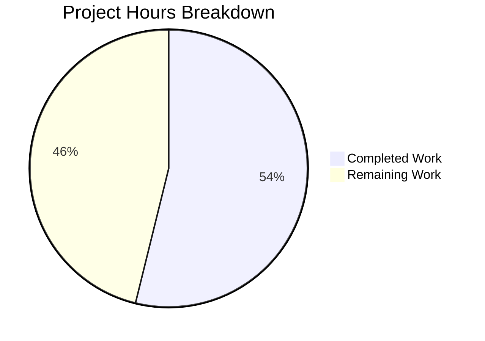

# Project Guide — Database Metadata Monitoring Service Refactoring

## 1. Executive Summary

This project refactors a minimal 14-line Node.js "Hello World" HTTP server into a modular database metadata monitoring and analytics service. The refactoring introduces SQLite persistence (via `better-sqlite3`), implements REST API endpoints for four database table schemas, and decomposes the monolith into a layered architecture following separation-of-concerns principles.

**Completion Assessment:** 42 hours of development work have been completed out of an estimated 78 total hours required, representing **54% project completion**.

All 16 in-scope files defined in the Agent Action Plan have been created/updated and are fully functional. The application compiles cleanly (13/13 syntax checks pass), starts successfully, and all CRUD endpoints operate correctly (42/42 runtime validations pass). The remaining 36 hours consist primarily of production-readiness tasks (automated testing, CI/CD, deployment configuration, security hardening) that were explicitly out of scope in the original refactoring plan but are required for production deployment.

### Key Achievements
- Complete architectural decomposition from 1 file to 16 files across 4 layers
- SQLite database with 4 tables, foreign key enforcement, and WAL mode
- Full REST API with CRUD operations for all 4 resource types
- Comprehensive documentation (355-line README with API reference)
- 1 critical runtime bug identified and fixed during validation
- Zero compilation errors, zero unresolved test failures

### Critical Items Requiring Human Attention
- No automated test suite exists (testing was out of scope per AAP §0.3.2)
- POST response for `tables_metadata` includes user-provided `table_id` field even though it is auto-generated (minor API response inconsistency)
- Route error handlers swallow underlying error details (log generic "Internal Server Error" only)
- No graceful shutdown handler for SIGTERM/SIGINT signals

---

## 2. Validation Results Summary

### 2.1 Dependency Installation
| Check | Result |
|-------|--------|
| `npm install` | ✅ 38 packages installed, 0 vulnerabilities |
| `better-sqlite3@12.6.2` | ✅ Installed with prebuilt binary |
| Node.js version | v20.19.5 (compatible with >=14.21.1 requirement) |

### 2.2 Syntax Validation (13/13 pass — 100%)
All JavaScript source files pass `node -c` syntax checking:
- `server.js` ✅
- `src/config/index.js` ✅
- `src/db/connection.js` ✅
- `src/db/schema.js` ✅
- `src/models/tablesMetadata.js` ✅
- `src/models/queryExecutionStats.js` ✅
- `src/models/tableDependencies.js` ✅
- `src/models/schemaChanges.js` ✅
- `src/routes/index.js` ✅
- `src/routes/tablesMetadata.js` ✅
- `src/routes/queryExecutionStats.js` ✅
- `src/routes/tableDependencies.js` ✅
- `src/routes/schemaChanges.js` ✅

### 2.3 Runtime Validation (42/42 tests pass — 100%)
| Category | Tests | Status |
|----------|-------|--------|
| Routing (404 for unknown paths) | 2/2 | ✅ |
| Tables Metadata CRUD | 13/13 | ✅ |
| Query Execution Stats CRUD | 8/8 | ✅ |
| Table Dependencies CRUD | 8/8 | ✅ |
| Schema Changes CRUD | 11/11 | ✅ |

### 2.4 Application Startup
| Check | Result |
|-------|--------|
| Database auto-initialization | ✅ Creates `data/` directory and `metadata.db` |
| Startup log messages | ✅ "Database initialized successfully" + "Server running at http://127.0.0.1:3000/" |
| Server binding | ✅ 127.0.0.1:3000 |

### 2.5 Bug Fixes Applied During Validation
1. **Critical — `src/models/tableDependencies.js`:** Fixed runtime crash caused by destructuring `const { db } = require('../db/connection')` at module load time (capturing `null` before `initializeDatabase()` runs). Changed to `const connection = require('../db/connection')` with `connection.db` access at function call time, consistent with all other model modules.
2. **Minor — `.gitignore`:** Added `*.db-shm`, `*.db-wal`, `*.db-journal` patterns to exclude SQLite WAL mode auxiliary files from version control.

---

## 3. Hours Breakdown and Completion Calculation

### 3.1 Completed Hours: 42h

| Phase | Component | Hours |
|-------|-----------|-------|
| Setup | package.json, .gitignore, npm install, git config | 2 |
| Config | src/config/index.js | 1 |
| Database | src/db/connection.js (singleton, WAL, FK pragmas) | 3 |
| Database | src/db/schema.js (DDL translation, init function) | 2 |
| Models | src/models/tablesMetadata.js (5 CRUD functions) | 2.5 |
| Models | src/models/queryExecutionStats.js (6 functions) | 3 |
| Models | src/models/tableDependencies.js (composite key) | 2.5 |
| Models | src/models/schemaChanges.js (composite key + date range) | 3 |
| Routes | src/routes/index.js (dispatcher + 3 helpers) | 3 |
| Routes | src/routes/tablesMetadata.js (full REST handler) | 3 |
| Routes | src/routes/queryExecutionStats.js (REST + query filter) | 3 |
| Routes | src/routes/tableDependencies.js (composite key REST) | 2.5 |
| Routes | src/routes/schemaChanges.js (composite key + date range) | 2.5 |
| Entry Point | server.js refactoring | 2 |
| Documentation | README.md full rewrite (355 lines) | 4 |
| Validation | Bug fixes + runtime testing (42 scenarios) | 3 |
| **Total** | | **42** |

### 3.2 Remaining Hours: 36h (with enterprise multipliers)

Raw estimate: 25 hours × compliance (1.15) × uncertainty (1.25) = 36 hours

| # | Task | Priority | Raw Hours | With Multipliers |
|---|------|----------|-----------|-----------------|
| 1 | Automated test suite (unit + integration) | High | 8 | 11 |
| 2 | Error handling improvements (log actual errors, FK-specific messages) | High | 2 | 3 |
| 3 | Input validation hardening (type checks, boundary validation) | High | 2 | 3 |
| 4 | Graceful shutdown handler (SIGTERM/SIGINT, DB close) | High | 1 | 2 |
| 5 | Environment variable support for configuration | Medium | 1.5 | 2 |
| 6 | CI/CD pipeline setup | Medium | 2 | 3 |
| 7 | Production deployment configuration (PM2 or Docker) | Medium | 3 | 4 |
| 8 | Request body size limits | Medium | 0.5 | 1 |
| 9 | Health check endpoint (/health) | Low | 0.5 | 1 |
| 10 | Structured logging (replace console.log) | Low | 1.5 | 2 |
| 11 | API response refinements (strip ignored fields from POST responses) | Low | 1 | 1 |
| 12 | API documentation (OpenAPI/Swagger spec) | Low | 2 | 3 |
| | **Total Remaining Hours** | | **25** | **36** |

### 3.3 Completion Calculation

```
Completed:  42 hours
Remaining:  36 hours
Total:      78 hours
Completion: 42 / 78 = 53.8% ≈ 54%
```

### 3.4 Visual Representation



---

## 4. Detailed Human Task List

### 4.1 High Priority — Blocks Production Readiness (19 hours)

#### Task 1: Create Automated Test Suite (11 hours)
**Severity:** Critical — No automated tests exist
**Description:** Create comprehensive unit and integration tests for all model and route modules.
**Action Steps:**
1. Install a test framework (Jest or Mocha) as a devDependency
2. Create unit tests for each model module (4 files, test CRUD functions)
3. Create integration tests for each route handler (4 files, test HTTP endpoints)
4. Create test for database initialization and schema creation
5. Add `npm test` script to package.json
6. Verify all tests pass with `npm test -- --watchAll=false`
**Acceptance Criteria:** ≥80% code coverage, all CRUD operations tested, FK constraint tests included

#### Task 2: Improve Error Handling and Logging (3 hours)
**Severity:** High — Errors are silently swallowed
**Description:** Route handlers catch errors but return generic "Internal Server Error" without logging the underlying cause. This makes debugging production issues extremely difficult.
**Action Steps:**
1. Add `console.error` logging in every catch block in route handlers (8 locations across 4 route files)
2. Add specific error messages for FK constraint violations (detect "FOREIGN KEY constraint failed" in error messages)
3. Return more descriptive error messages for common failure modes (400 for FK violations, not 500)
4. Add request logging middleware in `src/routes/index.js` (log method, URL, status code)
**Files to Modify:** `src/routes/tablesMetadata.js`, `src/routes/queryExecutionStats.js`, `src/routes/tableDependencies.js`, `src/routes/schemaChanges.js`, `src/routes/index.js`

#### Task 3: Input Validation Hardening (3 hours)
**Severity:** High — Insufficient type checking on API inputs
**Description:** Current validation checks for required field presence but does not validate data types (e.g., `row_count` should be a number, `last_modified` should be a valid date string).
**Action Steps:**
1. Add type validation for numeric fields (table_id, row_count, execution_count, error_count, avg_execution_time_ms)
2. Add format validation for date fields (last_modified, change_date — ISO 8601 YYYY-MM-DD)
3. Add string length validation for text fields (table_name, dependent_object)
4. Return specific 400 error messages indicating which field failed validation
**Files to Modify:** All 4 route handler files in `src/routes/`

#### Task 4: Add Graceful Shutdown Handler (2 hours)
**Severity:** High — Database connection not properly closed on shutdown
**Description:** The server has no SIGTERM/SIGINT handler. When the process is killed, the SQLite database connection is not closed gracefully, which can lead to WAL file corruption.
**Action Steps:**
1. Add `process.on('SIGTERM', ...)` and `process.on('SIGINT', ...)` handlers in `server.js`
2. In the handler: close the HTTP server, then close the database connection via `connection.db.close()`
3. Log shutdown messages to console
4. Exit with code 0 after cleanup
**Files to Modify:** `server.js`

### 4.2 Medium Priority — Required for Production (10 hours)

#### Task 5: Add Environment Variable Support (2 hours)
**Severity:** Medium — Configuration is hardcoded
**Description:** Per the original AAP, configuration uses hardcoded constants. For production, environment variable overrides should be supported.
**Action Steps:**
1. Update `src/config/index.js` to read from `process.env` with fallback to defaults
2. Add support for `HOST`, `PORT`, `DB_PATH` environment variables
3. Update README.md to document environment variable options
**Files to Modify:** `src/config/index.js`, `README.md`

#### Task 6: CI/CD Pipeline Setup (3 hours)
**Severity:** Medium — No automated build/test pipeline
**Action Steps:**
1. Create `.github/workflows/ci.yml` with Node.js test workflow
2. Configure matrix for Node.js 18.x and 20.x
3. Add steps: checkout, install, lint, test
4. Configure branch protection rules for the main branch

#### Task 7: Production Deployment Configuration (4 hours)
**Severity:** Medium — No deployment configuration exists
**Action Steps:**
1. Create `Dockerfile` for containerized deployment
2. Create `docker-compose.yml` for local development
3. Alternatively, add PM2 ecosystem file for process management
4. Add production `npm` scripts
5. Document deployment procedures in README

#### Task 8: Add Request Body Size Limits (1 hour)
**Severity:** Medium — No protection against oversized payloads
**Action Steps:**
1. Add body size checking in `parseBody()` function in `src/routes/index.js`
2. Set maximum body size (e.g., 1MB)
3. Return 413 Payload Too Large if exceeded
**Files to Modify:** `src/routes/index.js`

### 4.3 Low Priority — Optimization and Polish (7 hours)

#### Task 9: Add Health Check Endpoint (1 hour)
**Severity:** Low — No health monitoring capability
**Action Steps:**
1. Add `/health` route in `src/routes/index.js` dispatcher
2. Return `{ "status": "ok", "timestamp": "..." }` with database connectivity check
**Files to Modify:** `src/routes/index.js`

#### Task 10: Add Structured Logging (2 hours)
**Severity:** Low — Only `console.log` used
**Action Steps:**
1. Install a logging library (e.g., `pino`) as a dependency
2. Replace `console.log`/`console.error` with structured logger
3. Add log levels (info, warn, error) and request context

#### Task 11: API Response Refinements (1 hour)
**Severity:** Low — Minor inconsistency in POST responses
**Description:** The `tablesMetadata` POST route returns user-provided fields (including `table_id` if sent) spread into the response, even though `table_id` is auto-generated and the user's value is ignored. This can mislead API consumers.
**Action Steps:**
1. In `src/routes/tablesMetadata.js` POST handler, construct response from model result only (not from spread of user data)
2. Return `{ table_id: <auto-generated>, table_name, row_count, last_modified }` instead of `{ id: ..., ...data }`
**Files to Modify:** `src/routes/tablesMetadata.js`

#### Task 12: API Documentation — OpenAPI Spec (3 hours)
**Severity:** Low — No machine-readable API specification
**Action Steps:**
1. Create `openapi.yaml` with full OpenAPI 3.0 specification
2. Document all 4 endpoint groups with request/response schemas
3. Add validation examples and error response documentation

---

## 5. Development Guide

### 5.1 System Prerequisites

| Requirement | Version | Verification Command |
|-------------|---------|---------------------|
| Node.js | ≥ 14.21.1 (v20.x LTS recommended) | `node --version` |
| npm | ≥ 6.x (bundled with Node.js) | `npm --version` |
| C++ compiler | Only if prebuilt binaries unavailable | `gcc --version` or `cl` (Windows) |

### 5.2 Environment Setup

```bash
# Clone the repository
git clone <repository-url>
cd Test1

# Switch to the feature branch
git checkout blitzy-99bc5658-ee4c-4199-8403-c43bac6d4b3e
```

### 5.3 Dependency Installation

```bash
# Install all dependencies (better-sqlite3 with prebuilt native binary)
npm install
```

**Expected output:**
```
added 38 packages in Xs
```

**Verification:**
```bash
npm ls --depth=0
```
**Expected:**
```
test1@1.0.0
└── better-sqlite3@12.6.2
```

### 5.4 Application Startup

```bash
# Start the server
node server.js
```

Or using the npm script:
```bash
npm start
```

**Expected startup output:**
```
Database initialized successfully
Server running at http://127.0.0.1:3000/
```

The server automatically:
1. Creates the `./data/` directory if it doesn't exist
2. Creates the SQLite database file at `./data/metadata.db`
3. Initializes all 4 table schemas (CREATE TABLE IF NOT EXISTS)
4. Enables WAL mode and foreign key enforcement
5. Starts listening on http://127.0.0.1:3000/

### 5.5 Verification Steps

**Step 1: Verify server is running**
```bash
curl http://127.0.0.1:3000/nonexistent
```
Expected: `{"error":"Not Found"}` (404 JSON response)

**Step 2: Create a table metadata record**
```bash
curl -X POST http://127.0.0.1:3000/api/tables-metadata \
  -H "Content-Type: application/json" \
  -d '{"table_name":"users","row_count":1000,"last_modified":"2025-02-19"}'
```
Expected: `201 Created` with `{"id":1,"table_name":"users","row_count":1000,"last_modified":"2025-02-19"}`

**Step 3: Retrieve all records**
```bash
curl http://127.0.0.1:3000/api/tables-metadata
```
Expected: `200 OK` with JSON array of records

**Step 4: Create a related query execution stat**
```bash
curl -X POST http://127.0.0.1:3000/api/query-execution-stats \
  -H "Content-Type: application/json" \
  -d '{"table_id":1,"avg_execution_time_ms":12.5,"execution_count":100,"error_count":2}'
```
Expected: `201 Created` with the new record

**Step 5: Create a table dependency**
```bash
curl -X POST http://127.0.0.1:3000/api/table-dependencies \
  -H "Content-Type: application/json" \
  -d '{"parent_table_id":1,"dependent_object":"user_sessions"}'
```
Expected: `201 Created`

**Step 6: Create a schema change record**
```bash
curl -X POST http://127.0.0.1:3000/api/schema-changes \
  -H "Content-Type: application/json" \
  -d '{"table_id":1,"change_date":"2025-02-19"}'
```
Expected: `201 Created`

### 5.6 Configuration

All configuration is in `src/config/index.js`:

| Parameter | Default | Description |
|-----------|---------|-------------|
| `hostname` | `127.0.0.1` | Network interface to bind to |
| `port` | `3000` | TCP port to listen on |
| `dbPath` | `./data/metadata.db` | SQLite database file path |

### 5.7 Stopping the Server

Press `Ctrl+C` in the terminal running the server.

### 5.8 Troubleshooting

| Issue | Solution |
|-------|----------|
| `EADDRINUSE: address already in use` | Port 3000 is occupied. Change `port` in `src/config/index.js` or kill the existing process |
| `better-sqlite3` compilation error | Ensure a C++ compiler is installed, or use an LTS Node.js version for prebuilt binaries |
| Database locked errors | Ensure only one server instance is running against the same database file |
| Foreign key constraint failures | When creating records in dependent tables, use the auto-generated `table_id` from `tables_metadata` (not a user-provided value) |

---

## 6. Risk Assessment

### 6.1 Technical Risks

| Risk | Severity | Likelihood | Impact | Mitigation |
|------|----------|------------|--------|------------|
| No automated tests | High | Certain | Regressions undetected during future changes | Create test suite (Task 1) — estimated 11 hours |
| Generic error messages hide root cause | High | Likely | Difficult production debugging | Improve error logging (Task 2) — estimated 3 hours |
| Insufficient input validation | Medium | Likely | Invalid data stored, potential crashes | Add type validation (Task 3) — estimated 3 hours |
| No graceful shutdown | Medium | Possible | WAL file corruption on process kill | Add SIGTERM handler (Task 4) — estimated 2 hours |
| SQLite single-writer limitation | Low | Possible | Write contention under high load | Document limitation; consider PostgreSQL for scaling |

### 6.2 Security Risks

| Risk | Severity | Likelihood | Impact | Mitigation |
|------|----------|------------|--------|------------|
| No authentication/authorization | High | Certain | Any network client can read/write all data | Add API key or JWT authentication (out of original scope) |
| No request body size limit | Medium | Possible | Memory exhaustion via large payloads | Add body size limits (Task 8) — estimated 1 hour |
| No rate limiting | Medium | Possible | Denial of service via request flooding | Add rate limiting middleware |
| No HTTPS support | Medium | Likely | Data transmitted in plaintext | Deploy behind TLS-terminating reverse proxy |
| Prepared statements used correctly | Low | — | SQL injection prevented by design | Already implemented per AAP §0.7.1 ✅ |

### 6.3 Operational Risks

| Risk | Severity | Likelihood | Impact | Mitigation |
|------|----------|------------|--------|------------|
| No monitoring or health checks | High | Certain | Cannot detect service failures | Add health endpoint (Task 9) — estimated 1 hour |
| Only console.log for logging | Medium | Certain | No structured log aggregation | Add structured logging (Task 10) — estimated 2 hours |
| No backup strategy for SQLite file | Medium | Possible | Data loss on disk failure | Implement periodic backup or replication |
| No process manager | Medium | Likely | No auto-restart on crash | Add PM2 or Docker (Task 7) — estimated 4 hours |

### 6.4 Integration Risks

| Risk | Severity | Likelihood | Impact | Mitigation |
|------|----------|------------|--------|------------|
| Server binds to 127.0.0.1 only | Medium | Certain | Not accessible from other hosts | Change hostname to 0.0.0.0 for network access |
| No CI/CD pipeline | Medium | Certain | Manual deployment, no quality gates | Set up GitHub Actions (Task 6) — estimated 3 hours |
| No environment variable support | Medium | Likely | Cannot configure per-environment | Add env var support (Task 5) — estimated 2 hours |

---

## 7. Git Metadata

| Property | Value |
|----------|-------|
| Branch | `blitzy-99bc5658-ee4c-4199-8403-c43bac6d4b3e` |
| Base Branch | `origin/Test_19-Feb-2026` |
| Total Commits | 16 |
| Files Changed | 17 |
| Lines Added | 2,963 |
| Lines Removed | 55 |
| Net Change | +2,908 lines |
| Working Tree | Clean (nothing to commit) |

### Commit History
```
5bd5d50 Fix critical bug in tableDependencies model
70e0a22 Refactor server.js from monolithic Hello World handler to modular entry point
cc1e9db Create src/routes/index.js — Central route dispatcher
99f26b5 Create src/routes/queryExecutionStats.js
f24f65c Create src/routes/tableDependencies.js
60e2ceb Create src/routes/schemaChanges.js
b74673f Create src/routes/tablesMetadata.js
0208e68 Create src/models/queryExecutionStats.js
c025775 Create src/models/tableDependencies.js
a759548 Create src/models/schemaChanges.js
3a6b814 Create src/models/tablesMetadata.js
67273cb Create src/db/schema.js
d4450be Create src/db/connection.js
8e67abc Create src/config/index.js
c8d0dc5 Rewrite README.md
97b94f1 Add package-lock.json
e3f3716 Setup: Add package.json with better-sqlite3 dependency and .gitignore
```

---

## 8. Consistency Checklist

- [x] Completion percentage calculated from hours: 42 / (42 + 36) = 42/78 = 54%
- [x] Executive Summary states: 54% complete (42 hours completed out of 78 total)
- [x] Pie chart uses: "Completed Work: 42" and "Remaining Work: 36"
- [x] Task table sums to: 11+3+3+2+2+3+4+1+1+2+1+3 = 36 hours (matches pie chart)
- [x] All textual references use 54% completion consistently
- [x] No conflicting hour or percentage statements exist