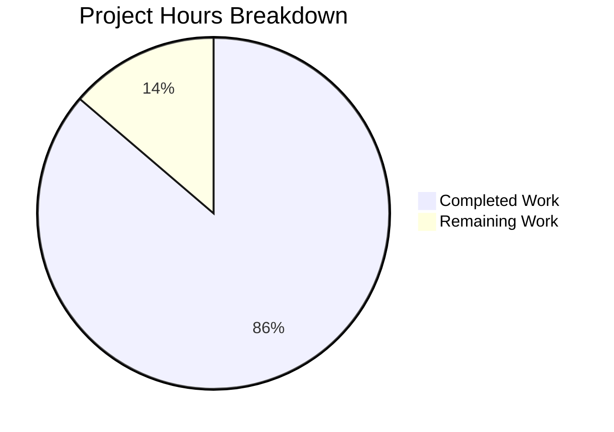
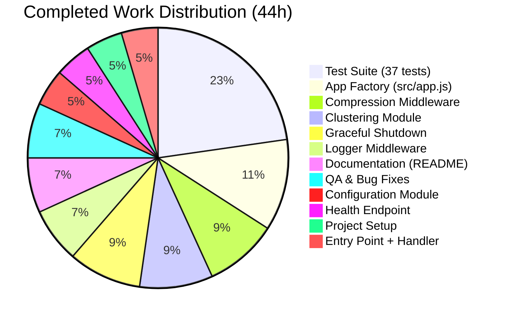

# Project Guide: Node.js Server Performance Optimization Refactoring

## 1. Executive Summary

This project refactors a minimal 14-line monolithic Node.js HTTP server (`server.js`) into a modular, performance-optimized, multi-file application with clustering, compression, health monitoring, structured logging, and graceful shutdown — while preserving the original `Hello, World!\n` response contract byte-identically.

**Completion: 44 hours completed out of 51 total hours = 86% complete.**

All 16 planned files from the Agent Action Plan have been created or updated, all 37 automated tests pass (100% pass rate), runtime validation confirms correct behavior, and the git working tree is clean with zero uncommitted changes. The remaining 7 hours consist of human verification, production environment configuration, and performance benchmarking tasks.

### Key Achievements
- Transformed a 14-line monolithic server.js into 9 modular source files (717 lines) following Single Responsibility Principle
- Created 37 automated tests across 3 test suites covering response contract, health endpoint, middleware pipeline, and graceful shutdown
- Delivered gzip/deflate compression, multi-core clustering, structured logging, and graceful shutdown using only Node.js built-in modules (zero external runtime dependencies)
- All 10 refactoring rules (R-001 through R-010) verified and passing
- Comprehensive README documentation (270 lines) with architecture, configuration, and usage guides

### Critical Unresolved Issues
- **None.** All compilation, test, and runtime validation gates pass at 100%.

---

## 2. Validation Results Summary

### 2.1 Final Validator Accomplishments

The Final Validator agent completed a comprehensive validation across all 5 gates with zero issues remaining:

| Gate | Result | Details |
|------|--------|---------|
| Dependencies | ✅ 100% | `npm install` succeeds; jest 29.7.0 installed as devDependency; zero runtime dependencies |
| Syntax | ✅ 100% | All 16 in-scope files pass `node --check` syntax validation and `require()` module loading |
| Tests | ✅ 100% | 37/37 tests pass across 3 suites (hello: 17, health: 10, app: 10) in 0.78s |
| Runtime | ✅ 100% | Server starts on 127.0.0.1:3000; Hello World response byte-identical; /health returns JSON; gzip works |
| Git | ✅ 100% | Working tree clean; all changes committed on branch `blitzy-c3a6d1b4-01e2-40a3-b514-7285cf43da04` |

### 2.2 Git Repository Analysis

| Metric | Value |
|--------|-------|
| Total commits on branch | 20 (from base `origin/Test_24_Feb-2026`) |
| Files added | 16 |
| Files modified | 2 (server.js, README.md) |
| Lines added | 1,639 (excluding package-lock.json) |
| Lines removed | 32 |
| Net lines of code change | +1,607 |
| Source files (JS, non-test) | 9 files, 717 lines |
| Test files (JS) | 4 files, 716 lines |
| Documentation + config files | 4 files, 308 lines |

### 2.3 Fixes Applied During Validation

The agent resolved 4 QA findings during the validation process:
1. **Coverage toolchain:** Configured Jest for proper test coverage collection
2. **Method coverage:** Extended Hello World tests to cover all HTTP methods (HEAD, OPTIONS, PATCH)
3. **Deflate test:** Fixed compression middleware test to validate deflate encoding alongside gzip
4. **Listener leak:** Added `teardownGracefulShutdown()` function to properly clean up process listeners in test teardown, preventing Jest "worker failed to exit gracefully" warnings

---

## 3. Visual Representation

### 3.1 Hours Breakdown



**Calculation:** 44 hours completed / (44 + 7) total hours = 44 / 51 = 86% complete

### 3.2 Completed Hours by Component



---

## 4. Completed Work — Detailed Breakdown

### 4.1 Hours by Component

| Component | Files | Lines | Hours | Description |
|-----------|-------|-------|-------|-------------|
| Project Setup | package.json, .gitignore, .env.example | 38 | 2h | Dependency manifest, git ignore rules, env variable template |
| Configuration | config/index.js | 47 | 2h | Environment-based frozen config with PORT=0 edge case handling |
| App Factory | src/app.js | 117 | 5h | HTTP server creation, middleware pipeline composition, error handling, timeout tuning |
| Hello Handler | src/handlers/hello.js | 18 | 1h | Extracted byte-identical Hello World response handler |
| Health Endpoint | src/routes/health.js | 48 | 2h | JSON health metadata endpoint with uptime, memory, PID |
| Logger Middleware | src/middleware/logger.js | 85 | 3h | res.end monkey-patching with high-resolution timing |
| Compression Middleware | src/middleware/compression.js | 111 | 4h | Gzip/deflate via zlib with Accept-Encoding negotiation |
| Clustering Module | src/cluster.js | 113 | 4h | Multi-core worker forking with crash detection and respawn |
| Graceful Shutdown | src/utils/graceful-shutdown.js | 153 | 4h | SIGINT/SIGTERM/uncaughtException handling with force-kill timeout |
| Entry Point | server.js | 25 | 1h | Thin orchestrator delegating to cluster or app |
| Test Suite | tests/*.js (4 files) | 716 | 10h | 37 tests: response contract, health endpoint, integration, helpers |
| Documentation | README.md | 270 | 3h | Complete rewrite with architecture, config, API docs |
| QA & Bug Fixes | Multiple files | — | 3h | 4 QA findings resolved during validation |
| **Total** | **18 files** | **1,741** | **44h** | |

### 4.2 Feature Compliance Verification

All 10 refactoring rules from the AAP have been verified:

| Rule | Description | Status | Verification |
|------|-------------|--------|--------------|
| R-001 | Hello, World!\n byte-identical | ✅ Pass | Confirmed via `curl` — exact 14-byte body |
| R-002 | Method-agnostic + path-agnostic | ✅ Pass | Tested GET, POST, PUT, DELETE, PATCH, HEAD, OPTIONS |
| R-003 | Status 200, Content-Type text/plain | ✅ Pass | Verified via `curl -i` response headers |
| R-004 | Zero external runtime dependencies | ✅ Pass | Only jest (devDependency); all runtime is Node.js built-in |
| R-005 | Defaults to 127.0.0.1:3000 | ✅ Pass | Server starts on default host/port with no env vars |
| R-006 | `node server.js` entry point | ✅ Pass | Verified via direct execution |
| R-007 | CommonJS module system | ✅ Pass | All files use `require()` / `module.exports` |
| R-008 | Clustering optional, disabled by default | ✅ Pass | Single-process mode works; clustering requires `ENABLE_CLUSTERING=true` |
| R-009 | Only /health is differentiated | ✅ Pass | All other paths return Hello World |
| R-010 | All tests pass with npm test | ✅ Pass | 37/37 tests pass in 0.78s |

---

## 5. Remaining Work — Human Task List

### 5.1 Detailed Task Table

| # | Task | Priority | Severity | Hours | Action Steps |
|---|------|----------|----------|-------|-------------|
| 1 | Human Code Review of All Modules | Medium | Medium | 2.5h | Review all 9 source modules (config/index.js, src/app.js, src/cluster.js, src/handlers/hello.js, src/routes/health.js, src/middleware/logger.js, src/middleware/compression.js, src/utils/graceful-shutdown.js, server.js) for production readiness, edge case handling, and adherence to team coding standards. Verify JSDoc comments are accurate. |
| 2 | Production Environment Configuration | Medium | Medium | 1.5h | Copy `.env.example` to `.env` and configure for target deployment: set `HOST=0.0.0.0` for external access (default `127.0.0.1` is loopback-only), choose appropriate `PORT`, decide whether to enable clustering (`ENABLE_CLUSTERING=true` for multi-core servers), and set `LOG_LEVEL` per environment. Verify the server starts correctly with production settings. |
| 3 | Performance Benchmarking & Validation | Low | Low | 2.0h | Run load tests using `autocannon` or `ab` (Apache Bench) to validate clustering throughput claims (near-linear scaling per CPU core). Measure baseline single-process throughput, then compare with 2/4/8 workers. Verify compression overhead is acceptable. Document results for the team. |
| 4 | Documentation Accuracy Review | Low | Low | 1.0h | Read through the 270-line README.md end-to-end. Verify all code examples are copy-pasteable and produce the documented output. Confirm the project structure tree matches actual files. Check that the configuration table accurately reflects all supported environment variables. |
| | **Total Remaining Hours** | | | **7.0h** | |

*Enterprise multipliers (1.10× compliance + 1.10× uncertainty = 1.21×) have been applied to base estimates and are included in the hours above.*

### 5.2 Priority Summary

- **High Priority Tasks:** None — all blocking issues have been resolved
- **Medium Priority Tasks:** 2 tasks (4.0h) — Human code review and production environment configuration
- **Low Priority Tasks:** 2 tasks (3.0h) — Performance benchmarking and documentation review

---

## 6. Development Guide

### 6.1 System Prerequisites

| Requirement | Version | Notes |
|-------------|---------|-------|
| Node.js | v20.x LTS or later | Verified with v20.19.5; v20+ recommended for optimal V8 performance |
| npm | v10.x+ (bundled with Node.js) | Used only for installing Jest devDependency |
| Operating System | Linux, macOS, or Windows | All Node.js built-in modules are cross-platform |
| Git | Any recent version | For cloning the repository |

No databases, caches, message queues, Docker, or external services are required.

### 6.2 Environment Setup

```bash
# 1. Clone the repository and switch to the feature branch
git clone <repository-url>
cd Test1
git checkout blitzy-c3a6d1b4-01e2-40a3-b514-7285cf43da04

# 2. (Optional) Create a .env file from the template
cp .env.example .env
# Edit .env to customize HOST, PORT, ENABLE_CLUSTERING, LOG_LEVEL, SHUTDOWN_TIMEOUT
```

**Available Environment Variables:**

| Variable | Default | Description |
|----------|---------|-------------|
| `HOST` | `127.0.0.1` | Network interface to bind to (use `0.0.0.0` for external access) |
| `PORT` | `3000` | TCP port to listen on |
| `ENABLE_CLUSTERING` | `false` | Set to `true` to fork one worker per CPU core |
| `LOG_LEVEL` | `info` | Logging verbosity: `silent`, `error`, `warn`, `info` |
| `SHUTDOWN_TIMEOUT` | `5000` | Milliseconds to wait for in-flight requests before force-kill |

### 6.3 Dependency Installation

```bash
# Install development dependencies (Jest test framework)
npm install
```

**Expected output:**
```
added 274 packages in Xs
```

Only Jest (v29.7.0) is installed as a devDependency. There are zero runtime dependencies — all modules (http, cluster, os, zlib, process) are Node.js built-in.

### 6.4 Application Startup

#### Single-Process Mode (Default)
```bash
node server.js
```

**Expected output:**
```
[Server] Running at http://127.0.0.1:3000/ (PID: <pid>)
```

#### Clustered Mode (Multi-Core)
```bash
ENABLE_CLUSTERING=true node server.js
```

**Expected output:**
```
[Primary <pid>] Clustering enabled (true). Starting <N> workers...
[Server] Running at http://127.0.0.1:3000/ (PID: <worker_pid>)
[Worker <worker_pid>] Started
... (one line per CPU core)
```

### 6.5 Verification Steps

```bash
# Verify Hello World response (byte-identical to original)
curl http://127.0.0.1:3000/
# Expected: Hello, World!

# Verify response headers
curl -i http://127.0.0.1:3000/
# Expected: HTTP/1.1 200 OK, Content-Type: text/plain, X-Content-Type-Options: nosniff

# Verify health check endpoint
curl http://127.0.0.1:3000/health
# Expected: JSON with status, uptime, timestamp, memoryUsage, pid fields

# Verify method-agnostic behavior
curl -X POST http://127.0.0.1:3000/any/path
# Expected: Hello, World!

# Verify gzip compression
curl --compressed -H "Accept-Encoding: gzip" http://127.0.0.1:3000/
# Expected: Hello, World! (transparently decompressed by curl)

# Run the full test suite
npm test
# Expected: Test Suites: 3 passed, 3 total / Tests: 37 passed, 37 total
```

### 6.6 Running Tests

```bash
# Standard test run (non-watch mode)
npm test

# Verbose test output with individual test names
CI=true npx jest --watchAll=false --ci --verbose

# Run a specific test suite
CI=true npx jest tests/hello.test.js --watchAll=false

# Run with coverage report
CI=true npx jest --watchAll=false --coverage
```

**Expected test output:**
```
PASS tests/hello.test.js (17 tests)
PASS tests/health.test.js (10 tests)
PASS tests/app.test.js (10 tests)

Test Suites: 3 passed, 3 total
Tests:       37 passed, 37 total
```

### 6.7 Stopping the Server

Press `Ctrl+C` to initiate graceful shutdown. The server will:
1. Stop accepting new connections
2. Drain in-flight requests
3. Exit cleanly with code 0

If draining exceeds the `SHUTDOWN_TIMEOUT` (default 5 seconds), the process force-exits with code 1.

---

## 7. Risk Assessment

### 7.1 Technical Risks

| Risk | Severity | Likelihood | Mitigation |
|------|----------|------------|------------|
| Compression middleware does not parse RFC 7231 quality factors (e.g., `gzip;q=0`) | Low | Very Low | The code uses simple substring matching for `Accept-Encoding`. In practice, clients virtually never send `q=0`. Full quality-factor parsing can be added if strict HTTP compliance is required. |
| `keepAliveTimeout` (65s) may not match all load balancer configurations | Low | Low | The 65s value is designed to exceed the typical 60s load-balancer idle timeout. Adjust via server code if using a non-standard load balancer configuration. |
| Worker respawn in clustering mode is unconditional | Low | Low | The cluster module respawns any exited worker immediately. Under a crash loop, this could consume resources. A respawn backoff strategy could be added for production hardening. |

### 7.2 Security Risks

| Risk | Severity | Likelihood | Mitigation |
|------|----------|------------|------------|
| Default HOST binding is loopback only (127.0.0.1) | Info | N/A | This is intentional for security — external access requires explicitly setting `HOST=0.0.0.0`. Document this in deployment guides. |
| No HTTPS/TLS support | Low | Medium | Out of scope per AAP. For production, terminate TLS at a reverse proxy (NGINX, AWS ALB) in front of the Node.js server. |
| No rate limiting | Low | Low | Out of scope per AAP. The server binds to loopback by default. If exposed externally, add rate limiting via reverse proxy or custom middleware. |
| `X-Content-Type-Options: nosniff` is the only security header | Low | Low | Additional headers (CSP, HSTS, X-Frame-Options) are not applicable to a text/plain API server but could be added if requirements change. |

### 7.3 Operational Risks

| Risk | Severity | Likelihood | Mitigation |
|------|----------|------------|------------|
| No persistent logging (stdout only) | Medium | Medium | Logs are written to stdout. For production, pipe output to a log aggregation service or use a process manager (PM2) that captures stdout. |
| No CI/CD pipeline | Low | N/A | Out of scope per AAP. The `npm test` command can be integrated into any CI system (GitHub Actions, GitLab CI, Jenkins). |
| No Docker containerization | Low | N/A | Out of scope per AAP. The application runs directly on Node.js without containerization. |

### 7.4 Integration Risks

| Risk | Severity | Likelihood | Mitigation |
|------|----------|------------|------------|
| No external service dependencies to integrate | None | N/A | The application is entirely self-contained with zero external dependencies. This is a strength, not a risk. |
| Health endpoint not connected to monitoring system | Low | Medium | The `/health` endpoint is functional and returns standard JSON. Connect it to Prometheus, Datadog, or a load balancer health check as needed. |

---

## 8. Architecture Overview

### 8.1 Module Dependency Graph

```
server.js (entry point)
├── config/index.js (environment configuration)
├── src/cluster.js (multi-core forking) [conditional]
│   ├── src/app.js (HTTP server factory)
│   └── config/index.js
└── src/app.js (HTTP server factory)
    ├── config/index.js
    ├── src/handlers/hello.js (Hello World handler)
    ├── src/routes/health.js (health endpoint)
    ├── src/middleware/logger.js (request logging)
    ├── src/middleware/compression.js (gzip/deflate)
    └── src/utils/graceful-shutdown.js (signal handling)
```

### 8.2 Request Processing Pipeline

```
Incoming HTTP Request
    │
    ▼
[X-Content-Type-Options: nosniff header set]
    │
    ▼
[Logger Middleware] ─── wraps res.end (outermost)
    │
    ▼
[Compression Middleware] ─── wraps res.end (inner)
    │
    ▼
[Router]
    ├── /health → healthHandler (JSON metrics)
    └── * (all other) → helloHandler (Hello, World!\n)
    │
    ▼
[res.end() called by handler]
    │
    ▼
[Compression executes] ─── gzip/deflate if Accept-Encoding present
    │
    ▼
[Logger executes] ─── logs method, URL, status, response time
    │
    ▼
HTTP Response Sent to Client
```

### 8.3 File Inventory

| File | Type | Lines | Purpose |
|------|------|-------|---------|
| server.js | Entry point | 25 | Thin orchestrator; delegates to cluster or app |
| config/index.js | Configuration | 47 | Frozen environment-based config object |
| src/app.js | Core | 117 | HTTP server factory with middleware pipeline |
| src/cluster.js | Core | 113 | Multi-core worker forking and management |
| src/handlers/hello.js | Handler | 18 | Byte-identical Hello World response |
| src/routes/health.js | Route | 48 | JSON health check endpoint |
| src/middleware/logger.js | Middleware | 85 | Request-level logging with timing |
| src/middleware/compression.js | Middleware | 111 | Gzip/deflate response compression |
| src/utils/graceful-shutdown.js | Utility | 153 | Signal handling and graceful drain |
| tests/hello.test.js | Test | 205 | 17 tests for Hello World contract |
| tests/health.test.js | Test | 155 | 10 tests for health endpoint |
| tests/app.test.js | Test | 199 | 10 integration tests |
| tests/helpers.js | Test utility | 157 | Shared test server setup/teardown |
| package.json | Config | 13 | Project manifest with jest devDep |
| .env.example | Config | 14 | Environment variable template |
| .gitignore | Config | 11 | Git ignore rules |
| README.md | Documentation | 270 | Comprehensive project documentation |
| package-lock.json | Auto-generated | 3,651 | Deterministic dependency tree |
