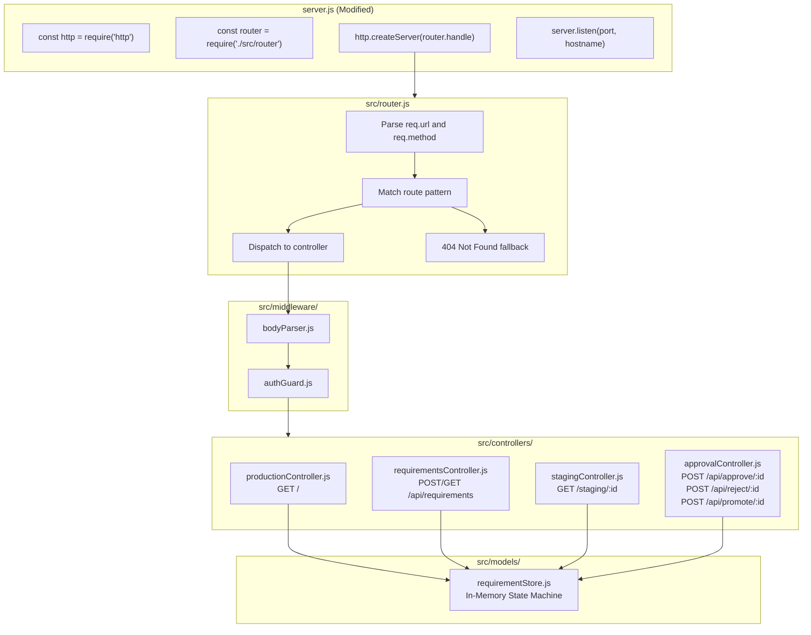
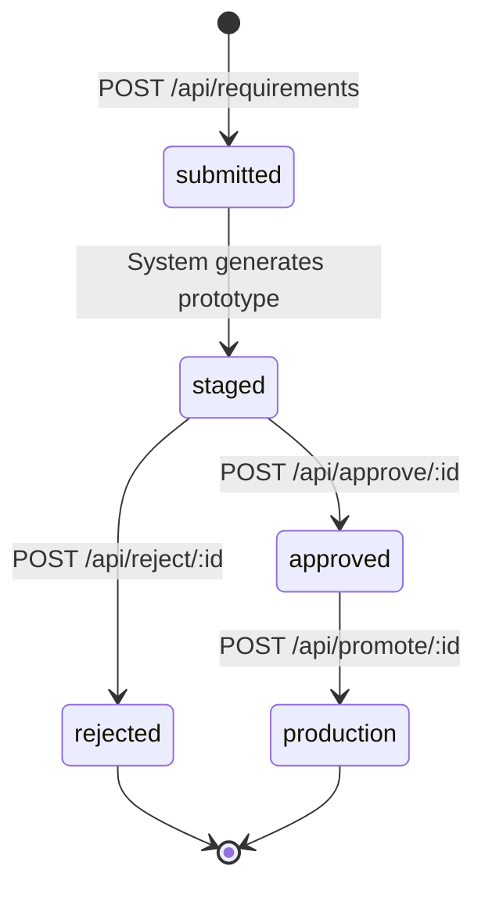

# Technical Specification

# 0. Agent Action Plan

## 0.1 Intent Clarification

### 0.1.1 Core Feature Objective

Based on the prompt, the Blitzy platform understands that the new feature requirement is to transform the existing minimal Node.js HTTP server into a system with a **Staging-Approval Workflow** that enforces a controlled promotion pipeline from prototype to production. Specifically, the feature must deliver the following capabilities:

- **Requirement Intake from Prompt**: The codebase shall expose a mechanism to receive new requirements (submitted as prompt text) and persist them as trackable entities within the system, each assigned a unique identifier and lifecycle state.
- **Self-Enhancement with New Functionality**: Upon receiving a new requirement, the system shall generate a prototype implementation — a sandboxed version of the enhanced codebase — that incorporates the requested functionality without altering the currently running production version.
- **Prototype Sharing for Approval**: The system shall expose the generated prototype through a dedicated staging endpoint (distinct from the production endpoint) so that reviewers can inspect, test, and validate the prototype before any production impact occurs.
- **Staging Approval Gate (No Direct Production Update)**: The system shall enforce a strict approval workflow where prototypes cannot reach production status without an explicit approval action. Direct updates to the production response are blocked; all changes must flow through a `submitted → staging → approved → production` pipeline.

The following implicit requirements have been surfaced through analysis of the user's directive:

- **State Persistence**: The current server is entirely stateless. Tracking requirements, prototypes, and approval states requires in-memory (or file-based) state management to be introduced.
- **Routing Layer**: The current server responds identically to all requests. Implementing distinct endpoints for requirement submission, prototype viewing, approval actions, and production serving requires a routing mechanism.
- **Environment Isolation**: The user's explicit instruction that production shall not be updated without staging approval implies a logical separation between what the "production" endpoint serves versus what the "staging" endpoint serves.
- **Approval State Machine**: Requirements must transition through defined lifecycle states (`submitted` → `staged` → `approved` → `production` or `rejected`), enforcing that only approved prototypes can be promoted.

### 0.1.2 Special Instructions and Constraints

The user has provided the following critical directives that constrain the implementation:

- **"It shall not update directly in production without staging approval"** — This is the paramount constraint. The system architecture must enforce an immutable rule: no prototype content shall be served on the production endpoint without an explicit approval transition. This is not advisory; it is a hard gate.
- **"Share the prototype for approval"** — Prototypes must be accessible to reviewers before approval. This means a dedicated staging inspection endpoint must exist.
- **Maintain backward compatibility** — The existing `Hello, World!` response must remain the default production response until a new prototype is explicitly approved and promoted.
- **Follow repository conventions** — The project currently uses zero external dependencies and only the built-in Node.js `http` module. The implementation must continue this pattern by building the routing, state management, and workflow logic using only Node.js built-in modules.
- **Environment variables available** — The user has provided environment variables (`c`, `d`, `r`) and secrets (`BLITZY_CLIENT_API_KEY`, `BLITZY_CLIENT_API_KEY2`, `BLITZY_CLIENT_API_KEY3`) that are available in the environment and can be leveraged for configuration or authentication if needed.

### 0.1.3 Technical Interpretation

These feature requirements translate to the following technical implementation strategy:

- To **accept new requirements**, we will create a `POST /api/requirements` endpoint in a new routing module that parses JSON request bodies using the built-in `http` module's data event streaming, validates the input, and stores the requirement in an in-memory data store with a unique ID and initial `submitted` status.
- To **generate a prototype**, we will create a staging service module that takes a submitted requirement and constructs a prototype response (representing the "enhanced functionality") and transitions the requirement state to `staged`, making it available at a staging-specific endpoint.
- To **share the prototype for approval**, we will create a `GET /staging/:id` endpoint that serves the staged prototype content to reviewers, along with a `GET /staging` listing endpoint to enumerate all prototypes awaiting review.
- To **enforce the approval gate**, we will create a `POST /api/approve/:id` endpoint that transitions a staged requirement to `approved` status and a `POST /api/promote/:id` endpoint that moves an approved prototype into the production response — this is the only path by which the production endpoint content can change.
- To **reject a prototype**, we will create a `POST /api/reject/:id` endpoint that transitions a staged requirement to `rejected` status, preventing it from reaching production.
- To **serve production content**, we will modify the root `GET /` handler so that it serves the currently promoted production content (defaulting to `Hello, World!\n` until a prototype is promoted).
- To **provide system visibility**, we will create a `GET /api/requirements` endpoint that lists all requirements and their current lifecycle states for audit and tracking purposes.

## 0.2 Repository Scope Discovery

### 0.2.1 Comprehensive File Analysis

The existing repository consists of 4 files across 3 directories with a single 14-line executable file. Every file has been analyzed for modification impact.

**Existing Files Requiring Modification:**

| File Path | Type | Current Purpose | Required Modification | Impact Level |
|-----------|------|----------------|----------------------|-------------|
| `server.js` | Application Code | Monolithic HTTP server; returns `Hello, World!` to all requests | Refactor into an application entry point that imports routing, state management, and workflow modules; replace the single anonymous handler with a router-dispatched handler; retain default `Hello, World!` as the initial production response | Critical |
| `README.md` | Documentation | Comprehensive project documentation (120 lines) | Update to reflect new feature endpoints, staging/approval workflow, API reference for all new routes, updated project structure, and configuration guidance for the new functionality | High |
| `blitzy/documentation/Project Guide.md` | Documentation | Task report and validation results (248 lines) | Update validation results to include new feature verification, add new runtime behaviors, extend development guide with staging workflow instructions | Medium |
| `blitzy/documentation/Technical Specifications.md` | Documentation | Spec stub placeholder | Populate with formal specification of the staging-approval workflow, state machine definition, and API contracts | Medium |

**Integration Point Discovery:**

| Integration Area | Current State | Required Change |
|-----------------|--------------|----------------|
| HTTP Request Handling | Single handler ignoring `req` object entirely (`server.js` lines 6–10) | Route requests based on `req.method` and `req.url` to appropriate controllers |
| Server Configuration | Hardcoded `hostname` and `port` constants (`server.js` lines 3–4) | Extend with staging port configuration and environment variable support |
| Startup Logging | Single `console.log` at startup (`server.js` lines 12–14) | Enhance with module initialization logging and environment readiness confirmation |
| State Management | Entirely stateless — no data persistence | Introduce in-memory store for requirements, prototypes, and approval states |

### 0.2.2 New File Requirements

**New Source Files to Create:**

| File Path | Purpose | Description |
|-----------|---------|-------------|
| `src/router.js` | Request Routing | URL and method-based request dispatcher that maps incoming requests to the correct handler; replaces the monolithic single-handler pattern |
| `src/controllers/requirementsController.js` | Requirements API | Handles `POST /api/requirements` (submit), `GET /api/requirements` (list), and `GET /api/requirements/:id` (detail) endpoints |
| `src/controllers/stagingController.js` | Staging API | Handles `GET /staging` (list staged prototypes) and `GET /staging/:id` (view specific prototype) endpoints |
| `src/controllers/approvalController.js` | Approval Workflow API | Handles `POST /api/approve/:id`, `POST /api/reject/:id`, and `POST /api/promote/:id` endpoints enforcing the approval state machine |
| `src/controllers/productionController.js` | Production Handler | Handles `GET /` to serve the current production content (defaults to `Hello, World!\n` until a prototype is promoted) |
| `src/models/requirementStore.js` | In-Memory Data Store | Manages the requirements collection with CRUD operations, state transitions, and validation; implements the `submitted → staged → approved → production` state machine |
| `src/middleware/bodyParser.js` | Request Body Parser | Parses JSON request bodies from `req` data events using Node.js built-in streaming; returns parsed objects to controllers |
| `src/middleware/authGuard.js` | API Authentication | Optional authentication middleware leveraging the provided `BLITZY_CLIENT_API_KEY` secrets to protect approval and promotion endpoints |
| `src/utils/responseHelper.js` | Response Utilities | Shared helper functions for setting JSON response headers, sending success/error responses, and standardizing API output format |
| `src/config.js` | Application Configuration | Centralizes hostname, port, staging port, and environment variable references (`c`, `d`, `r`, API keys) in a single configuration module |
| `package.json` | Project Manifest | Defines project metadata, Node.js engine requirements, and npm scripts for starting the server; maintains zero external dependencies |

**New Test Files to Create:**

| File Path | Purpose | Coverage Target |
|-----------|---------|----------------|
| `tests/router.test.js` | Router Unit Tests | Route matching, method dispatch, 404 handling, parameterized routes |
| `tests/requirementsController.test.js` | Requirements API Tests | POST submission, GET listing, input validation, error responses |
| `tests/stagingController.test.js` | Staging API Tests | Staged prototype retrieval, listing, non-existent ID handling |
| `tests/approvalController.test.js` | Approval Workflow Tests | Approve, reject, promote transitions; invalid state transition rejection; approval gate enforcement |
| `tests/requirementStore.test.js` | Data Store Tests | CRUD operations, state machine transitions, concurrent access patterns |
| `tests/integration/workflow.test.js` | End-to-End Workflow Tests | Full lifecycle: submit → stage → approve → promote → verify production response change |

**New Configuration and Documentation:**

| File Path | Purpose |
|-----------|---------|
| `.env.example` | Documents all environment variables and secrets available for configuration |
| `docs/api-reference.md` | Complete API reference for all new endpoints with request/response examples |
| `docs/staging-workflow.md` | Detailed guide explaining the staging-approval workflow and state machine |

### 0.2.3 Web Search Research Conducted

Research was conducted on the following topics to inform implementation decisions:

- **Best practices for routing in vanilla Node.js** — Pattern-based URL matching using `url.parse()` and `RegExp` for parameterized routes without external frameworks
- **In-memory state management patterns for Node.js** — Singleton store pattern with Map-based collections for O(1) lookups and state machine enforcement
- **Approval workflow design patterns** — State machine pattern with explicit transition guards to prevent invalid state changes; widely used in CI/CD and content management systems
- **Staging environment patterns for Node.js servers** — Logical environment isolation within a single process using namespace-separated state rather than requiring separate physical deployments
- **Security considerations for approval APIs** — API key-based authentication using request headers (`Authorization` or `X-API-Key`) to protect sensitive workflow actions

## 0.3 Dependency Inventory

### 0.3.1 Private and Public Packages

The implementation follows the repository's established zero-external-dependency convention. All functionality is built exclusively on Node.js built-in modules. No private packages are required.

| Package Registry | Name | Version | Purpose | Status |
|-----------------|------|---------|---------|--------|
| Node.js Built-in | `http` | Bundled with Node.js v20.20.0 | HTTP server creation, request handling, response streaming | Already in use (`server.js` line 1) |
| Node.js Built-in | `url` | Bundled with Node.js v20.20.0 | URL parsing for route matching and query string extraction | New import required |
| Node.js Built-in | `crypto` | Bundled with Node.js v20.20.0 | UUID generation for unique requirement identifiers via `crypto.randomUUID()` | New import required |
| Node.js Built-in | `events` | Bundled with Node.js v20.20.0 | Event emitter for state transition notifications and workflow hooks | New import required |
| Node.js Built-in | `assert` | Bundled with Node.js v20.20.0 | Built-in assertion library for test files | New import required (tests only) |
| Node.js Built-in | `fs` | Bundled with Node.js v20.20.0 | Optional file-based persistence for requirement state durability | New import required (optional) |
| npm (init only) | `package.json` | N/A | Project manifest with `engines` field and npm scripts; no external deps listed | To be created |

**Key Constraint**: The `dependencies` field in `package.json` will remain empty (`{}`). The manifest is introduced solely for project metadata, npm script definitions (`start`, `test`), and Node.js engine version specification — not for introducing external packages.

### 0.3.2 Dependency Updates

**Import Updates Required Across Files:**

The following import patterns will be introduced in new source files. No existing imports in `server.js` are removed; the `require('http')` statement is retained and the file is refactored to import the new routing module.

| File Pattern | Import Transformation | Purpose |
|-------------|----------------------|---------|
| `server.js` | Add: `const router = require('./src/router');` | Wire the new router into the existing HTTP server |
| `src/router.js` | Add: `const url = require('url');` | Parse incoming request URLs for route matching |
| `src/models/requirementStore.js` | Add: `const crypto = require('crypto');` and `const events = require('events');` | Generate UUIDs and emit state-change events |
| `src/middleware/bodyParser.js` | No new built-in imports needed; uses `req` stream events (`data`, `end`) | Parse JSON bodies from incoming request streams |
| `src/middleware/authGuard.js` | No new built-in imports; reads `process.env.BLITZY_CLIENT_API_KEY` | Validate API key from request headers |
| `src/controllers/*.js` | Add: `const store = require('../models/requirementStore');` | Access shared data store for CRUD and state transitions |
| `tests/**/*.js` | Add: `const assert = require('assert');` and `const http = require('http');` | Built-in test assertions and HTTP client for integration tests |

**External Reference Updates:**

| File | Update Description |
|------|--------------------|
| `package.json` (new) | Define `"engines": { "node": ">=4.0.0" }`, `"main": "server.js"`, scripts for `start` and `test` |
| `README.md` | Add new API Behavior section documenting all endpoints; update Project Structure diagram; add staging workflow section |
| `.env.example` (new) | Document `BLITZY_CLIENT_API_KEY`, `c`, `d`, `r` and any port/host configuration variables |
| `docs/api-reference.md` (new) | Full API documentation for all new REST endpoints |

## 0.4 Integration Analysis

### 0.4.1 Existing Code Touchpoints

**Direct Modifications Required:**

| File | Modification | Detail |
|------|-------------|--------|
| `server.js` (lines 1–14) | Refactor HTTP handler to use router | Replace the anonymous `(req, res) => { ... }` callback inside `http.createServer()` with a call to the imported router's dispatch function. Retain the `http.createServer()` call, `hostname`/`port` constants, and `server.listen()` structure. |
| `server.js` (line 1) | Add router import | Insert `const router = require('./src/router');` after the existing `const http = require('http');` line |
| `server.js` (lines 6–9) | Replace hardcoded handler | Change `http.createServer((req, res) => { res.statusCode = 200; ... })` to `http.createServer((req, res) => router.handle(req, res))` so that the router dispatches all requests |
| `server.js` (line 13) | Enhance startup log | Extend the `console.log` to also indicate that the staging workflow is active |
| `README.md` (lines 74–109) | Extend API Behavior section | Add endpoint documentation for all new routes including method, path, request body, and response contract |
| `README.md` (lines 111–121) | Update Project Structure | Expand the project structure tree to include the `src/`, `tests/`, and `docs/` directories |

**Integration Wiring Points:**

The following diagram illustrates how the new modules integrate with the existing `server.js` entry point:

### 0.4.2 State Machine Integration

The requirement lifecycle state machine is the core integration contract that all controllers must respect. The `requirementStore.js` module enforces all transition rules:

**State Transition Guards:**

| From State | To State | Guard Condition | Enforced By |
|-----------|----------|----------------|-------------|
| `submitted` | `staged` | Prototype content must be non-empty | `requirementStore.js` |
| `staged` | `approved` | Requirement must be in `staged` state; API key validated | `approvalController.js` + `authGuard.js` |
| `staged` | `rejected` | Requirement must be in `staged` state; API key validated | `approvalController.js` + `authGuard.js` |
| `approved` | `production` | Requirement must be in `approved` state; only one requirement can be in `production` state at a time | `approvalController.js` |
| Any | `submitted` | Not allowed — no backward transitions | `requirementStore.js` |
| `rejected` | Any | Terminal state — no further transitions | `requirementStore.js` |

### 0.4.3 API Route Registry

All new routes that the router must register:

| Method | Path | Controller | Auth Required | Request Body | Response |
|--------|------|-----------|---------------|-------------|----------|
| `GET` | `/` | `productionController` | No | None | Current production content (default: `Hello, World!\n`) |
| `POST` | `/api/requirements` | `requirementsController` | No | `{ "prompt": "string", "description": "string" }` | `{ "id": "uuid", "status": "submitted" }` |
| `GET` | `/api/requirements` | `requirementsController` | No | None | `[{ "id", "prompt", "status", "createdAt" }]` |
| `GET` | `/api/requirements/:id` | `requirementsController` | No | None | `{ "id", "prompt", "status", "prototype", ... }` |
| `GET` | `/staging` | `stagingController` | No | None | `[{ "id", "prompt", "prototype", "status": "staged" }]` |
| `GET` | `/staging/:id` | `stagingController` | No | None | Renders the staged prototype content for review |
| `POST` | `/api/approve/:id` | `approvalController` | Yes | None | `{ "id", "status": "approved" }` |
| `POST` | `/api/reject/:id` | `approvalController` | Yes | `{ "reason": "string" }` | `{ "id", "status": "rejected" }` |
| `POST` | `/api/promote/:id` | `approvalController` | Yes | None | `{ "id", "status": "production" }` |
| `GET` | `/health` | `productionController` | No | None | `{ "status": "ok", "uptime": number }` |

## 0.5 Technical Implementation

### 0.5.1 File-by-File Execution Plan

Every file listed below will be created or modified as part of this feature addition. Files are grouped by functional area and execution order.

**Group 1 — Core Infrastructure (Foundation Layer):**

| Action | File | Description |
|--------|------|-------------|
| CREATE | `package.json` | Project manifest defining `"name": "test1"`, `"main": "server.js"`, `"engines": { "node": ">=4.0.0" }`, npm scripts `start` and `test`; `dependencies` remains `{}` to honor the zero-dependency convention |
| CREATE | `src/config.js` | Centralized configuration module exporting `hostname`, `port`, `apiKeyEnvVar`, and any staging-specific settings; reads from `process.env` with hardcoded defaults matching original values (`127.0.0.1`, `3000`) |
| CREATE | `src/utils/responseHelper.js` | Shared response utilities: `sendJSON(res, statusCode, data)`, `sendText(res, statusCode, text)`, `sendError(res, statusCode, message)` — standardizes all API responses with correct `Content-Type` headers |

**Group 2 — Data and State Management:**

| Action | File | Description |
|--------|------|-------------|
| CREATE | `src/models/requirementStore.js` | Singleton in-memory store backed by a `Map`; exposes `create(prompt, description)`, `getById(id)`, `getAll()`, `transition(id, toState)`, `getProduction()`, `getStaged()`; enforces the state machine with transition guard logic; uses `crypto.randomUUID()` for ID generation |

**Group 3 — Middleware:**

| Action | File | Description |
|--------|------|-------------|
| CREATE | `src/middleware/bodyParser.js` | Exports an async function `parseBody(req)` that collects `data` events from the request stream, concatenates chunks, and returns `JSON.parse(body)` — handles malformed JSON gracefully with a descriptive error |
| CREATE | `src/middleware/authGuard.js` | Exports `authenticate(req)` that reads the `x-api-key` header from the request and validates it against `process.env.BLITZY_CLIENT_API_KEY`; returns `true`/`false`; used by approval and promote endpoints to protect sensitive operations |

**Group 4 — Controllers (Business Logic):**

| Action | File | Description |
|--------|------|-------------|
| CREATE | `src/controllers/productionController.js` | Handles `GET /`: retrieves the current production content from the store (defaults to `Hello, World!\n`); handles `GET /health` returning `{ "status": "ok" }` |
| CREATE | `src/controllers/requirementsController.js` | Handles `POST /api/requirements`: parses body, validates `prompt` field, creates requirement in store, auto-generates prototype from prompt, transitions to `staged` state, returns `201` with ID. Handles `GET /api/requirements` and `GET /api/requirements/:id` for listing and detail |
| CREATE | `src/controllers/stagingController.js` | Handles `GET /staging`: lists all requirements in `staged` state with their prototype content. Handles `GET /staging/:id`: renders the specific staged prototype for reviewer inspection |
| CREATE | `src/controllers/approvalController.js` | Handles `POST /api/approve/:id`: validates auth, transitions requirement from `staged` to `approved`. Handles `POST /api/reject/:id`: validates auth, transitions to `rejected` with optional reason. Handles `POST /api/promote/:id`: validates auth, transitions from `approved` to `production`, updates the production response content |

**Group 5 — Routing:**

| Action | File | Description |
|--------|------|-------------|
| CREATE | `src/router.js` | URL pattern router using `url.parse()`; registers all routes with method+path pattern matching; supports parameterized routes (`:id`); dispatches to controllers; returns 404 JSON for unmatched routes; returns 405 for method-mismatched routes |

**Group 6 — Entry Point Modification:**

| Action | File | Description |
|--------|------|-------------|
| MODIFY | `server.js` | Add `require('./src/router')` import; replace the inline request handler with `router.handle`; retain `hostname`, `port` constants (now optionally sourced from `src/config.js`); enhance startup log message to indicate staging workflow active |

**Group 7 — Tests:**

| Action | File | Description |
|--------|------|-------------|
| CREATE | `tests/router.test.js` | Tests route registration, pattern matching, parameterized URL extraction, 404/405 fallback behavior |
| CREATE | `tests/requirementsController.test.js` | Tests requirement creation with valid/invalid input, listing, detail retrieval, auto-staging |
| CREATE | `tests/stagingController.test.js` | Tests staging list and detail endpoints, handling of non-existent IDs |
| CREATE | `tests/approvalController.test.js` | Tests approve/reject/promote workflows, invalid state transitions, authentication enforcement |
| CREATE | `tests/requirementStore.test.js` | Tests state machine transitions, guard enforcement, CRUD operations, UUID generation |
| CREATE | `tests/integration/workflow.test.js` | End-to-end test of full lifecycle: submit → auto-stage → approve → promote → verify production |

**Group 8 — Documentation:**

| Action | File | Description |
|--------|------|-------------|
| MODIFY | `README.md` | Add Staging Workflow section, update API Behavior with all new endpoints, update Project Structure tree, add environment variable documentation |
| MODIFY | `blitzy/documentation/Project Guide.md` | Extend validation results, add staging workflow verification steps, update development guide |
| MODIFY | `blitzy/documentation/Technical Specifications.md` | Populate with formal workflow specification, state machine definition, and API contracts |
| CREATE | `.env.example` | Document all available environment variables and secrets |
| CREATE | `docs/api-reference.md` | Complete REST API reference with curl examples for every endpoint |
| CREATE | `docs/staging-workflow.md` | Visual guide to the staging-approval workflow with state diagrams |

### 0.5.2 Implementation Approach per File

The implementation follows a bottom-up dependency order to ensure each module's dependencies are available before integration:

- **Establish feature foundation** — Begin by creating the configuration module (`src/config.js`), response utilities (`src/utils/responseHelper.js`), and the in-memory data store (`src/models/requirementStore.js`) since all controllers depend on these.
- **Build middleware layer** — Create `bodyParser.js` and `authGuard.js` next, as controllers require body parsing and authentication capabilities.
- **Implement controllers** — Build each controller (`productionController`, `requirementsController`, `stagingController`, `approvalController`) in isolation, importing the store and middleware as needed.
- **Wire routing** — Create the router module that imports all controllers and maps routes to handler functions.
- **Integrate with entry point** — Modify `server.js` to import the router and delegate all incoming requests to it, ensuring the existing server lifecycle (create → listen → log) remains intact.
- **Ensure quality** — Write and execute all test files against the new modules using the built-in `assert` module and `http` client.
- **Document** — Update all documentation files to reflect the new architecture, endpoints, and workflow.

### 0.5.3 User Interface Design

This feature does not include a graphical user interface. All interactions occur through HTTP API endpoints. The "prototype for approval" is served as a text or JSON response accessible via `curl`, browser, or any HTTP client. The staging endpoint (`GET /staging/:id`) serves as the review interface, rendering the prototype content in plain text or JSON format for inspection.

A summary of the key interaction model:

- **Submitter** sends a `POST /api/requirements` with their prompt text to propose a new feature
- **System** automatically generates a prototype and stages it for review
- **Reviewer** visits `GET /staging/:id` to inspect the prototype content
- **Approver** sends `POST /api/approve/:id` (with API key) to approve the staged prototype
- **Promoter** sends `POST /api/promote/:id` (with API key) to push the approved content to the production endpoint
- **End User** visits `GET /` and receives the promoted content (or the default `Hello, World!\n` if no prototype has been promoted)

## 0.6 Scope Boundaries

### 0.6.1 Exhaustively In Scope

**All Feature Source Files:**

| Pattern / Path | Description |
|---------------|-------------|
| `server.js` | Modified entry point — router integration |
| `src/config.js` | Application configuration module |
| `src/router.js` | Request routing and dispatch |
| `src/controllers/**/*.js` | All controller modules (production, requirements, staging, approval) |
| `src/middleware/**/*.js` | All middleware modules (body parser, auth guard) |
| `src/models/**/*.js` | Data store and state machine |
| `src/utils/**/*.js` | Response helper utilities |

**All Feature Test Files:**

| Pattern / Path | Description |
|---------------|-------------|
| `tests/router.test.js` | Router unit tests |
| `tests/requirementsController.test.js` | Requirements API tests |
| `tests/stagingController.test.js` | Staging API tests |
| `tests/approvalController.test.js` | Approval workflow tests |
| `tests/requirementStore.test.js` | Data store and state machine tests |
| `tests/integration/workflow.test.js` | End-to-end workflow integration tests |

**Integration Points:**

| Path | Lines / Scope | Purpose |
|------|--------------|---------|
| `server.js` (line 1 area) | Import section | Add `router` module import |
| `server.js` (lines 6–10) | Handler callback | Replace with router dispatch |
| `server.js` (lines 12–14) | Listen callback | Enhance startup logging |

**Configuration Files:**

| Path | Description |
|------|-------------|
| `package.json` (new) | Project manifest, engine constraints, npm scripts |
| `.env.example` (new) | Environment variable documentation template |
| `src/config.js` (new) | Runtime configuration centralization |

**Documentation:**

| Path | Description |
|------|-------------|
| `README.md` | Updated with new endpoints, workflow, and project structure |
| `blitzy/documentation/Project Guide.md` | Extended with staging workflow verification |
| `blitzy/documentation/Technical Specifications.md` | Populated with formal specification |
| `docs/api-reference.md` (new) | Complete API endpoint reference |
| `docs/staging-workflow.md` (new) | Staging-approval workflow guide with state diagrams |

### 0.6.2 Explicitly Out of Scope

| Category | Exclusion | Rationale |
|----------|----------|-----------|
| External dependencies | No npm packages to be installed | Maintains zero-dependency convention per project design |
| Database integration | No database or file-system persistence | In-memory store is sufficient; persistence is a future enhancement |
| Graphical UI | No HTML/CSS frontend for the staging workflow | User interacts via HTTP API; aligns with current `text/plain` architecture |
| CI/CD pipeline | No GitHub Actions, Jenkins, or automated deployment | Excluded per constraint C-004; manual deployment remains |
| Docker/containerization | No Dockerfile or docker-compose | Excluded per constraint C-004 |
| HTTPS/TLS | No SSL certificate or HTTPS server | Server remains loopback-only; low security risk |
| External API integrations | No outbound HTTP calls to third-party services | The system operates entirely within its own process |
| Performance optimization | No load balancing, clustering, or caching | Out of scope per original project constraints |
| Refactoring unrelated code | No changes to existing documentation-only files beyond feature documentation | Only feature-relevant updates to existing files |
| Additional features | No features beyond the staging-approval workflow | Only the explicitly requested requirement-to-production pipeline is implemented |

## 0.7 Rules for Feature Addition

### 0.7.1 Feature-Specific Rules

The following rules are derived from the user's explicit directive and the established repository conventions. All implementation agents must strictly adhere to these:

- **No Direct Production Mutation** — The production endpoint (`GET /`) must never be updated except through the explicit `POST /api/promote/:id` workflow, which itself requires the requirement to have passed through the `submitted → staged → approved → production` state machine. Any code path that bypasses this pipeline is a violation of the core requirement.
- **Staging Approval is Mandatory** — A prototype must be in the `staged` state and explicitly transitioned to `approved` before it can be promoted. There is no shortcut from `staged` to `production` and no shortcut from `submitted` to `production`.
- **Backward Compatibility** — The default production response must remain `Hello, World!\n` with HTTP status `200 OK` and `Content-Type: text/plain` until an explicit promotion occurs. All existing behavior documented in the tech spec (B-001 through B-007) must be preserved for the default case.
- **Zero External Dependencies** — All new functionality must be implemented using only Node.js built-in modules (`http`, `url`, `crypto`, `events`, `fs`, `assert`). The `package.json` file is introduced for project metadata only — its `dependencies` object must remain empty.
- **CommonJS Module System** — All new files must use `require()`/`module.exports` syntax consistent with the existing `server.js` pattern. ES Module (`import`/`export`) syntax must not be introduced.
- **Authentication on Sensitive Endpoints** — The `approve`, `reject`, and `promote` endpoints must be protected by API key authentication using the provided `BLITZY_CLIENT_API_KEY` environment variable. Unauthenticated requests to these endpoints must receive a `401 Unauthorized` response.
- **Idempotent State Transitions** — Attempting to transition a requirement to its current state (e.g., approving an already-approved requirement) should return the current state without error, not cause a failure.
- **Terminal States are Final** — Requirements in the `rejected` or `production` state must not be transitioned to any other state. These are terminal states in the lifecycle.
- **Single Active Production Prototype** — Only one requirement may be in the `production` state at any given time. Promoting a new requirement to production must automatically archive the previously active production requirement.

### 0.7.2 Integration Requirements with Existing Features

- The existing features F-001 through F-004 must continue to function exactly as documented. The server creation, network binding, startup logging, and configuration features are extended — never broken or replaced.
- The startup log message must still include `Server running at http://{hostname}:{port}/` as its first line to maintain backward compatibility with any tooling or documentation that checks for this exact output.
- The `server.js` file must remain the entry point. No refactoring to a different entry point (e.g., `src/index.js`) is permitted.

### 0.7.3 Security Requirements

- API key values must never be logged, included in response bodies, or exposed in error messages.
- The `authGuard.js` middleware must use constant-time comparison for API key validation to prevent timing attacks.
- All user-submitted prompt text must be treated as untrusted input. While the current implementation does not evaluate or execute prompt content, any string stored in the requirement store must be sanitized to prevent prototype injection.

## 0.8 References

### 0.8.1 Repository Files and Folders Searched

The following files and folders were comprehensively searched and analyzed to derive the conclusions in this Agent Action Plan:

| Path | Type | Analysis Purpose |
|------|------|-----------------|
| `` (root) | Folder | Repository structure discovery — identified 4 files across 3 directories |
| `server.js` | File | Full source code analysis (14 lines) — understood current HTTP server architecture, handler pattern, configuration constants, and startup behavior |
| `README.md` | File | Full documentation review (121 lines) — extracted prerequisites (Node.js v4+), configuration parameters, API behavior contracts, and project structure |
| `blitzy/` | Folder | Documentation directory exploration — identified `documentation/` subdirectory containing project artifacts |
| `blitzy/documentation/` | Folder | Contents enumeration — found `Project Guide.md` and `Technical Specifications.md` |
| `blitzy/documentation/Project Guide.md` | File | Summary analysis — extracted validation results, development guide, risk assessment, and remaining work items |
| `blitzy/documentation/Technical Specifications.md` | File | Summary analysis — confirmed placeholder status for formal specification |

### 0.8.2 Technical Specification Sections Referenced

| Section | Key Information Extracted |
|---------|-------------------------|
| 1.1 Executive Summary | Project is a Blitzy platform exploration initiative; repository hosted at `https://github.com/ajitblitzy/Test1.git` |
| 1.3 Scope | In-scope features (F-001–F-005) and explicit out-of-scope exclusions including CI/CD, Docker, and new dependencies |
| 2.1 Feature Catalog | Five features (F-001 through F-005) with metadata, dependencies, and validation status |
| 2.2 Functional Requirements | Testable requirements for each feature with acceptance criteria |
| 2.4 Implementation Considerations | Technical constraints including single-file architecture, zero dependencies, hardcoded configuration, CommonJS modules |
| 2.6 Assumptions and Constraints | Assumptions A-001 through A-004 and constraints C-001 through C-004 |
| 3.1 Programming Languages | JavaScript ES6+ with CommonJS modules; minimum Node.js v4.0.0 |
| 3.2 Runtime Environment | Node.js v20.20.0 LTS installed; compatibility matrix from v4.x through v24.x |
| 4.2 Core Business Process Flows | Server startup flow, request-response cycle, end-to-end user journey |
| 4.4 State Management and Transitions | Five-state server lifecycle; entirely stateless request processing |
| 5.1 High-Level Architecture | Monolithic single-file architecture; zero external integration points |
| 5.5 Repository Structure | 4 files across 3 directories; single executable with documentation artifacts |
| 6.1 Core Services Architecture | Confirmed non-applicable — single-process monolith with no service decomposition |
| 8.6 CI/CD Pipeline | Confirmed non-applicable — no pipelines exist; manual deployment only |

### 0.8.3 Environment Configuration

| Item | Value | Source |
|------|-------|--------|
| Node.js Version | v20.20.0 LTS ("Iron") | Verified via `node --version` in active environment |
| Active Git Branch | `Test_16_Feb-2026` | Verified via `git branch` in repository |
| Total Git Commits | 5 | Verified via `git log --oneline` |
| Environment Variables | `c`, `d`, `r` | User-provided; available in `process.env` |
| Secrets | `BLITZY_CLIENT_API_KEY`, `BLITZY_CLIENT_API_KEY2`, `BLITZY_CLIENT_API_KEY3` | User-provided; available in `process.env` |
| User Setup Instruction | `test` | Acknowledged — no actionable setup steps beyond environment confirmation |

### 0.8.4 Attachments

No file attachments were provided for this project. No Figma URLs or design assets were specified.

