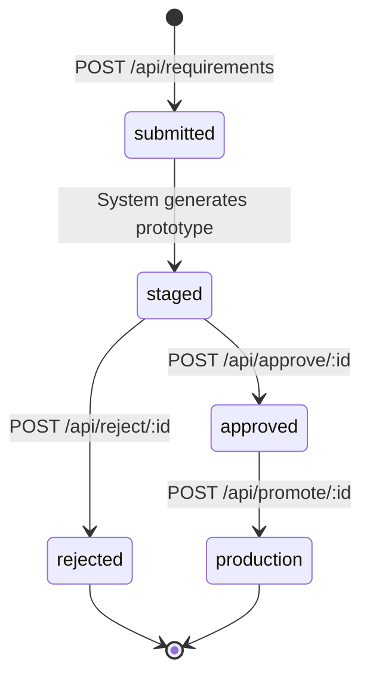

# Technical Specification — Test1 Staging-Approval Workflow

This document is the formal technical specification for the **Staging-Approval Workflow** feature added to the Test1 Node.js HTTP server. It defines the requirement lifecycle state machine, API contracts, system architecture, security requirements, configuration reference, dependency constraints, and feature rules that govern the controlled promotion pipeline from prototype to production.

The Staging-Approval Workflow enforces a strict `submitted → staged → approved → production` pipeline, ensuring that no prototype content reaches the production endpoint (`GET /`) without explicit approval. The default production response remains `Hello, World!\n` until a prototype is explicitly promoted through the workflow.

---

## 1. Requirement Lifecycle State Machine

### 1.1 States

The system defines five lifecycle states for each requirement:

| State | Description |
|-------|-------------|
| `submitted` | Initial state upon creation via `POST /api/requirements`. The requirement prompt has been received and recorded. |
| `staged` | A prototype has been automatically generated from the submitted prompt and is available for review at the staging endpoint. |
| `approved` | A reviewer has explicitly approved the staged prototype via `POST /api/approve/:id`. The prototype is eligible for production promotion. |
| `rejected` | A reviewer has explicitly rejected the staged prototype via `POST /api/reject/:id`. This is a **terminal state** — no further transitions are permitted. |
| `production` | The approved prototype has been promoted to production via `POST /api/promote/:id` and is now served by `GET /`. This is a **terminal state** — no further transitions are permitted. |

### 1.2 Valid Transitions

| Transition | Trigger | Authentication Required |
|------------|---------|------------------------|
| `submitted → staged` | System auto-generates prototype (triggered after `POST /api/requirements`) | No |
| `staged → approved` | `POST /api/approve/:id` | Yes (`x-api-key` header) |
| `staged → rejected` | `POST /api/reject/:id` | Yes (`x-api-key` header) |
| `approved → production` | `POST /api/promote/:id` | Yes (`x-api-key` header) |

### 1.3 State Diagram



### 1.4 Transition Guards

| From State | To State | Guard Condition | Enforced By |
|-----------|----------|----------------|-------------|
| `submitted` | `staged` | Prototype content must be non-empty | `requirementStore.js` |
| `staged` | `approved` | Must be in `staged` state; API key validated | `approvalController.js` + `authGuard.js` |
| `staged` | `rejected` | Must be in `staged` state; API key validated | `approvalController.js` + `authGuard.js` |
| `approved` | `production` | Must be in `approved` state; only one requirement in `production` at a time | `approvalController.js` |
| Any | `submitted` | Not allowed — no backward transitions | `requirementStore.js` |
| `rejected` | Any | Terminal state — no further transitions | `requirementStore.js` |

### 1.5 Transition Rules

- **No backward transitions**: Once a requirement advances to a later state, it cannot return to any earlier state (e.g., `approved` cannot transition back to `staged`).
- **Terminal states are final**: Requirements in `rejected` or `production` state cannot be transitioned to any other state. These represent the end of the lifecycle.
- **Idempotent transitions**: Attempting to transition a requirement to its current state returns the current state without error.
- **Single active production**: Only one requirement may occupy the `production` state at any given time. Promoting a new requirement automatically archives the previously active production requirement.

---

## 2. API Contracts

### 2.1 Endpoint Registry

| Method | Path | Description | Auth | Request Body | Success Response |
|--------|------|-------------|------|-------------|-----------------|
| `GET` | `/` | Serve current production content | No | None | `200` — current production text (default: `Hello, World!\n`) |
| `POST` | `/api/requirements` | Submit new requirement | No | `{ "prompt": "string", "description": "string" }` | `201 { "id": "uuid", "status": "submitted" }` |
| `GET` | `/api/requirements` | List all requirements | No | None | `200 [{ "id", "prompt", "status", "createdAt" }]` |
| `GET` | `/api/requirements/:id` | Get requirement detail | No | None | `200 { "id", "prompt", "status", "prototype", ... }` |
| `GET` | `/staging` | List staged prototypes | No | None | `200 [{ "id", "prompt", "prototype", "status": "staged" }]` |
| `GET` | `/staging/:id` | View staged prototype | No | None | `200` — Renders staged prototype content |
| `POST` | `/api/approve/:id` | Approve staged prototype | Yes (`x-api-key`) | None | `200 { "id", "status": "approved" }` |
| `POST` | `/api/reject/:id` | Reject staged prototype | Yes (`x-api-key`) | `{ "reason": "string" }` (optional) | `200 { "id", "status": "rejected" }` |
| `POST` | `/api/promote/:id` | Promote approved to production | Yes (`x-api-key`) | None | `200 { "id", "status": "production" }` |
| `GET` | `/health` | Health check | No | None | `200 { "status": "ok", "uptime": number }` |

### 2.2 Error Responses

| Status Code | Meaning | Example Condition |
|-------------|---------|-------------------|
| `400 Bad Request` | Invalid request body or missing required fields | `POST /api/requirements` without `prompt` field |
| `401 Unauthorized` | Missing or invalid API key on protected endpoints | `POST /api/approve/:id` without valid `x-api-key` header |
| `404 Not Found` | Requirement not found by ID, or route not matched | `GET /api/requirements/nonexistent-uuid` |
| `405 Method Not Allowed` | HTTP method not supported for the given route | `DELETE /api/requirements` (unsupported method) |
| `409 Conflict` | Invalid state transition attempted | `POST /api/approve/:id` on a `rejected` requirement |

All error responses follow a standardized JSON format:

```json
{
  "error": "string describing the error"
}
```

### 2.3 Example Requests

**Submit a new requirement:**

```bash
curl -X POST http://127.0.0.1:3000/api/requirements \
  -H "Content-Type: application/json" \
  -d '{"prompt": "Add user authentication", "description": "Implement login/logout endpoints"}'
```

**Approve a staged prototype:**

```bash
curl -X POST http://127.0.0.1:3000/api/approve/<id> \
  -H "x-api-key: <KEY>"
```

**Promote an approved prototype to production:**

```bash
curl -X POST http://127.0.0.1:3000/api/promote/<id> \
  -H "x-api-key: <KEY>"
```

**List all requirements:**

```bash
curl http://127.0.0.1:3000/api/requirements
```

**View a staged prototype:**

```bash
curl http://127.0.0.1:3000/staging/<id>
```

**Check server health:**

```bash
curl http://127.0.0.1:3000/health
```

---

## 3. System Architecture

### 3.1 Module Overview

The application follows a modular architecture built entirely with Node.js built-in modules. All modules use the CommonJS module system (`require()` / `module.exports`).

| Module | Path | Responsibility |
|--------|------|---------------|
| Entry Point | `server.js` | Creates the HTTP server using the built-in `http` module, imports the router, delegates all incoming requests to `router.handle(req, res)`. Retains hostname (`127.0.0.1`) and port (`3000`) configuration with startup logging. |
| Router | `src/router.js` | URL pattern matching using `url.parse()` and `RegExp` for parameterized routes (`:id`). Dispatches matched routes to the appropriate controller. Returns `404` JSON for unmatched routes and `405` for method-mismatched routes. |
| Production Controller | `src/controllers/productionController.js` | Handles `GET /` (serves current production content, defaulting to `Hello, World!\n`) and `GET /health` (returns server health status with uptime). |
| Requirements Controller | `src/controllers/requirementsController.js` | Handles `POST /api/requirements` (submit new requirement), `GET /api/requirements` (list all), and `GET /api/requirements/:id` (detail view). Auto-generates a prototype and transitions to `staged` state upon submission. |
| Staging Controller | `src/controllers/stagingController.js` | Handles `GET /staging` (list all staged prototypes) and `GET /staging/:id` (view specific staged prototype for reviewer inspection). |
| Approval Controller | `src/controllers/approvalController.js` | Handles `POST /api/approve/:id`, `POST /api/reject/:id`, and `POST /api/promote/:id`. Enforces the approval state machine with authentication via `authGuard`. |
| Body Parser | `src/middleware/bodyParser.js` | Parses JSON request bodies from Node.js request streams using `data`/`end` events. Handles malformed JSON gracefully with descriptive error responses. |
| Auth Guard | `src/middleware/authGuard.js` | Validates API key from `x-api-key` request header against `process.env.BLITZY_CLIENT_API_KEY`. Uses constant-time string comparison (`crypto.timingSafeEqual`) to prevent timing attacks. |
| Requirement Store | `src/models/requirementStore.js` | Singleton in-memory store backed by a JavaScript `Map`. Manages requirements with CRUD operations. Enforces the state machine with transition guard logic. Uses `crypto.randomUUID()` for ID generation. Emits state-change events via `events.EventEmitter`. |
| Response Helper | `src/utils/responseHelper.js` | Shared helper functions: `sendJSON(res, statusCode, data)`, `sendText(res, statusCode, text)`, `sendError(res, statusCode, message)` for standardized API responses with correct `Content-Type` headers. |
| Config | `src/config.js` | Centralizes hostname, port, and API key environment variable references with hardcoded defaults matching original values (`127.0.0.1`, `3000`). |

### 3.2 Data Flow

The request processing pipeline follows this sequence:

1. **HTTP request arrives** at `server.js` on the configured hostname and port.
2. **`server.js` delegates** to `router.handle(req, res)` — the router receives full control of the request.
3. **Router parses** the URL and HTTP method using `url.parse()`, then matches against registered route patterns.
4. **Router applies middleware** as needed — `bodyParser` for `POST` endpoints that require request body parsing, `authGuard` for protected endpoints requiring API key validation.
5. **Router dispatches** the request to the matched controller function with parsed parameters (e.g., `:id`).
6. **Controller interacts** with `requirementStore` for data operations (CRUD, state transitions).
7. **Controller uses** `responseHelper` to send a standardized JSON or text response back to the client.

If no route matches, the router returns a `404 Not Found` JSON response. If the route matches but the HTTP method is not supported, the router returns a `405 Method Not Allowed` JSON response.

### 3.3 Project Structure

```
Test1/
├── server.js                              # Application entry point — HTTP server with router integration
├── package.json                           # Project manifest (zero external dependencies)
├── .env.example                           # Environment variable documentation template
├── README.md                              # Project documentation
├── src/
│   ├── config.js                          # Centralized configuration module
│   ├── router.js                          # URL pattern-based request router
│   ├── controllers/
│   │   ├── productionController.js        # GET / and GET /health handlers
│   │   ├── requirementsController.js      # Requirements CRUD API handlers
│   │   ├── stagingController.js           # Staging review API handlers
│   │   └── approvalController.js          # Approve/reject/promote API handlers
│   ├── middleware/
│   │   ├── bodyParser.js                  # JSON request body parser
│   │   └── authGuard.js                   # API key authentication middleware
│   ├── models/
│   │   └── requirementStore.js            # In-memory data store with state machine
│   └── utils/
│       └── responseHelper.js              # Standardized response helpers
├── tests/
│   ├── router.test.js                     # Router unit tests
│   ├── requirementStore.test.js           # Data store and state machine tests
│   ├── requirementsController.test.js     # Requirements API tests
│   ├── stagingController.test.js          # Staging API tests
│   ├── approvalController.test.js         # Approval workflow tests
│   └── integration/
│       └── workflow.test.js               # End-to-end workflow integration tests
├── docs/
│   ├── api-reference.md                   # Complete REST API reference
│   └── staging-workflow.md                # Staging-approval workflow guide
└── blitzy/
    └── documentation/
        ├── Project Guide.md               # Task report and validation results
        └── Technical Specifications.md    # This document
```

---

## 4. Security Requirements

### 4.1 API Key Authentication

- **Protected endpoints**: `POST /api/approve/:id`, `POST /api/reject/:id`, and `POST /api/promote/:id` require API key authentication.
- **Authentication mechanism**: Clients must include a valid API key in the `x-api-key` HTTP request header.
- **Validation**: The `authGuard.js` middleware reads the `x-api-key` header value and compares it against the value of the `BLITZY_CLIENT_API_KEY` environment variable.
- **Constant-time comparison**: The `authGuard.js` middleware uses `crypto.timingSafeEqual` (or an equivalent constant-time comparison function) to prevent timing attacks that could leak information about the API key.
- **Failure response**: If the API key is missing or invalid, the server returns `401 Unauthorized` with a JSON error body. No details about why the key was rejected are disclosed.

### 4.2 Secret Protection

- API key values must **NEVER** be logged to stdout, stderr, or any log file.
- API key values must **NEVER** be included in response bodies, error messages, or stack traces.
- API key values must **NEVER** be exposed in client-facing error descriptions.

### 4.3 Input Handling

- User-submitted prompt text (via `POST /api/requirements`) is treated as **untrusted input**.
- Prompt text is stored as-is in the in-memory data store but is never evaluated, executed, or interpreted as code.
- Prototype generation uses prompt content for display purposes only — no dynamic code execution from user input.

### 4.4 Network Security

- The server runs on the loopback interface only (`127.0.0.1`) and does not implement HTTPS/TLS.
- HTTPS/TLS is out of scope for this implementation. In a production deployment, a reverse proxy (e.g., Nginx) would terminate TLS.
- No request rate limiting is implemented. This is an acknowledged out-of-scope limitation.

### 4.5 Authentication Availability

- If the `BLITZY_CLIENT_API_KEY` environment variable is not set, all protected endpoints return `401 Unauthorized` for every request. The system does not fall back to an open-access mode.

---

## 5. Configuration Reference

### 5.1 Environment Variables

| Variable | Default | Description |
|----------|---------|-------------|
| `BLITZY_CLIENT_API_KEY` | (none — must be set) | API key for authenticating approval, rejection, and promotion endpoints |
| `BLITZY_CLIENT_API_KEY2` | (from env) | Additional API key available in the environment |
| `BLITZY_CLIENT_API_KEY3` | (from env) | Additional API key available in the environment |
| `PORT` | `3000` | Server listening port |
| `HOSTNAME` | `127.0.0.1` | Server bind address |
| `c` | (from env) | User-provided environment variable |
| `d` | (from env) | User-provided environment variable |
| `r` | (from env) | User-provided environment variable |

### 5.2 Configuration Files

- **`.env.example`**: Provides a template for all environment variables. Copy to `.env` and populate with actual values for local development.
- **`src/config.js`**: Centralizes all configuration access with sensible defaults. Reads from `process.env` and falls back to hardcoded defaults (`127.0.0.1` for hostname, `3000` for port).

### 5.3 Configuration Precedence

1. Environment variables (highest priority)
2. `src/config.js` hardcoded defaults (fallback)

---

## 6. Zero-Dependency Constraint

### 6.1 Built-in Modules Used

The project uses **exclusively** Node.js built-in modules. No external npm packages are permitted.

| Module | Purpose | Used In |
|--------|---------|---------|
| `http` | HTTP server creation, request handling, response streaming | `server.js` |
| `url` | URL parsing for route matching and query string extraction | `src/router.js` |
| `crypto` | UUID generation via `crypto.randomUUID()`; constant-time comparison via `crypto.timingSafeEqual` | `src/models/requirementStore.js`, `src/middleware/authGuard.js` |
| `events` | Event emitter for state transition notifications and workflow hooks | `src/models/requirementStore.js` |
| `assert` | Built-in assertion library for test files | `tests/` (test files only) |
| `fs` | File system operations (available but not currently used for persistence) | (optional — reserved for future use) |

### 6.2 Package Manifest

- `package.json` exists for project metadata, npm script definitions (`start`, `test`), and Node.js engine version specification only.
- `dependencies` field: `{}` (empty — must remain empty).
- `devDependencies` field: `{}` (empty — must remain empty).
- No `node_modules` directory is required.

### 6.3 Module System

- **Module system**: CommonJS (`require()` / `module.exports`).
- **ES Module syntax** (`import` / `export`) must **NOT** be used in any file.
- All new and modified files must follow the CommonJS pattern established by `server.js`.

### 6.4 Node.js Version Requirement

- **Minimum version**: Node.js v4.0.0 (per the `engines` field in `package.json`).
- **Target runtime**: Node.js v20.20.0 LTS ("Iron").
- **Compatibility**: The codebase is designed to work with Node.js v4.x through v24.x.

---

## 7. Feature Rules and Constraints

### 7.1 No Direct Production Mutation

The production endpoint (`GET /`) must **never** be updated except through the explicit `POST /api/promote/:id` workflow. All changes to production content must flow through the complete `submitted → staged → approved → production` pipeline. Any code path that bypasses this pipeline is a violation of the core requirement.

### 7.2 Staging Approval is Mandatory

A prototype must pass through the `staged` state and be explicitly transitioned to `approved` before it can be promoted to production. There is no shortcut from `staged` to `production` and no shortcut from `submitted` to `production`.

### 7.3 Backward Compatibility

The default production response remains `Hello, World!\n` with HTTP `200 OK` and `Content-Type: text/plain` until an explicit promotion occurs. All existing behaviors documented in the original specification (B-001 through B-007) are preserved for the default case. The `GET /` endpoint continues to serve this default response until a prototype is explicitly promoted.

### 7.4 Zero External Dependencies

All functionality is implemented using only Node.js built-in modules. The `package.json` `dependencies` field must remain `{}`. No external npm packages may be introduced.

### 7.5 CommonJS Module System

All files must use `require()` / `module.exports` syntax. ES Module (`import` / `export`) syntax must not be introduced anywhere in the codebase.

### 7.6 Authentication on Sensitive Endpoints

The `approve`, `reject`, and `promote` endpoints must be protected by API key authentication using the `x-api-key` request header validated against the `BLITZY_CLIENT_API_KEY` environment variable. Unauthenticated requests to these endpoints must receive a `401 Unauthorized` response.

### 7.7 Idempotent State Transitions

Attempting to transition a requirement to its current state (e.g., approving an already-approved requirement) should return the current state without error, not cause a failure.

### 7.8 Terminal States are Final

Requirements in the `rejected` or `production` state must not be transitioned to any other state. These are terminal states in the lifecycle. Any attempt to transition from a terminal state must be rejected with a `409 Conflict` response.

### 7.9 Single Active Production Prototype

Only one requirement may be in the `production` state at any given time. Promoting a new requirement to production must automatically archive the previously active production requirement (transitioning it out of the active `production` state).

### 7.10 Entry Point Preservation

`server.js` remains the application entry point. No refactoring to a different entry point (e.g., `src/index.js`) is permitted. The first startup log line must include `Server running at http://{hostname}:{port}/` to maintain backward compatibility with tooling and documentation that checks for this output.

---

## Appendix A: Historical — README Documentation Task Specification

> **Note:** The content below is historical context from the initial project phase — a documentation-only task focused on updating the README.md based on server.js analysis. It is preserved here for reference and traceability. The sections numbered 0.1 through 0.10 below reflect the original Agent Action Plan for that earlier documentation task.

# 0. Agent Action Plan

## 0.1 Intent Clarification

### 0.1.1 Core Testing Objective

Based on the provided requirements, the Blitzy platform understands that the primary objective is **not a testing task but a documentation task**: the user requests reading the contents of `server.js` and creating or updating the `README.md` file accordingly. Since a `README.md` file already exists in the repository (containing only `# Test1`), the task is to **update** the existing `README.md` with comprehensive project documentation derived from the `server.js` source code, and to **document the specific changes separately** so that the delta between the old and new README is clearly visible.

**Request Category:** Documentation Update — Update existing README.md based on source code analysis

**Requirements with Enhanced Clarity:**

- **R-001 — Read `server.js`:** Analyze the complete contents of `server.js` (14 lines) to extract all documentable information including the server's purpose, technology, configuration, usage instructions, and behavior
- **R-002 — Create README if absent:** Produce a new `README.md` file with comprehensive project documentation (conditional — bypassed because file already exists)
- **R-003 — Update existing README:** Since `README.md` exists with only `# Test1`, replace the placeholder content with meaningful project documentation derived from `server.js`
- **R-004 — Share updates separately:** Provide a clear accounting of what changed between the old `README.md` and the new `README.md`, enabling reviewers to understand the exact delta

**Implicit Needs Surfaced:**

- The new README should document the project name, description, prerequisites (Node.js), installation/setup, usage instructions, server configuration (hostname, port), and expected behavior
- The README should reflect the project's minimalist architecture — a single-file Node.js HTTP server with zero external dependencies
- The update delta should clearly distinguish what was removed (the bare `# Test1` heading) versus what was added (structured documentation sections)

### 0.1.2 Special Instructions and Constraints

- **User Setup Instruction:** The user provided `test` as the setup instruction — this is a placeholder string and does not convey actionable setup directives
- **Environment Variables:** Three environment variables (`c`, `d`, `r`) are set with trivial values and are not referenced by the project source code
- **Secrets:** Three secret keys (`BLITZY_CLIENT_API_KEY`, `BLITZY_CLIENT_API_KEY2`, `BLITZY_CLIENT_API_KEY3`) are available but are not used by the application
- **No Attachments:** No Figma designs, wireframes, or external attachments were provided
- **No Test-Specific Directives:** The user has not requested any test creation, update, or fix — the task is exclusively documentation-oriented
- **Conditional Logic:** The user specified "If readme file exist update it" — this condition evaluates to **true** since `README.md` exists at the repository root

### 0.1.3 Technical Interpretation

These requirements translate to the following technical implementation strategy:

- To fulfill R-001 (read `server.js`), parse and analyze `server.js` at the repository root to extract: the `http` module import, hostname (`127.0.0.1`) and port (`3000`) constants, the `createServer` request handler behavior (status 200, Content-Type text/plain, body "Hello, World!\n"), and the `server.listen` startup logic
- To fulfill R-003 (update README), replace the existing single-line `README.md` content (`# Test1`) with a structured Markdown document containing: project title, description, prerequisites, installation, usage, configuration, API behavior, and project structure sections
- To fulfill R-004 (share updates separately), produce a before/after diff or summary that itemizes every content block added to the README, clearly annotating the removal of the placeholder content

### 0.1.4 Coverage Requirements Interpretation

Since this is a documentation task rather than a testing task, coverage is interpreted as **documentation coverage** rather than code coverage:

- **Explicit coverage target:** The user did not specify a coverage metric; the implicit expectation is that the README comprehensively documents the project
- **Documentation coverage should include:** Project overview, prerequisites, setup and run instructions, server behavior, configuration details, and project file structure
- To achieve comprehensive documentation coverage, the updated README should reflect 100% of the observable behaviors documented in `server.js` — specifically all seven deterministic behaviors (server binding, startup log, HTTP 200 response, Content-Type header, response body, method-agnostic handling, and path-agnostic handling)

## 0.2 Test Discovery and Analysis

### 0.2.1 Existing Test Infrastructure Assessment

Repository analysis was conducted across the entire codebase located at `/tmp/blitzy/Test1/Test_16_Feb2026`. The project contains exactly **two files** (`server.js` and `README.md`) within a flat directory structure with no subdirectories (apart from `.git`).

**Search Results:**

| Search Pattern | Files Found | Result |
|---------------|-------------|--------|
| `*test*`, `*spec*`, `test_*`, `*_test.*` | 0 | No test files exist |
| `*.test.js`, `*.spec.js`, `__tests__/` | 0 | No JavaScript test files or directories |
| `package.json` | 0 | No dependency manifest — cannot declare test scripts |
| `jest.config.*`, `.mocharc.*`, `vitest.config.*` | 0 | No test runner configuration |
| `.nycrc`, `c8.config.*`, `.coveragerc` | 0 | No code coverage configuration |
| `.github/workflows/`, `.gitlab-ci.yml` | 0 | No CI/CD pipeline definitions |

**Assessment Summary:** Repository analysis reveals a **completely absent** testing setup. There is no testing framework, no test runner, no test files, no coverage tooling, no CI/CD pipeline, and no `package.json` to configure any of these. This finding is consistent with the technical specification Section 6.6 which formally documents that "Detailed Testing Strategy is not applicable for this system."

| Infrastructure Element | Status | Details |
|-----------------------|--------|---------|
| Current testing framework | **None** | No test framework installed or configured |
| Test runner configuration | **None** | No configuration files present |
| Coverage tools in use | **None** | No coverage tooling detected |
| Mock/stub libraries | **None** | No mocking libraries present |
| Test data fixtures | **None** | No fixture files or factory patterns |
| Test directories | **None** | Flat repository with zero subdirectories |

### 0.2.2 Web Search Research Conducted

No web search research was required for this task. The user's request is a straightforward documentation update (README creation/update based on `server.js` analysis) and does not involve testing framework selection, mocking strategies, or test organization patterns. The repository's technology (Node.js built-in `http` module) is well-understood and requires no compatibility research for documentation purposes.

**Research Not Needed Because:**

- The task does not introduce any testing framework, assertion library, or coverage tool
- No external dependencies are being added that require version compatibility validation
- The `server.js` file uses only the Node.js built-in `http` module with stable, well-documented APIs
- README authoring for a minimal Node.js project follows standard Markdown conventions that do not require research

## 0.3 Testing Scope Analysis

### 0.3.1 Test Target Identification

Since the user's request is a documentation task (README update), there are no source files requiring test coverage. Instead, the analysis below identifies the **documentation target** — the single source file whose contents inform the README update.

**Primary code to be documented (not tested):**

- Module: `server.js` at repository root — requires documentation extraction, not test creation
- Functions: HTTP request handler (anonymous arrow function), `server.listen` callback — to be described in README usage section

**Existing file mapping for the documentation task:**

| Source File | Existing Documentation File | Documentation Sections Present |
|-------------|---------------------------|-------------------------------|
| `server.js` | `README.md` | None — contains only `# Test1` placeholder title |

**Dependencies requiring mocking:** Not applicable — no tests are being created, updated, or fixed. The task scope is confined entirely to `README.md` content generation based on `server.js` analysis.

### 0.3.2 Version Compatibility Research

The project operates on **Node.js v20.20.0** with **npm 11.1.0**, using exclusively the built-in `http` module. No `package.json` exists to declare engine constraints or dependency versions.

**Current runtime stack for documentation purposes:**

| Component | Version | Source of Truth |
|-----------|---------|----------------|
| Node.js | v20.20.0 | `node --version` executed in environment |
| npm | 11.1.0 | `npm --version` executed in environment |
| JavaScript | ES6+ (CommonJS) | `server.js` line 1: `const http = require('http')` |
| `http` module | Built-in (stable since v0.1.x) | Node.js standard library |

**Testing framework version compatibility:** Not applicable — no testing framework is being introduced. The user's request does not involve testing, and no test dependencies need version validation.

**Version conflicts to resolve:** None. The project has zero external dependencies, and the README update does not introduce any new packages or version requirements.

## 0.4 Test Implementation Design

### 0.4.1 Task Strategy Selection

The user's request does not involve test implementation. The task is a **documentation implementation** — specifically, updating `README.md` based on the contents of `server.js`. No test types (unit, integration, edge case, or error handling) are being created.

**Documentation strategy to implement:**

- **Source analysis:** Extract all documentable facts from `server.js` — purpose, technology, configuration constants, server behavior, startup process, and runtime requirements
- **README structure design:** Create a well-organized Markdown document with standard sections: title, description, prerequisites, installation, usage, configuration, API behavior, and project structure
- **Delta documentation:** Produce a clear record of what changed from the original `README.md` (`# Test1`) to the updated version

### 0.4.2 README Content Blueprint

The updated `README.md` should be structured with the following sections, each derived directly from `server.js` analysis:

```
Component: README.md
Content Sections:
- Project Title and Description: Name, purpose, tech stack
- Prerequisites: Node.js runtime requirement
- Getting Started: Clone, navigate, run instructions
- Usage: How to start the server and verify it works
- Configuration: Hostname (127.0.0.1), Port (3000)
- API Behavior: Response status, headers, body
- Project Structure: File listing and descriptions
```

### 0.4.3 Existing File Extension Strategy

- **File to update:** `README.md` — Replace the single-line placeholder `# Test1` with comprehensive multi-section documentation
- **Content source:** All documentation content is derived exclusively from `server.js` analysis (14 lines of source code)
- **Update tracking:** The original content (`# Test1`) is fully replaced; the update delta should enumerate every new section added

### 0.4.4 Content Data Design

**Required documentation data points extracted from `server.js`:**

| Data Point | Source Line | Value |
|-----------|-------------|-------|
| Module import | Line 1 | `http` (built-in Node.js module) |
| Hostname | Line 3 | `127.0.0.1` (loopback interface) |
| Port | Line 4 | `3000` |
| Response status | Line 7 | `200` |
| Content-Type | Line 8 | `text/plain` |
| Response body | Line 9 | `Hello, World!\n` |
| Startup log | Line 13 | `Server running at http://127.0.0.1:3000/` |

**No fixtures, mock objects, or test databases are required** — the task produces a Markdown documentation file only.

## 0.5 Test File Transformation Mapping

### 0.5.1 File-by-File Transformation Plan

The user's request involves exactly one file transformation. No test files are being created, updated, or deleted. The sole deliverable is an updated `README.md`.

| Target File | Transformation | Source File | Purpose/Changes |
|------------|----------------|-------------|-----------------|
| `README.md` | UPDATE | `server.js` | Replace placeholder content (`# Test1`) with comprehensive project documentation including description, prerequisites, installation, usage, configuration, API behavior, and project structure — all derived from `server.js` analysis |

**Comprehensive file inventory:** The repository contains exactly two files. The complete scope of this task affects only `README.md`. `server.js` is read-only input for documentation extraction and must not be modified.

| Repository File | Role in This Task | Action |
|----------------|-------------------|--------|
| `server.js` | Source (read-only) | Analyzed to extract documentation content; no modifications |
| `README.md` | Target (write) | Updated with comprehensive documentation content |

### 0.5.2 Updated File Detail

**`README.md` — Replace placeholder with comprehensive documentation**

The existing content of `README.md` is a single line:

```
# Test1

```

The updated `README.md` should contain the following structured sections, all derived from `server.js`:

- **Project title and description:** Retain `Test1` as the project name; add a description explaining it is a minimal Node.js HTTP server
- **Prerequisites section:** Document that Node.js (v4.x or later) is required to run the server
- **Getting Started section:** Provide clone, navigate, and run instructions
- **Usage section:** Document the `node server.js` command and the expected startup log output
- **Configuration section:** Document the hardcoded hostname (`127.0.0.1`) and port (`3000`)
- **API Behavior section:** Document that all HTTP requests to `http://127.0.0.1:3000/` return HTTP 200 with `Content-Type: text/plain` and body `Hello, World!\n`
- **Project Structure section:** List `server.js` and `README.md` with brief descriptions

**Changes from original to updated README (delta documentation as requested by user):**

| Section | Old Content | New Content |
|---------|-------------|-------------|
| Title | `# Test1` (only content) | `# Test1` (retained) |
| Description | absent | Added — project purpose and technology overview |
| Prerequisites | absent | Added — Node.js runtime requirement |
| Getting Started | absent | Added — setup and run instructions |
| Usage | absent | Added — command examples and expected output |
| Configuration | absent | Added — hostname and port details |
| API Behavior | absent | Added — response contract documentation |
| Project Structure | absent | Added — file listing with descriptions |

### 0.5.3 Configuration Updates

No test configuration updates are required. The task does not introduce any test runner, coverage tool, CI/CD pipeline, or build configuration. The sole configuration-adjacent change is the content update to `README.md`, which is a documentation file and not a configuration artifact.

### 0.5.4 Cross-File Dependencies

**No cross-file dependencies exist for this task.** The `README.md` update is a standalone documentation change that:

- Does not import or reference any modules
- Does not affect the runtime behavior of `server.js`
- Does not introduce new files, directories, or dependencies
- Does not require changes to any other file in the repository
- Has no shared fixtures, mock objects, test utilities, or import chains

## 0.6 Dependency Inventory

### 0.6.1 Testing Dependencies

No testing dependencies are required for this task. The user's request involves updating a `README.md` file, which is a Markdown documentation artifact that requires no packages, frameworks, or tools to produce.

**Current project dependency status:**

| Category | Count | Details |
|----------|-------|---------|
| Production dependencies | 0 | No `package.json` exists; `server.js` uses only the built-in `http` module |
| Development dependencies | 0 | No test frameworks, linters, formatters, or build tools |
| Peer dependencies | 0 | No shared dependency requirements |
| Dependencies to add for this task | 0 | README update requires no new packages |

**Runtime requirements (documentation purposes only):**

| Registry | Package Name | Version | Purpose |
|----------|-------------|---------|---------|
| Built-in | `http` | Node.js v20.20.0 built-in | Core HTTP server module used by `server.js` — documented in README, not installed as a dependency |

### 0.6.2 Import Updates

No import updates are required. The task modifies only `README.md`, which is a Markdown file with no import statements, module references, or code execution. The `server.js` file is read-only for documentation extraction and its imports remain unchanged:

- `server.js` line 1: `const http = require('http');` — unchanged; documented in README as a project dependency note
- `README.md`: Not applicable — Markdown files do not have imports

## 0.7 Coverage and Quality Targets

### 0.7.1 Coverage Metrics

Since this task involves documentation (README update) rather than test creation, coverage is measured as **documentation completeness** — the degree to which the updated README captures all documentable aspects of `server.js`.

| Coverage Dimension | Target | Rationale |
|-------------------|--------|-----------|
| Feature documentation | 100% | All seven observable behaviors of `server.js` (B-001 through B-007 per Section 6.6.3.1) should be reflected in the README |
| Configuration documentation | 100% | Both hardcoded constants (hostname `127.0.0.1`, port `3000`) must be documented |
| Usage instruction completeness | 100% | The README should enable a new developer to run the server without consulting any other source |
| Prerequisites documentation | 100% | Node.js runtime requirement must be clearly stated |
| Project structure documentation | 100% | Both repository files (`server.js`, `README.md`) should be listed and described |

**Documentation gaps to address:**

| Aspect | Current Coverage | Target Coverage |
|--------|-----------------|-----------------|
| Project description | 0% — placeholder title only | 100% — full description with purpose and technology |
| Setup instructions | 0% — no instructions present | 100% — complete clone-to-run workflow |
| API behavior | 0% — not documented | 100% — response status, headers, body documented |
| Configuration | 0% — not documented | 100% — hostname and port documented |
| File structure | 0% — not documented | 100% — all files listed with descriptions |

### 0.7.2 Quality Criteria

**README quality standards to meet:**

- **Accuracy:** Every statement in the README must be verifiable against `server.js` source code — no assumed or speculative content
- **Completeness:** A developer with only the README should be able to understand what the project does, how to run it, and what to expect
- **Clarity:** Instructions should be step-by-step with exact commands (e.g., `node server.js`, `curl http://127.0.0.1:3000/`)
- **Consistency:** The README title should match the existing project name (`Test1`) to maintain repository identity
- **Standard structure:** Follow widely accepted README conventions (title, description, prerequisites, installation, usage, configuration)
- **Delta transparency:** The separately shared updates should clearly itemize every section added, enabling reviewers to understand the scope of changes without comparing raw files

## 0.8 Scope Boundaries

### 0.8.1 Exhaustively In Scope

**Documentation file updates:**

- `README.md` — The sole target file; to be updated with comprehensive project documentation derived from `server.js`

**Source file analysis (read-only):**

- `server.js` — Read and analyzed to extract all documentable content; the file itself is not modified

**Deliverables:**

- Updated `README.md` with structured Markdown content covering project description, prerequisites, setup, usage, configuration, API behavior, and project structure
- Separate documentation of the update delta (before/after changes) as explicitly requested by the user

**Content sections to be added to README.md:**

- Project title and description
- Prerequisites (Node.js requirement)
- Getting started / installation instructions
- Usage instructions with exact terminal commands
- Configuration details (hostname, port)
- API behavior documentation (status code, content type, response body)
- Project structure (file listing)

### 0.8.2 Explicitly Out of Scope

**Source code modifications:**

- `server.js` must not be modified — the user requested reading its contents, not changing it

**Test creation or modification:**

- No test files are to be created, updated, or deleted — the user did not request any testing work
- No testing frameworks are to be installed
- No test configuration files are to be created
- No `package.json` is to be introduced for test script purposes

**Infrastructure additions:**

- No CI/CD pipeline configuration
- No Docker or containerization files
- No linting, formatting, or build tooling
- No environment configuration files (`.env`, `.nvmrc`, etc.)

**Feature additions:**

- No new functionality is to be added to `server.js`
- No routing, error handling, or middleware additions
- No external dependency installation

**Items excluded by user omission:**

- The user did not request test creation, code refactoring, dependency management, or deployment configuration — all such activities are out of scope
- Performance optimization, security hardening, and monitoring setup are not part of this task

## 0.9 Execution Parameters

### 0.9.1 Task-Specific Instructions

Since this task is a documentation update and not a testing exercise, the execution parameters relate to validating the README content rather than running test suites.

**Server verification command (to validate README accuracy):**

```
node server.js
```

**Response verification command (to confirm documented behavior):**

```
curl http://127.0.0.1:3000/
```

**Expected output to document in README:**

- Startup: `Server running at http://127.0.0.1:3000/`
- Response: `Hello, World!` with HTTP 200 and `Content-Type: text/plain`

**Execution environment:**

| Parameter | Value |
|-----------|-------|
| Working directory | Repository root (containing `server.js` and `README.md`) |
| Runtime | Node.js v20.20.0 (verified; broadly compatible with v4.x+) |
| Network | Loopback only — `127.0.0.1:3000` |
| Environment variables | None required by the application |
| External dependencies | None — uses only built-in `http` module |

**Test-related execution parameters:** Not applicable — no tests exist and none are being created. There are no test execution commands, coverage measurement commands, watch mode commands, or debug mode commands to document.

**Repository conventions to follow:**

- The project follows a flat file structure with no subdirectories
- JavaScript uses CommonJS module syntax (`require`)
- Code style uses `const` declarations, arrow functions, and template literals (ES6+)
- The README should use standard Markdown (CommonMark) formatting consistent with the existing `# Test1` ATX heading syntax

## 0.10 Special Instructions

### 0.10.1 User-Specified Directives

The user's original request is reproduced verbatim below for traceability:

> **User Example:** "Read the contents of server.js file and create readme file. If readme file exist update it and share the updates separately."

**Directive interpretation and enforcement rules:**

- **"Read the contents of server.js file"** — `server.js` is a read-only input. Its 14 lines of source code have been analyzed to extract all documentable information. The file must not be modified as part of this task.

- **"create readme file"** — A `README.md` file is to be produced with comprehensive project documentation. Since the file already exists, this directive is superseded by the conditional update directive below.

- **"If readme file exist update it"** — `README.md` exists at the repository root with content `# Test1`. The existing file will be updated in-place with structured documentation content. The project title `Test1` will be retained to preserve repository identity.

- **"share the updates separately"** — The delta between the old README (single line: `# Test1`) and the new README (multi-section documentation) must be clearly documented as a separate deliverable. This ensures reviewers can understand exactly what changed without performing a manual file diff.

### 0.10.2 Constraints and Guardrails

- **DO NOT modify `server.js`** — The user requested reading, not writing. Source code is out of scope.
- **DO NOT introduce new dependencies** — No `package.json`, no npm packages, no test frameworks. The task produces only a Markdown file.
- **DO NOT create test files** — The user's request is a documentation task. Test creation was not requested and must not be performed.
- **DO retain the project title** — The `# Test1` heading from the original README should be preserved as the document title.
- **DO provide the update delta separately** — Per the user's explicit instruction, the changes to README must be documented as a distinct, reviewable artifact.
- **DO ensure documentation accuracy** — Every claim in the README must be verifiable by reading `server.js` or running the server. No speculative features, no assumed capabilities, no aspirational content.

### 0.10.3 Environment and Setup Notes

- **User setup instruction:** `test` — interpreted as a non-actionable placeholder. No specific environment configuration was requested.
- **Environment variables provided:** `c`, `d`, `r` — these are not referenced by `server.js` and have no bearing on the documentation task.
- **Secrets provided:** `BLITZY_CLIENT_API_KEY`, `BLITZY_CLIENT_API_KEY2`, `BLITZY_CLIENT_API_KEY3` — these are not referenced by the application and must not appear in the README.
- **No Figma attachments:** No UI designs or visual references were provided, consistent with the project having no user interface.

