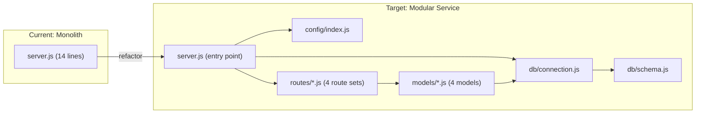

# Technical Specification

# 0. Agent Action Plan

## 0.1 Intent Clarification

### 0.1.1 Core Refactoring Objective

Based on the prompt, the Blitzy platform understands that the refactoring objective is to transform the existing minimal, stateless, single-file Node.js HTTP server (`server.js`) into a **structured database metadata monitoring and analytics service**. The user has provided four SQL table schema definitions that define the data model for tracking database table metadata, query execution statistics, table dependency relationships, and schema change history.

- **Refactoring type:** Code structure | Modularity | Tech stack expansion (adding a persistence layer to a stateless application)
- **Target repository:** Same repository — the existing `server.js` monolith will be decomposed and extended in place
- **Refactoring goals with enhanced clarity:**
  - **Introduce a relational data layer** — Add SQLite-backed persistence implementing the four user-specified table schemas (`tables_metadata`, `query_execution_stats`, `table_dependencies`, `schema_changes`)
  - **Decompose the monolithic server** — Break the single 14-line `server.js` into a modular, multi-file architecture with dedicated directories for database logic, route handling, models, and configuration
  - **Add package management** — Introduce `package.json` to manage the new external dependency (`better-sqlite3`) required for SQLite integration, transitioning the project from a zero-dependency model to a managed dependency model
  - **Implement REST API endpoints** — Expose HTTP routes for CRUD operations against each of the four defined tables, replacing the universal "Hello, World!" handler with purpose-driven request routing
  - **Preserve startup and configuration patterns** — Retain the existing configurable hostname/port constants and startup logging behavior from the original `server.js`

- **Implicit requirements surfaced:**
  - The original "Hello, World!" response behavior will be replaced; backward compatibility with the exact prior response contract (`200 OK` / `text/plain` / `Hello, World!\n` for all paths) is **not** preserved
  - A database initialization routine must be created to execute `CREATE TABLE IF NOT EXISTS` statements for all four schemas on application startup
  - The project will require a `package.json` file and `node_modules/` directory, breaking the prior "zero external dependencies" constraint
  - JSON response formatting (`Content-Type: application/json`) will replace the previous `text/plain` output for API endpoints
  - Input validation and error handling must be introduced for database write operations

### 0.1.2 Technical Interpretation

This refactoring translates to the following technical transformation strategy:

- **Current Architecture:** Monolithic single-file HTTP server (`server.js`, 14 lines) using only `require('http')` with a single handler that ignores all requests and returns a hardcoded string. Zero external dependencies, zero state, zero routing.

- **Target Architecture:** Layered, modular Node.js HTTP service with:
  - A **database layer** — SQLite file-based storage managed via `better-sqlite3`, initialized with four tables on startup
  - A **model/schema layer** — JavaScript modules defining schema creation SQL and data access methods for each table
  - A **routing layer** — URL path and HTTP method dispatching to specific handler functions
  - A **configuration layer** — Centralized server and database configuration constants
  - An **entry point** — Refactored `server.js` that wires together database initialization, route registration, and server startup

- **Transformation rules:**
  - The built-in `http` module will remain the HTTP server foundation (no Express or framework introduction required by the user)
  - All four user-provided schemas will be translated from SQL DDL notation into `CREATE TABLE IF NOT EXISTS` statements compatible with SQLite syntax
  - Each table will have a dedicated model module exporting CRUD functions via `better-sqlite3` prepared statements
  - The server request handler will parse `req.url` and `req.method` to dispatch to the appropriate table-specific route handler
  - JSON serialization/deserialization will be used for request bodies and response payloads



### 0.1.3 User-Provided Schema Definitions

The user has provided the following four table schemas exactly as specified:

**User Example: tables_metadata schema**
```
tables_metadata (
  table_id INT,
  table_name VARCHAR(100),
  row_count BIGINT,
  last_modified DATE
)
```

**User Example: query_execution_stats schema**
```
query_execution_stats (
  query_id INT,
  table_id INT,
  avg_execution_time_ms FLOAT,
  execution_count INT,
  error_count INT
)
```

**User Example: table_dependencies schema**
```
table_dependencies (
  parent_table_id INT,
  dependent_object VARCHAR(100)
)
```

**User Example: schema_changes schema**
```
schema_changes (
  table_id INT,
  change_date DATE
)
```


## 0.2 Source Analysis

### 0.2.1 Comprehensive Source File Discovery

The repository is an extremely minimal project containing only two source files and a documentation directory. A thorough inspection of the entire repository was conducted via `get_source_folder_contents` at the root level, `read_file` on each source file, and recursive traversal into the `blitzy/documentation/` directory.

**Complete Repository Inventory (all files listed):**

| File Path | Type | Lines | Size | Status | Refactoring Role |
|-----------|------|-------|------|--------|-----------------|
| `server.js` | Source | 14 | ~400B | UNCHANGED | Primary refactoring target — will be decomposed and extended |
| `README.md` | Documentation | 121 | ~3KB | UNCHANGED | Must be updated to reflect new architecture, endpoints, and setup |
| `blitzy/documentation/Project Guide.md` | Documentation | 248 | ~7KB | UNCHANGED | Internal Blitzy artifact — not in refactoring scope |
| `blitzy/documentation/Technical Specifications.md` | Documentation | 437 | ~12KB | UNCHANGED | Internal Blitzy artifact — not in refactoring scope |

**Current Directory Structure:**

```
(root)
├── server.js                              (14 lines - sole executable)
├── README.md                              (121 lines - project documentation)
└── blitzy/
    └── documentation/
        ├── Project Guide.md               (248 lines - Blitzy artifact)
        └── Technical Specifications.md    (437 lines - Blitzy artifact)
```

### 0.2.2 Source File Analysis

**server.js — Primary Refactoring Target**

The entire application is a 14-line Node.js script implementing features F-001 through F-004 as documented in the tech spec:

- **Line 1:** `const http = require('http');` — Imports the built-in `http` module (the only dependency)
- **Lines 3–4:** Configuration constants — `const hostname = '127.0.0.1';` and `const port = 3000;`
- **Lines 6–9:** Server creation via `http.createServer()` with an arrow-function handler that sets status code `200`, `Content-Type: text/plain` header, and ends with `'Hello, World!\n'`
- **Lines 11–13:** Server binding via `server.listen(port, hostname, callback)` with startup console log

**Key technical characteristics to preserve or transform:**
- Uses ES6+ syntax (const, arrow functions, template literals) — this convention will be maintained
- Uses CommonJS module system (`require()`) — this convention will be maintained across new modules
- Binds to loopback address `127.0.0.1` — this will be retained as the default
- Hardcoded configuration constants — these will be centralized in a config module
- Single universal handler — this will be replaced by a routing dispatcher

**README.md — Documentation Update Target**

The 121-line README documents the current "Hello World" server including:
- Prerequisites (Node.js v4+)
- Installation and usage instructions (`node server.js`)
- Configuration (hostname/port constants)
- API behavior (all methods/paths return same response)
- Project structure (single-file explanation)

All sections require updates to reflect the new database-backed, multi-file architecture.

### 0.2.3 Absent Infrastructure (New Files Required)

The following standard project artifacts do not exist and must be created as part of this refactoring:

- **`package.json`** — No package manifest exists; required to declare `better-sqlite3` dependency
- **Database modules** — No `db/`, `models/`, or persistence layer exists
- **Route handlers** — No routing logic exists; all handled inline
- **Configuration module** — No externalized config; constants are embedded in `server.js`
- **`.gitignore`** — No gitignore exists; `node_modules/` and `*.db` files must be excluded
- **Schema/migration files** — No SQL or schema definition files exist


## 0.3 Scope Boundaries

### 0.3.1 Exhaustively In Scope

**Source Transformations:**
- `server.js` — Refactored from monolithic 14-line script to modular entry point that initializes the database, registers routes, and starts the HTTP server
- `src/db/**/*.js` — New database connection and schema initialization modules
- `src/models/**/*.js` — New data access model modules for all four user-specified tables
- `src/routes/**/*.js` — New HTTP route handler modules dispatching CRUD operations per table
- `src/config/**/*.js` — New centralized configuration module extracting hostname, port, and database path constants

**New File Creation:**
- `package.json` — Project manifest with metadata, scripts, and `better-sqlite3` dependency
- `.gitignore` — Git ignore rules for `node_modules/`, `*.db`, and other generated artifacts
- `src/db/connection.js` — SQLite database connection singleton via `better-sqlite3`
- `src/db/schema.js` — DDL execution for all four tables (`tables_metadata`, `query_execution_stats`, `table_dependencies`, `schema_changes`)
- `src/models/tablesMetadata.js` — CRUD operations for `tables_metadata`
- `src/models/queryExecutionStats.js` — CRUD operations for `query_execution_stats`
- `src/models/tableDependencies.js` — CRUD operations for `table_dependencies`
- `src/models/schemaChanges.js` — CRUD operations for `schema_changes`
- `src/routes/tablesMetadata.js` — HTTP route handlers for `/api/tables-metadata`
- `src/routes/queryExecutionStats.js` — HTTP route handlers for `/api/query-execution-stats`
- `src/routes/tableDependencies.js` — HTTP route handlers for `/api/table-dependencies`
- `src/routes/schemaChanges.js` — HTTP route handlers for `/api/schema-changes`
- `src/routes/index.js` — Central route dispatcher
- `src/config/index.js` — Configuration constants for server and database

**Documentation Updates:**
- `README.md` — Full rewrite to document new project structure, setup instructions (including `npm install`), API endpoints, database schema, and configuration options

**Import Corrections:**
- Every new module file must use correct relative `require()` paths consistent with the `src/` directory structure
- `server.js` must import from `src/config`, `src/db`, and `src/routes` paths

### 0.3.2 Explicitly Out of Scope

- **`blitzy/` directory** — Internal Blitzy platform documentation artifacts (`Project Guide.md`, `Technical Specifications.md`) are not modified
- **Test framework introduction** — No test files, test runners (Jest, Mocha), or test configuration are requested by the user
- **TypeScript migration** — The project remains JavaScript ES6+ with CommonJS modules; no TypeScript conversion
- **Express or framework adoption** — The built-in `http` module remains the HTTP server foundation; no web framework is introduced
- **CI/CD pipelines** — No GitHub Actions, GitLab CI, or other continuous integration configuration
- **Docker or containerization** — No Dockerfile, docker-compose, or container orchestration
- **Authentication or authorization** — No access control, API keys, or security middleware
- **External database systems** — Only SQLite via `better-sqlite3` is in scope; no PostgreSQL, MySQL, or other database engines
- **Environment variable management** — No `.env` files or `dotenv` package; configuration remains hardcoded constants (matching the existing pattern)
- **Logging framework** — No Winston, Pino, or structured logging; `console.log` remains the logging mechanism


## 0.4 Target Design

### 0.4.1 Refactored Structure Planning

The target architecture transforms the flat, single-file project into a layered, modular structure following the separation-of-concerns principle. Every file and folder listed below is exhaustive and represents the complete target state.

```
Target:
├── server.js                          (refactored entry point — wires DB, routes, starts server)
├── package.json                       (new — project manifest and dependency declaration)
├── .gitignore                         (new — excludes node_modules/, *.db)
├── README.md                          (updated — reflects new architecture and API)
├── src/
│   ├── config/
│   │   └── index.js                   (new — centralized server and DB configuration)
│   ├── db/
│   │   ├── connection.js              (new — better-sqlite3 singleton connection)
│   │   └── schema.js                  (new — CREATE TABLE DDL for all four tables)
│   ├── models/
│   │   ├── tablesMetadata.js          (new — CRUD for tables_metadata)
│   │   ├── queryExecutionStats.js     (new — CRUD for query_execution_stats)
│   │   ├── tableDependencies.js       (new — CRUD for table_dependencies)
│   │   └── schemaChanges.js           (new — CRUD for schema_changes)
│   └── routes/
│       ├── index.js                   (new — central URL dispatcher)
│       ├── tablesMetadata.js          (new — HTTP handlers for /api/tables-metadata)
│       ├── queryExecutionStats.js     (new — HTTP handlers for /api/query-execution-stats)
│       ├── tableDependencies.js       (new — HTTP handlers for /api/table-dependencies)
│       └── schemaChanges.js           (new — HTTP handlers for /api/schema-changes)
└── blitzy/                            (unchanged — Blitzy platform artifacts)
    └── documentation/
        ├── Project Guide.md           (unchanged)
        └── Technical Specifications.md (unchanged)
```

### 0.4.2 Web Search Research Conducted

Research was performed to validate technology choices and design patterns for this refactoring:

- **better-sqlite3 (v12.6.2)** — Confirmed as the fastest and simplest SQLite library for Node.js, providing a synchronous API ideal for this use case. Requires Node.js v14.21.1 or later, fully compatible with Node.js v20.20.0 LTS. The synchronous API avoids callback/promise complexity in the built-in `http` handler where each request is already handled synchronously.

- **Node.js service-oriented architecture patterns** — The `config → db → models → routes → server` layered structure follows widely adopted Node.js separation-of-concerns conventions where business logic is isolated from transport (HTTP) concerns, and data access is abstracted behind model modules.

- **Singleton pattern for database connections** — The database connection should be instantiated once at application startup and shared across all model modules via CommonJS module caching, consistent with established Node.js singleton patterns for database resources.

- **Repository / Data Access pattern** — Each model module encapsulates all SQL operations for its respective table, exposing clean CRUD functions. This isolates database query logic from route handlers and enables future testability.

### 0.4.3 Design Pattern Applications

- **Singleton pattern** — Applied to the database connection (`src/db/connection.js`). A single `better-sqlite3` database instance is created on first `require()` and reused across all model imports via Node.js module caching.

- **Repository pattern** — Applied to each model module (`src/models/*.js`). Each model exports functions (`getAll`, `getById`, `create`, `update`, `delete`) that encapsulate prepared SQL statements. Route handlers call model functions without knowledge of SQL syntax.

- **Dispatcher pattern** — Applied to the route layer (`src/routes/index.js`). The central dispatcher parses `req.url` and `req.method`, then delegates to the appropriate table-specific route handler module based on URL prefix matching.

- **Configuration externalization** — Applied via `src/config/index.js`. Server hostname, port, and database file path are defined as named exports, centralizing all magic values that were previously scattered inline.

### 0.4.4 Schema Translation Strategy

The user-provided SQL schemas use generic SQL data types that must be translated to SQLite-compatible types:

| User Schema Type | SQLite Translation | Notes |
|-----------------|-------------------|-------|
| `INT` | `INTEGER` | Standard SQLite integer affinity |
| `BIGINT` | `INTEGER` | SQLite integers support up to 8 bytes natively |
| `VARCHAR(100)` | `TEXT` | SQLite does not enforce character length limits on TEXT |
| `FLOAT` | `REAL` | SQLite REAL is 8-byte IEEE floating point |
| `DATE` | `TEXT` | Stored as ISO 8601 strings (`YYYY-MM-DD`) per SQLite convention |

Primary keys will be added to each table where semantically appropriate:
- `tables_metadata.table_id` — `INTEGER PRIMARY KEY`
- `query_execution_stats.query_id` — `INTEGER PRIMARY KEY`
- `table_dependencies` — Composite key on `(parent_table_id, dependent_object)`
- `schema_changes` — Composite key on `(table_id, change_date)`

Foreign key relationships between `query_execution_stats.table_id`, `table_dependencies.parent_table_id`, `schema_changes.table_id` and `tables_metadata.table_id` will be enforced via `REFERENCES tables_metadata(table_id)` with SQLite `PRAGMA foreign_keys = ON`.


## 0.5 Transformation Mapping

### 0.5.1 File-by-File Transformation Plan

Every target file is mapped to a source file (where applicable) with its transformation mode and key changes. This mapping is exhaustive — no files are deferred or pending.

| Target File | Transformation | Source File | Key Changes |
|------------|---------------|-------------|-------------|
| `server.js` | UPDATE | `server.js` | Refactor from monolithic handler to modular entry point: import config, initialize database via `src/db/connection.js`, invoke schema setup via `src/db/schema.js`, replace universal handler with route dispatcher from `src/routes/index.js`, retain `server.listen()` with configured hostname/port |
| `package.json` | CREATE | _(none)_ | New file declaring project name `test1`, version `1.0.0`, main entry `server.js`, scripts (`start`, `init-db`), dependency on `better-sqlite3@^12.6.2`, engine constraint `node >=14.21.1` |
| `.gitignore` | CREATE | _(none)_ | New file with rules for `node_modules/`, `*.db`, `.DS_Store` |
| `README.md` | UPDATE | `README.md` | Full rewrite: update prerequisites to include npm, add `npm install` to setup steps, document all four API endpoint groups with HTTP methods, describe database schema, update project structure diagram, update configuration section to include DB path |
| `src/config/index.js` | CREATE | `server.js` | Extract `hostname` and `port` constants from `server.js` lines 3–4 into a dedicated config module; add `dbPath` constant for SQLite file location (default: `./data/metadata.db`) |
| `src/db/connection.js` | CREATE | _(none)_ | New module: `require('better-sqlite3')`, create singleton Database instance at `dbPath`, enable WAL mode and foreign keys via PRAGMAs, export the `db` instance |
| `src/db/schema.js` | CREATE | _(none)_ | New module: import `db` from `connection.js`, execute four `CREATE TABLE IF NOT EXISTS` statements translating user-provided DDL into SQLite-compatible SQL, export `initializeSchema()` function |
| `src/models/tablesMetadata.js` | CREATE | _(none)_ | New model: import `db`, export `getAll()`, `getById(id)`, `create(data)`, `update(id, data)`, `deleteById(id)` using `better-sqlite3` prepared statements against `tables_metadata` table |
| `src/models/queryExecutionStats.js` | CREATE | _(none)_ | New model: same pattern as `tablesMetadata.js` operating on `query_execution_stats` table; includes `getByTableId(tableId)` for filtered queries by `table_id` foreign key |
| `src/models/tableDependencies.js` | CREATE | _(none)_ | New model: same pattern operating on `table_dependencies` table; primary operations are `getAll()`, `getByParentId(parentTableId)`, `create(data)`, `deleteByParentAndObject(parentTableId, dependentObject)` |
| `src/models/schemaChanges.js` | CREATE | _(none)_ | New model: same pattern operating on `schema_changes` table; includes `getByTableId(tableId)` and `getByDateRange(startDate, endDate)` for filtered queries |
| `src/routes/index.js` | CREATE | `server.js` | New dispatcher module replacing the universal handler: parse `req.url` to match `/api/tables-metadata`, `/api/query-execution-stats`, `/api/table-dependencies`, `/api/schema-changes` prefixes; delegate to appropriate route handler; return 404 JSON for unmatched paths |
| `src/routes/tablesMetadata.js` | CREATE | `server.js` | New route handler: parse HTTP method (GET, POST, PUT, DELETE) and URL parameters for `/api/tables-metadata` endpoints; read JSON request bodies; call `tablesMetadata` model functions; return JSON responses with appropriate status codes |
| `src/routes/queryExecutionStats.js` | CREATE | `server.js` | New route handler: same pattern for `/api/query-execution-stats` endpoints |
| `src/routes/tableDependencies.js` | CREATE | `server.js` | New route handler: same pattern for `/api/table-dependencies` endpoints |
| `src/routes/schemaChanges.js` | CREATE | `server.js` | New route handler: same pattern for `/api/schema-changes` endpoints |

### 0.5.2 Cross-File Dependencies

**Import Statement Updates:**

The original `server.js` has a single import (`const http = require('http');`). After refactoring, the import graph expands significantly:

- **server.js (updated):**
  - FROM: `const http = require('http');`
  - TO: `const http = require('http');` + `const config = require('./src/config');` + `const { initializeDatabase } = require('./src/db/connection');` + `const { initializeSchema } = require('./src/db/schema');` + `const { handleRequest } = require('./src/routes');`

- **src/routes/index.js → src/routes/*.js:**
  - `const tablesMetadataRoutes = require('./tablesMetadata');`
  - `const queryExecutionStatsRoutes = require('./queryExecutionStats');`
  - `const tableDependenciesRoutes = require('./tableDependencies');`
  - `const schemaChangesRoutes = require('./schemaChanges');`

- **src/routes/*.js → src/models/*.js:**
  - Each route handler requires its corresponding model: e.g., `const tablesMetadata = require('../models/tablesMetadata');`

- **src/models/*.js → src/db/connection.js:**
  - Every model module requires the shared database instance: `const db = require('../db/connection');`

- **src/db/schema.js → src/db/connection.js:**
  - `const db = require('./connection');`

- **src/db/connection.js → src/config/index.js:**
  - `const { dbPath } = require('../config');`

**Configuration Updates:**
- `server.js` will read `hostname` and `port` from `src/config/index.js` instead of declaring local constants
- `src/db/connection.js` will read `dbPath` from `src/config/index.js` for the SQLite file location
- A `data/` directory will be created automatically on first database initialization (if it does not exist)

### 0.5.3 Wildcard Patterns

All wildcard patterns are trailing and specific:

- `src/models/*.js` — All four model modules (tablesMetadata, queryExecutionStats, tableDependencies, schemaChanges)
- `src/routes/*.js` — All five route modules (index dispatcher + four table-specific handlers)
- `src/db/*.js` — Both database modules (connection and schema)
- `src/config/*.js` — Configuration module

### 0.5.4 One-Phase Execution

The entire refactor will be executed by Blitzy in **ONE phase**. All 16 file operations (1 update to `server.js`, 1 update to `README.md`, 14 new file creations) are included in a single execution pass. No files are deferred to future phases.


## 0.6 Dependency Inventory

### 0.6.1 Key Packages

The current project has **zero** external dependencies — no `package.json`, no `node_modules/`, no lock files exist. The refactoring introduces a single new external dependency.

| Registry | Package Name | Version | Purpose |
|----------|-------------|---------|---------|
| npm | `better-sqlite3` | `12.6.2` | Synchronous SQLite3 database driver for Node.js — provides the persistence layer for all four user-specified table schemas |
| _(built-in)_ | `http` | _(Node.js core)_ | HTTP server creation — already in use, no installation required |
| _(built-in)_ | `path` | _(Node.js core)_ | File path resolution for database file location — no installation required |
| _(built-in)_ | `fs` | _(Node.js core)_ | Directory creation for `data/` folder ensuring database path exists — no installation required |

**Version Justification for better-sqlite3@12.6.2:**
- Version `12.6.2` is the latest stable release as confirmed via npm registry search
- Requires Node.js v14.21.1 or later — fully compatible with the project's Node.js v20.20.0 LTS runtime
- Prebuilt binaries are available for LTS versions, ensuring clean installation without native compilation
- Provides synchronous API that aligns naturally with the built-in `http` module's synchronous request handler pattern

### 0.6.2 Dependency Updates

**Import Refactoring:**

Since the project currently has only one import statement in one file, the refactoring does not update existing imports — it establishes a new import graph from scratch. The full import map is as follows:

- `server.js` — Adds new imports for `src/config`, `src/db/connection`, `src/db/schema`, `src/routes`
- `src/config/index.js` — No external imports (exports only constants)
- `src/db/connection.js` — Adds `require('better-sqlite3')` and `require('../config')`
- `src/db/schema.js` — Adds `require('./connection')`
- `src/models/*.js` — Each adds `require('../db/connection')`
- `src/routes/index.js` — Adds `require('./tablesMetadata')`, `require('./queryExecutionStats')`, `require('./tableDependencies')`, `require('./schemaChanges')`
- `src/routes/tablesMetadata.js` — Adds `require('../models/tablesMetadata')`
- `src/routes/queryExecutionStats.js` — Adds `require('../models/queryExecutionStats')`
- `src/routes/tableDependencies.js` — Adds `require('../models/tableDependencies')`
- `src/routes/schemaChanges.js` — Adds `require('../models/schemaChanges')`

**External Reference Updates:**

| File | Update Type | Details |
|------|------------|---------|
| `package.json` | CREATE | Declares `better-sqlite3@^12.6.2` in `dependencies`, sets `"main": "server.js"`, adds `"start": "node server.js"` script |
| `.gitignore` | CREATE | Excludes `node_modules/`, `data/*.db`, `.DS_Store` |
| `README.md` | UPDATE | Add `npm install` to setup instructions, document `better-sqlite3` as required dependency, update prerequisites section |

### 0.6.3 Package.json Specification

The new `package.json` will contain the following structure:

```json
{
  "name": "test1",
  "version": "1.0.0",
  "description": "Database metadata monitoring and analytics service",
  "main": "server.js",
  "scripts": {
    "start": "node server.js"
  },
  "dependencies": {
    "better-sqlite3": "^12.6.2"
  },
  "engines": {
    "node": ">=14.21.1"
  }
}
```


## 0.7 Refactoring Rules

### 0.7.1 Refactoring-Specific Rules

- **Preserve the built-in HTTP module pattern** — The refactored application must continue using `require('http')` and `http.createServer()` as the HTTP server foundation. No Express, Fastify, Koa, or other web framework shall be introduced.

- **Preserve startup logging behavior** — The original startup `console.log` message pattern (`Server running at http://${hostname}:${port}/`) must be retained in the refactored `server.js`, augmented with a database initialization confirmation message.

- **Preserve configuration constants pattern** — The `hostname` and `port` values must remain configurable constants (not environment variables), relocated to `src/config/index.js` but functionally equivalent to the original inline declarations.

- **Maintain CommonJS module convention** — All new and existing files must use `require()` / `module.exports` syntax consistent with the project's established ES6+ CommonJS pattern. No ES module (`import/export`) syntax shall be introduced.

- **Implement all four user-specified schemas exactly** — Each table must include every column defined in the user's schema input with appropriate SQLite type translations. No columns shall be added, renamed, or omitted.

- **Use prepared statements for all SQL operations** — All `better-sqlite3` database interactions must use `.prepare()` with parameterized queries to prevent SQL injection and ensure performance. No raw string interpolation in SQL.

- **Enable SQLite WAL mode and foreign keys** — The database connection must execute `PRAGMA journal_mode = WAL` and `PRAGMA foreign_keys = ON` immediately after opening, per `better-sqlite3` best practices for performance and referential integrity.

- **Return JSON responses for all API endpoints** — All HTTP responses from API routes must use `Content-Type: application/json` and return well-formed JSON payloads. Error responses must include an `error` field with a descriptive message.

- **Use HTTP status codes correctly** — API routes must return `200` for successful reads, `201` for successful creates, `200` for successful updates, `200` for successful deletes, `400` for malformed requests, `404` for resource not found, and `500` for server errors.

### 0.7.2 Special Instructions and Constraints

- **No backward compatibility with the Hello World endpoint** — The universal `200 OK / text/plain / Hello, World!\n` response is intentionally replaced. The refactoring is a functional transformation, not an additive feature.

- **SQLite file-based storage** — The database must persist to a file on disk (default `./data/metadata.db`), not in-memory, ensuring data survives server restarts.

- **Automatic schema initialization** — On server startup, `CREATE TABLE IF NOT EXISTS` statements must execute for all four tables. No separate migration tool or manual initialization step is required.

- **No `.env` or dotenv** — Configuration remains as hardcoded JavaScript constants in `src/config/index.js`, consistent with the project's existing approach. Environment variable support is out of scope.

- **Data directory auto-creation** — If the `./data/` directory does not exist when the server starts, it must be created automatically using `fs.mkdirSync` with `{ recursive: true }` before the database connection is opened.

### 0.7.3 Coding Conventions

- **ES6+ syntax** — Use `const` for all declarations (use `let` only where reassignment is necessary), arrow functions for callbacks, template literals for string interpolation, and destructuring for imports
- **Naming conventions** — camelCase for file names, variable names, and function names; snake_case for SQL table and column names (matching the user's schema definitions)
- **Error handling** — Wrap all database operations in try/catch blocks; propagate errors to the route layer which returns appropriate HTTP error responses
- **No semicolons** — Follow the convention observed in the original `server.js` which uses semicolons at statement ends (the original does use semicolons, so this convention is maintained)


## 0.8 References

### 0.8.1 Repository Files and Folders Searched

The following files and folders were comprehensively searched across the codebase to derive the conclusions in this Agent Action Plan:

| Path | Type | Tool Used | Key Findings |
|------|------|-----------|-------------|
| _(root)_ | Folder | `get_source_folder_contents` | Contains `server.js`, `README.md`, and `blitzy/` directory; confirmed minimal repository structure |
| `server.js` | File | `read_file` | 14-line monolithic HTTP server; sole executable in the project; uses `http.createServer()` with hardcoded config |
| `README.md` | File | `read_file` | 121-line documentation covering setup, usage, configuration, and API behavior of the Hello World server |
| `blitzy/` | Folder | `get_source_folder_contents` | Contains single `documentation/` subdirectory with Blitzy platform artifacts |
| `blitzy/documentation/` | Folder | `get_source_folder_contents` | Contains `Project Guide.md` (248 lines) and `Technical Specifications.md` (437 lines) |

### 0.8.2 Technical Specification Sections Retrieved

The following tech spec sections were retrieved via `get_tech_spec_section` to inform the analysis:

| Section | Key Insights |
|---------|-------------|
| 1.1 Executive Summary | Test1 is a minimal Node.js HTTP server serving as a Blitzy platform exploration initiative |
| 1.3 Scope | Explicitly states "No database integrations" as out of scope for the current spec — this refactoring extends beyond the original scope |
| 2.1 Feature Catalog | Five features (F-001 through F-005) documented; F-001 Server Creation and F-002 Universal Request Handling are directly affected |
| 2.2 Functional Requirements | Detailed acceptance criteria for all features; all F-001/F-002 requirements currently pass — the refactoring changes their behavior |
| 3.1 Programming Languages | JavaScript ES6+ (CommonJS) is the sole language; no TypeScript |
| 3.2 Runtime Environment | Node.js v20.20.0 LTS "Iron" installed and recommended; compatible with v4.x through v24.x |
| 3.4 Open Source Dependencies | Zero external dependencies confirmed; no package.json or node_modules exist |
| 5.1 High-Level Architecture | Monolithic single-file architecture with zero external integration points |
| 5.2 Component Details | server.js implements F-001 through F-004 with dependency chain: F-004 → F-001 → F-002 + F-003 |
| 5.5 Repository Structure | 4 files across 3 directories documented |
| 6.2 Database Design | "Database Design is not applicable to this system" — four formal constraints (C-001 through C-004) preclude database introduction in current spec |

### 0.8.3 Web Searches Conducted

| Query | Purpose | Key Result |
|-------|---------|------------|
| "Node.js SQLite better-sqlite3 database service refactoring best practices" | Validate technology choice and integration patterns | Confirmed `better-sqlite3` provides synchronous API ideal for Node.js HTTP handlers; WAL mode recommended for performance |
| "Node.js database metadata monitoring service architecture patterns" | Research architectural patterns for the target structure | Validated layered config → db → models → routes → server separation-of-concerns pattern as industry standard |
| "better-sqlite3 npm latest version 2025" | Confirm current stable version for dependency specification | Confirmed latest version is `12.6.2`, requires Node.js v14.21.1+, prebuilt binaries available for LTS |

### 0.8.4 Environment Verification

| Check | Result |
|-------|--------|
| Node.js version | v20.20.0 (at `/usr/bin/node`) |
| npm version | 11.1.0 |
| `.blitzyignore` files | None found (searched entire filesystem) |
| Environment files (`/tmp/environments_files/`) | Directory does not exist |
| User-provided setup instructions | None provided |
| User-provided environment variables | None |
| User-provided secrets | None |

### 0.8.5 Attachments

No file attachments were provided by the user. No Figma URLs were referenced.

The user's input consisted solely of four SQL table schema definitions provided inline as text:
- `tables_metadata` — 4 columns describing database table metadata
- `query_execution_stats` — 5 columns tracking query performance metrics
- `table_dependencies` — 2 columns mapping parent-child table relationships
- `schema_changes` — 2 columns recording schema modification history


