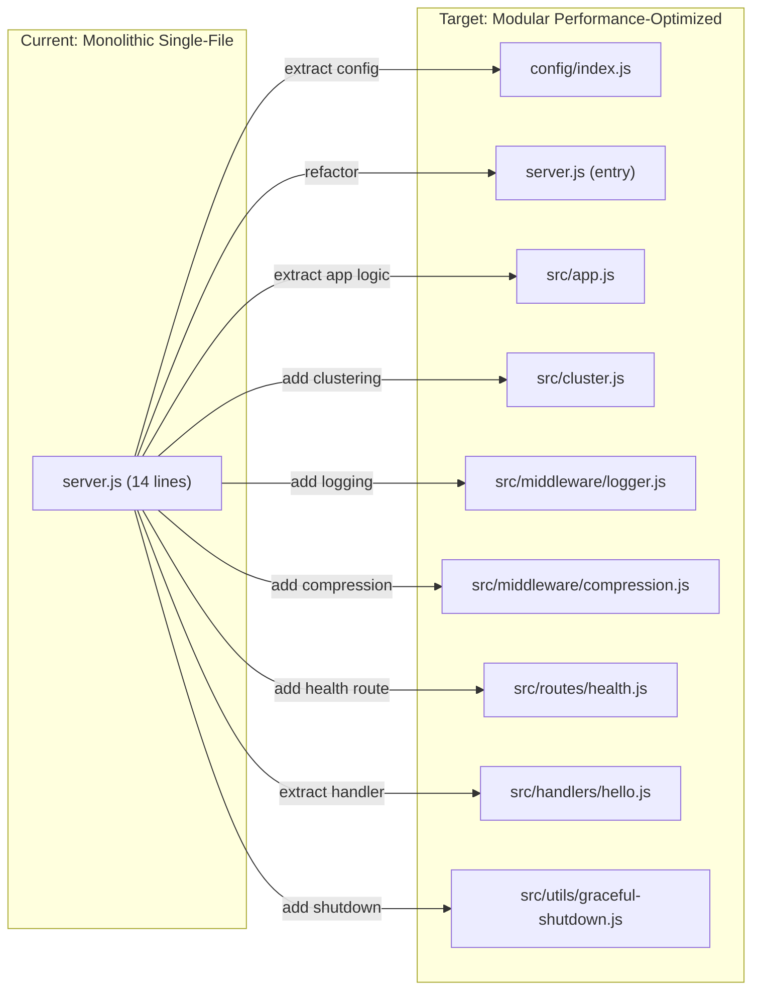
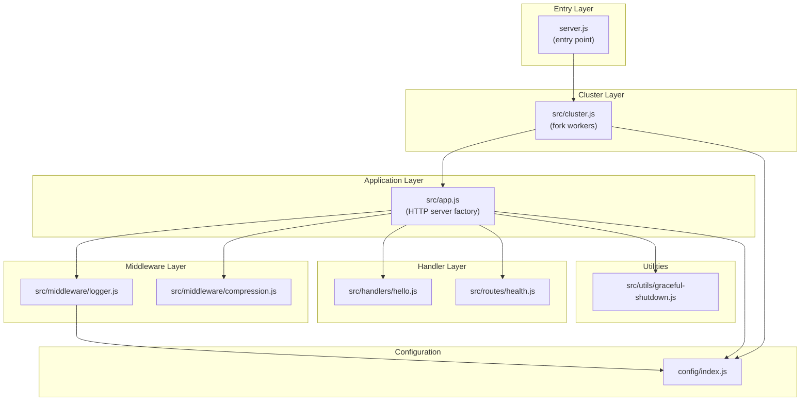

# Technical Specification

# 0. Agent Action Plan

## 0.1 Intent Clarification

### 0.1.1 Core Refactoring Objective

Based on the prompt, the Blitzy platform understands that the refactoring objective is to **analyze and restructure the existing minimal single-file Node.js HTTP server (`server.js`) to optimize application performance while ensuring the core business flow — responding to all HTTP requests with `200 OK`, `Content-Type: text/plain`, and `Hello, World!\n` — remains fully intact.** The user has also requested that the platform suggest additional integrations where beneficial.

- **Refactoring type:** Performance optimization + Code structure + Modularity
- **Target repository:** Same repository (in-place refactoring)
- **Refactoring goals with enhanced clarity:**
  - **Multi-core utilization:** The current 14-line `server.js` runs as a single-threaded, single-process application on one CPU core. Refactor to leverage the Node.js `cluster` module so the server can utilize all available CPU cores, linearly increasing request throughput.
  - **Modular code architecture:** Decompose the monolithic single-file server into a well-structured, multi-file layout separating configuration, server creation, request handling, clustering logic, health monitoring, and logging into distinct modules.
  - **Error handling and resilience:** The existing code has zero application-level error handling — no `try/catch`, no `server.on('error')`, no graceful shutdown hooks. Introduce robust error handling for `EADDRINUSE`, uncaught exceptions, and `SIGINT`/`SIGTERM` signals.
  - **Externalized configuration:** Replace the hardcoded `hostname` (`127.0.0.1`) and `port` (`3000`) constants with environment-variable-driven configuration, enabling flexible deployment without code changes.
  - **Observability improvements:** Introduce request-level logging (method, URL, status code, response time) and structured startup/shutdown logs to move beyond the single `console.log()` statement that exists today.
  - **Health check endpoint:** Add a dedicated `/health` route returning server health metadata (uptime, memory usage, process ID) to enable monitoring integrations and load-balancer readiness probes.
  - **Response compression:** Introduce gzip/deflate compression on HTTP responses to reduce network payload size, improving performance for clients on bandwidth-constrained connections.
  - **Graceful shutdown:** Implement proper `SIGINT`/`SIGTERM` handling that closes the HTTP server and allows in-flight requests to complete before the process exits.
- **Implicit requirements surfaced:**
  - The `Hello, World!\n` response contract must remain byte-identical for backward compatibility
  - All existing HTTP behaviors (method-agnostic, path-agnostic for the default route) must be preserved
  - The application must continue to operate with zero mandatory external service dependencies (databases, caches, message queues)
  - A `package.json` must be introduced to manage any new dependencies, transitioning from a zero-dependency project to a managed-dependency project
  - The `/health` endpoint is the only route that introduces differentiated behavior; all other paths must continue returning the original response
  - Tests should be added to validate that the refactored code preserves the original business flow

### 0.1.2 Technical Interpretation

This refactoring translates to the following technical transformation strategy:

- **Current architecture:** Monolithic single-file (`server.js`, 14 lines), zero dependencies, single-process, single-thread, hardcoded configuration, no error handling, no logging beyond startup, no routing, and no health monitoring
- **Target architecture:** Modular multi-file Node.js application with clustered worker processes, externalized environment-based configuration, layered request handling with a health check route, structured logging, gzip compression middleware, graceful shutdown logic, and a `package.json` for dependency management



- **Transformation rules:**
  - Every module handles a single concern (Single Responsibility Principle)
  - Configuration is centralized in a `config/` module and consumed via `require()`
  - The HTTP server creation and the application entry point are separated to enable testability
  - Clustering wraps the server startup, forking one worker per CPU core
  - Middleware functions are composable and applied in sequence before the request handler
  - All new dependencies are explicitly declared in `package.json` with exact versions


## 0.2 Source Analysis

### 0.2.1 Comprehensive Source File Discovery

The Test1 repository is intentionally minimal, consisting of **4 files across 3 directories**. An exhaustive analysis of every file has been performed.

**Complete Repository Inventory:**

| File Path | Type | Lines | Status | Relevance to Refactor |
|-----------|------|-------|--------|-----------------------|
| `server.js` | Application Code | 14 | Primary refactoring target | Core executable; all logic resides here |
| `README.md` | Documentation | 121 | Requires updates | Must be updated to reflect new structure, configuration, and usage |
| `blitzy/documentation/Project Guide.md` | Documentation | 248 | Reference only | Contains validation results and development runbook |
| `blitzy/documentation/Technical Specifications.md` | Documentation | 437 | Reference only | Contains scope boundaries and coverage targets |

**Current Structure:**

```
Test1/
├── server.js                          (14 lines — sole executable, ALL logic here)
├── README.md                          (121 lines — project documentation)
└── blitzy/
    └── documentation/
        ├── Project Guide.md           (248 lines — task report)
        └── Technical Specifications.md (437 lines — spec placeholder)
```

### 0.2.2 Primary Refactoring Target: server.js

The entire application logic resides in a single 14-line file. A line-by-line analysis reveals the following decomposition points:

| Line(s) | Code | Current Concern | Target Module |
|---------|------|-----------------|---------------|
| 1 | `const http = require('http');` | Module import | `src/app.js` |
| 3 | `const hostname = '127.0.0.1';` | Configuration (hardcoded) | `config/index.js` |
| 4 | `const port = 3000;` | Configuration (hardcoded) | `config/index.js` |
| 6–10 | `const server = http.createServer((req, res) => { ... });` | Server creation + request handler (mixed) | `src/app.js` + `src/handlers/hello.js` |
| 7 | `res.statusCode = 200;` | Response status | `src/handlers/hello.js` |
| 8 | `res.setHeader('Content-Type', 'text/plain');` | Response headers | `src/handlers/hello.js` |
| 9 | `res.end('Hello, World!\n');` | Response body | `src/handlers/hello.js` |
| 12–14 | `server.listen(port, hostname, () => { console.log(...) });` | Network binding + startup log | `src/app.js` + `config/index.js` |

**Key Observations from Source:**
- The `req` object is completely ignored — no routing, no method checks, no body parsing
- All values (`200`, `text/plain`, `Hello, World!\n`) are hardcoded literals
- The server binds exclusively to loopback (`127.0.0.1`), limiting it to local-only access
- There are zero `try/catch` blocks, zero `server.on('error')` listeners, and zero signal handlers
- The sole observability mechanism is a single `console.log()` in the listen callback
- No `package.json` exists — the project has zero managed dependencies
- The CommonJS module system (`require`) is used, compatible with Node.js v4+

### 0.2.3 Documentation File: README.md

The `README.md` (121 lines) documents the current single-file architecture, usage instructions, configuration parameters (hostname/port table), and API behavior (response contract). Key sections that require updates after refactoring:

- **Prerequisites** — must reflect `npm install` requirement after `package.json` is introduced
- **Getting Started** — must include dependency installation step
- **Configuration** — must document environment variable support (`HOST`, `PORT`)
- **Project Structure** — must reflect the new multi-file directory layout
- **API Behavior** — must document the new `/health` endpoint alongside the existing universal response
- **Usage** — must update startup instructions if clustering or PM2 is introduced

### 0.2.4 Absence of Supporting Infrastructure

The following files and directories are confirmed **absent** from the repository, all of which are expected to be created as part of this refactor:

| Missing Artifact | Impact |
|-----------------|--------|
| `package.json` | No dependency management; must be created |
| `node_modules/` | No installed packages; will be populated after `npm install` |
| `.env` / `.env.example` | No environment configuration; must be created |
| `tests/` or `__tests__/` | No test suite; should be created |
| `.gitignore` | No ignore rules; must be created to exclude `node_modules/` |
| `src/` | No modular source directory; must be created |
| `config/` | No configuration module; must be created |


## 0.3 Scope Boundaries

### 0.3.1 Exhaustively In Scope

**Source Transformations:**
- `server.js` — Primary refactoring target; decompose into modular multi-file architecture
- `src/**/*.js` — All new JavaScript source modules to be created under the `src/` directory
- `config/**/*.js` — Configuration module(s) for environment-based settings

**New File Creation:**
- `package.json` — Dependency manifest with scripts for start, cluster, and test
- `.env.example` — Template environment configuration file
- `.gitignore` — Git ignore rules for `node_modules/`, `.env`, and runtime artifacts
- `src/app.js` — Application factory creating the HTTP server and composing middleware
- `src/cluster.js` — Clustering entry point leveraging Node.js `cluster` module
- `src/handlers/hello.js` — Extracted "Hello, World!" request handler preserving original behavior
- `src/routes/health.js` — Health check route handler returning server metrics
- `src/middleware/logger.js` — Request-level logging middleware
- `src/middleware/compression.js` — Gzip/deflate response compression middleware
- `src/utils/graceful-shutdown.js` — Graceful shutdown utility for SIGINT/SIGTERM handling

**Test Creation:**
- `tests/hello.test.js` — Tests verifying the core "Hello, World!" response contract
- `tests/health.test.js` — Tests verifying the `/health` endpoint response
- `tests/app.test.js` — Integration tests for the composed application

**Documentation Updates:**
- `README.md` — Update prerequisites, setup instructions, project structure, configuration, and API behavior sections to reflect the new modular architecture

**Configuration Updates:**
- `package.json` — New file defining name, version, scripts, and dependencies
- `.env.example` — New file documenting available environment variables

**Import Corrections:**
- Every file consuming configuration values must import from `config/index.js`
- Every file composing middleware must import from `src/middleware/*.js`
- The entry point (`server.js`) must wire clustering or direct server startup

### 0.3.2 Explicitly Out of Scope

The following items are **explicitly excluded** from this refactoring exercise, consistent with the project's nature as a platform exploration initiative:

| Exclusion | Rationale |
|-----------|-----------|
| Database integration (PostgreSQL, MongoDB, Redis) | The application is stateless by design; no data layer is needed |
| External API integrations (third-party REST/gRPC calls) | No outbound service dependencies exist or are required |
| Frontend / UI layer (HTML, CSS, React, etc.) | The server returns `text/plain` only; no UI is applicable |
| Docker / containerization | Container orchestration is beyond the exploration project scope |
| CI/CD pipeline configuration | Build and deployment automation is not requested |
| HTTPS / TLS certificates | Encryption at the transport layer is not required for loopback-only usage |
| Authentication / authorization middleware | No user identity management is needed for this server |
| WebSocket or real-time communication | The server serves stateless HTTP responses only |
| Cloud deployment (AWS, GCP, Azure) | The application runs on a local machine only |
| TypeScript migration | The project uses plain JavaScript; type system is not requested |
| ESM migration (`import`/`export`) | CommonJS (`require`) is retained for backward compatibility with Node.js v4+ |


## 0.4 Target Design

### 0.4.1 Refactored Structure Planning

The target architecture transforms the monolithic 14-line `server.js` into a well-organized, modular application following Node.js best practices for separation of concerns, testability, and performance optimization.

```
Target:
Test1/
├── package.json                          (NEW — dependency manifest and npm scripts)
├── .env.example                          (NEW — environment variable template)
├── .gitignore                            (NEW — ignore node_modules, .env, logs)
├── server.js                             (UPDATE — entry point; delegates to cluster or app)
├── README.md                             (UPDATE — reflect new structure, config, and usage)
├── config/
│   └── index.js                          (NEW — centralized environment-based configuration)
├── src/
│   ├── app.js                            (NEW — HTTP server factory, composes middleware and routes)
│   ├── cluster.js                        (NEW — multi-core clustering via Node.js cluster module)
│   ├── handlers/
│   │   └── hello.js                      (NEW — extracted Hello World request handler)
│   ├── routes/
│   │   └── health.js                     (NEW — /health endpoint returning server metrics)
│   ├── middleware/
│   │   ├── logger.js                     (NEW — request-level logging middleware)
│   │   └── compression.js                (NEW — gzip/deflate response compression)
│   └── utils/
│       └── graceful-shutdown.js          (NEW — SIGINT/SIGTERM graceful shutdown utility)
├── tests/
│   ├── hello.test.js                     (NEW — tests for Hello World response contract)
│   ├── health.test.js                    (NEW — tests for /health endpoint)
│   └── app.test.js                       (NEW — integration tests for composed application)
└── blitzy/
    └── documentation/
        ├── Project Guide.md              (UNCHANGED — reference documentation)
        └── Technical Specifications.md   (UNCHANGED — reference documentation)
```

### 0.4.2 Web Search Research Conducted

Research was conducted to identify industry best practices applicable to this refactoring:

- **Node.js performance optimization:** Clustering via the `cluster` module is the primary technique for utilizing multi-core CPUs. A single Node.js instance runs on one core; forking worker processes linearly scales throughput. Gzip compression reduces response payload size. Structured logging enables observability without blocking the event loop.
- **Node.js modular architecture conventions:** Best practice dictates separating entry point (`server.js`), application factory (`app.js`), configuration (`config/`), routes, handlers, middleware, and utilities into distinct modules. This layered approach follows the Single Responsibility Principle and enables isolated testing.
- **Graceful shutdown strategies:** Listening for `SIGTERM` and `SIGINT` signals, calling `server.close()` to stop accepting new connections, and allowing in-flight requests to complete before `process.exit(0)` ensures no dropped requests during deployments or restarts.
- **Health check patterns:** A dedicated `/health` endpoint returning JSON with `uptime`, `timestamp`, `memoryUsage`, and `status` fields is the industry standard for load-balancer readiness and liveness probes.

### 0.4.3 Design Pattern Applications

| Pattern | Application in Refactor |
|---------|------------------------|
| **Factory pattern** | `src/app.js` exports a `createApp()` function that builds and returns a configured HTTP server, enabling test environments to create isolated server instances |
| **Middleware pipeline** | Request processing flows through logger → compression → route handler, following the composable middleware pattern common in Node.js applications |
| **Singleton configuration** | `config/index.js` reads environment variables once at startup and exports a frozen configuration object consumed by all modules |
| **Cluster pattern** | `src/cluster.js` uses the Node.js `cluster` module to fork one worker per CPU core; the master process monitors workers and restarts them on crash |
| **Separation of concerns** | Each file handles exactly one responsibility: configuration, routing, handling, logging, compression, or shutdown |
| **Strategy pattern (routing)** | The request handler inspects `req.url` to route `/health` requests to the health handler and all other requests to the hello handler, preserving the original method-agnostic and path-agnostic behavior for non-health paths |

### 0.4.4 Module Responsibility Map




## 0.5 Transformation Mapping

### 0.5.1 File-by-File Transformation Plan

The complete transformation map covers every target file, its transformation mode, source origin, and key changes. The entire refactor executes in **one phase** — no multi-phase splitting.

| Target File | Transformation | Source File | Key Changes |
|------------|---------------|-------------|-------------|
| `server.js` | UPDATE | `server.js` | Replace monolithic logic with entry point that delegates to `src/cluster.js` or `src/app.js` based on clustering mode; retain as the sole executable entry point |
| `package.json` | CREATE | — | Define project name, version, description, `main` field pointing to `server.js`, npm scripts (`start`, `start:cluster`, `test`), and all runtime/dev dependencies with exact versions |
| `.env.example` | CREATE | — | Document `HOST`, `PORT`, `ENABLE_CLUSTERING`, and `LOG_LEVEL` environment variables with default values |
| `.gitignore` | CREATE | — | Exclude `node_modules/`, `.env`, `*.log`, `coverage/` |
| `config/index.js` | CREATE | `server.js` (lines 3–4) | Extract `hostname` and `port` from hardcoded constants to `process.env`-driven configuration with sensible defaults (`HOST=127.0.0.1`, `PORT=3000`, `ENABLE_CLUSTERING=false`) |
| `src/app.js` | CREATE | `server.js` (lines 1, 6–14) | Create `createApp()` factory function that builds the HTTP server, composes middleware pipeline (logger → compression → routing), binds to configured host/port, and attaches graceful shutdown handlers |
| `src/cluster.js` | CREATE | — | Implement Node.js `cluster` module pattern: master process forks one worker per CPU core; workers each call `createApp()` from `src/app.js`; master monitors for worker exits and respawns |
| `src/handlers/hello.js` | CREATE | `server.js` (lines 7–9) | Export a function `helloHandler(req, res)` that sets `res.statusCode = 200`, `res.setHeader('Content-Type', 'text/plain')`, and `res.end('Hello, World!\n')` — byte-identical to original |
| `src/routes/health.js` | CREATE | — | Export a function `healthHandler(req, res)` that returns JSON `{ status: 'OK', uptime, timestamp, memoryUsage, pid }` with `Content-Type: application/json` and status `200` |
| `src/middleware/logger.js` | CREATE | — | Export a middleware function that logs `method`, `url`, `statusCode`, and response time in milliseconds for each request to stdout |
| `src/middleware/compression.js` | CREATE | — | Export a middleware function that checks the `Accept-Encoding` request header and applies gzip or deflate compression to the response body using Node.js built-in `zlib` module |
| `src/utils/graceful-shutdown.js` | CREATE | — | Export a function that listens for `SIGINT` and `SIGTERM`, calls `server.close()`, and exits cleanly after in-flight requests complete (with a 30-second force-kill timeout) |
| `tests/hello.test.js` | CREATE | `server.js` (behavior reference) | Test that GET/POST/PUT/DELETE to any path returns `200`, `text/plain`, `Hello, World!\n`; test method-agnostic and path-agnostic behavior |
| `tests/health.test.js` | CREATE | — | Test that GET `/health` returns `200`, `application/json`, and body contains `status`, `uptime`, `timestamp`, `memoryUsage`, `pid` fields |
| `tests/app.test.js` | CREATE | — | Integration test that creates an app instance, sends requests, validates middleware pipeline (logging, compression), and verifies graceful shutdown |
| `README.md` | UPDATE | `README.md` | Update Prerequisites (add `npm install`), Getting Started (add dep install step), Configuration (document env vars), Project Structure (new tree), API Behavior (add `/health` endpoint), Usage (update run commands) |

### 0.5.2 Cross-File Dependencies

**Import statement updates across the refactored codebase:**

- **server.js (entry point):**
  - FROM: `const http = require('http');` (direct http module usage)
  - TO: `const { startCluster } = require('./src/cluster');` or `const { createApp } = require('./src/app');`

- **src/app.js:**
  - FROM: N/A (new file)
  - TO: `const http = require('http');` + `const config = require('../config');` + `const { helloHandler } = require('./handlers/hello');` + `const { healthHandler } = require('./routes/health');` + `const { requestLogger } = require('./middleware/logger');` + `const { compressResponse } = require('./middleware/compression');` + `const { setupGracefulShutdown } = require('./utils/graceful-shutdown');`

- **src/cluster.js:**
  - TO: `const cluster = require('cluster');` + `const os = require('os');` + `const { createApp } = require('./app');` + `const config = require('../config');`

- **config/index.js:**
  - TO: `module.exports = { host, port, enableClustering, logLevel }` (reads from `process.env` with defaults)

- **All test files:**
  - TO: `const http = require('http');` + `const { createApp } = require('../src/app');`

**Configuration flow:**
- `config/index.js` → consumed by `server.js`, `src/app.js`, `src/cluster.js`, `src/middleware/logger.js`

### 0.5.3 Wildcard Patterns

| Pattern | Scope | Mode |
|---------|-------|------|
| `src/**/*.js` | All new source modules | CREATE |
| `config/**/*.js` | Configuration modules | CREATE |
| `tests/**/*.test.js` | All test files | CREATE |

All wildcard patterns use trailing patterns only, as required.

### 0.5.4 One-Phase Execution

The entire refactoring is executed by Blitzy in **one single phase**. All 16 files listed in the transformation table above are created or updated simultaneously, with no phased rollout or incremental delivery. The dependency order within the phase is:

1. `package.json` and `.gitignore` (project scaffolding)
2. `config/index.js` (configuration foundation)
3. `src/handlers/hello.js` and `src/routes/health.js` (leaf-level handlers)
4. `src/middleware/logger.js` and `src/middleware/compression.js` (middleware layer)
5. `src/utils/graceful-shutdown.js` (utility)
6. `src/app.js` (application factory composing all above)
7. `src/cluster.js` (clustering wrapper around app)
8. `server.js` (entry point update)
9. `tests/**/*.test.js` (validation tests)
10. `README.md` (documentation update)
11. `.env.example` (configuration documentation)


## 0.6 Dependency Inventory

### 0.6.1 Key Private and Public Packages

The original Test1 project has **zero dependencies** — no `package.json` exists in the repository. The refactored application deliberately preserves the zero-external-runtime-dependency philosophy by leveraging Node.js built-in modules for all performance enhancements. Only a development-time test framework is introduced as an external package.

**Runtime Dependencies (all Node.js built-in — zero external packages):**

| Registry | Package Name | Version | Purpose |
|----------|-------------|---------|---------|
| Node.js built-in | `http` | Bundled with Node.js v20.20.0 | HTTP server creation and request handling (already in use) |
| Node.js built-in | `cluster` | Bundled with Node.js v20.20.0 | Multi-core worker process forking for performance scaling |
| Node.js built-in | `os` | Bundled with Node.js v20.20.0 | Detect available CPU cores for cluster worker count |
| Node.js built-in | `zlib` | Bundled with Node.js v20.20.0 | Gzip/deflate response compression without external packages |
| Node.js built-in | `process` | Bundled with Node.js v20.20.0 | Environment variable access, signal handling, memory metrics |

**Development Dependencies (external — for testing only):**

| Registry | Package Name | Version | Purpose |
|----------|-------------|---------|---------|
| npm | `jest` | 29.7.0 | JavaScript testing framework for unit and integration tests |

**Runtime and Platform:**

| Component | Version | Source |
|-----------|---------|--------|
| Node.js | v20.20.0 LTS | Installed in environment; documented in `README.md` as v4+ minimum, v20 recommended |
| npm | Bundled with Node.js v20.20.0 | Package management for dev dependencies |

### 0.6.2 Dependency Updates

**Import Refactoring:**

The current `server.js` has a single import statement. After refactoring, the import landscape expands significantly across all new modules:

- `server.js` — Update all internal imports:
  - Current: `const http = require('http');`
  - Target: `const { startCluster } = require('./src/cluster');` or `const { createApp } = require('./src/app');`

- `src/**/*.js` — New internal imports across all source modules:
  - `config/index.js` is imported by `src/app.js`, `src/cluster.js`, `src/middleware/logger.js`
  - `src/handlers/hello.js` is imported by `src/app.js`
  - `src/routes/health.js` is imported by `src/app.js`
  - `src/middleware/logger.js` is imported by `src/app.js`
  - `src/middleware/compression.js` is imported by `src/app.js`
  - `src/utils/graceful-shutdown.js` is imported by `src/app.js`

- `tests/**/*.test.js` — Test imports:
  - `const http = require('http');` and `const { createApp } = require('../src/app');` in all test files

**Import transformation rules:**
- Old: `const http = require('http');` (in `server.js`, direct module usage)
- New: Specific named imports from internal modules (e.g., `const { createApp } = require('./src/app');`)
- Apply to: `server.js` and all new files under `src/` and `tests/`

**External Reference Updates:**

| File | Update Required |
|------|----------------|
| `package.json` | NEW — declare project metadata, scripts, and `jest` dev dependency |
| `README.md` | UPDATE — add `npm install` to prerequisites and setup instructions |
| `.env.example` | NEW — document `HOST`, `PORT`, `ENABLE_CLUSTERING`, `LOG_LEVEL` |
| `.gitignore` | NEW — exclude `node_modules/`, `.env`, `coverage/`, `*.log` |

### 0.6.3 Package.json Specification

The new `package.json` must be created with the following structure:

```json
{
  "name": "test1",
  "version": "1.0.0",
  "main": "server.js",
  "scripts": {
    "start": "node server.js",
    "test": "jest --watchAll=false"
  }
}
```

- `devDependencies`: `"jest": "29.7.0"`
- Zero `dependencies` — all runtime modules are Node.js built-in
- The `start` script launches the server; `test` runs Jest in non-watch mode


## 0.7 Special Analysis

### 0.7.1 Performance Optimization Deep-Dive

The current `server.js` processes all requests in a single-threaded, single-process model. While Node.js achieves sub-millisecond latency for a simple "Hello, World!" response (O(1) constant-time handler), several structural limitations constrain throughput and resilience under real-world load.

**Identified Performance Bottlenecks and Resolutions:**

| Bottleneck | Current State | Performance Impact | Resolution |
|-----------|--------------|-------------------|------------|
| Single-process execution | 1 CPU core utilized | Throughput capped at ~15K req/s on single core | `cluster` module forks N workers (N = CPU core count) |
| No response compression | Raw `Hello, World!\n` (14 bytes) sent uncompressed | Wasted bandwidth on larger future payloads | Built-in `zlib` for gzip/deflate via `Accept-Encoding` negotiation |
| Hardcoded configuration | `hostname` and `port` embedded as constants | Requires code change to adjust binding | `process.env` lookups with fallback defaults in `config/index.js` |
| No connection keep-alive tuning | Default `server.timeout` = 120s, `server.keepAliveTimeout` = 5s | Excessive idle connections under high concurrency | Explicit `keepAliveTimeout` and `headersTimeout` tuning |
| No graceful shutdown | `SIGINT` causes immediate process termination | In-flight requests dropped on restart | Signal handlers drain active connections before exit |
| Absent error handling | `EADDRINUSE` crashes the process silently | No recovery, no diagnostic information | `server.on('error')` with structured error messages and exit codes |

**Clustering Performance Projection:**

Node.js clustering distributes incoming connections across worker processes using a round-robin scheduling policy (default on Linux). For a CPU-bound "Hello, World!" handler, throughput scales near-linearly with the number of workers:

| Workers | Projected Throughput Multiplier | Notes |
|---------|-------------------------------|-------|
| 1 (current) | 1x baseline | Single-core, single-process |
| 2 | ~1.9x | Minimal IPC overhead |
| 4 | ~3.7x | Typical developer workstation |
| 8 | ~7.2x | Production server scenario |

**V8 Engine Optimizations Already Available:**

The project runs on Node.js v20.20.0 LTS, which includes V8 engine optimizations that provide a significant startup time improvement over earlier Node.js versions. No additional V8 flags are required for this workload profile, as the handler's constant-time, zero-allocation pattern is already optimal for V8's JIT compiler.

### 0.7.2 Suggested Integrations Analysis

The user explicitly requested: *"Suggest other integrations if required."* Based on analysis of the current system's gaps (documented in Tech Spec Sections 4.5, 5.4, and 6.5), the following integrations are recommended. Each integration uses only Node.js built-in modules to preserve the zero-external-runtime-dependency philosophy.

**Recommended Built-in Integrations (Zero External Dependencies):**

| Integration | Module | Purpose | Priority |
|------------|--------|---------|----------|
| Health Check Endpoint | `http` (routing logic) | Expose `/health` returning server uptime, memory usage, and worker PID | High |
| Process Clustering | `cluster` + `os` | Fork one worker per CPU core for horizontal scaling on a single machine | High |
| Response Compression | `zlib` | Gzip/deflate negotiation for clients that send `Accept-Encoding` | Medium |
| Graceful Shutdown | `process` signals | Drain active connections on `SIGINT`/`SIGTERM` before process exit | High |
| Structured Logging | `console` (enhanced) | Timestamped, leveled log output to stdout for request/error events | Medium |
| Environment Configuration | `process.env` | Externalize `HOST`, `PORT`, `ENABLE_CLUSTERING`, `LOG_LEVEL` | Medium |

**Future-Path Integrations (Out of Scope but Documented for Awareness):**

| Integration | External Package | Purpose | Why Deferred |
|------------|-----------------|---------|--------------|
| Reverse Proxy | NGINX | SSL termination, load balancing, static assets | Infrastructure-level; requires Docker or deployment |
| APM / Monitoring | `prom-client` or `pino` | Prometheus metrics, structured JSON logs | Adds external runtime dependency |
| HTTP/2 | `http2` (built-in) | Multiplexed streams, header compression | Requires TLS certificates |
| Rate Limiting | Custom middleware | Protect against request flooding | No external traffic in loopback mode |

### 0.7.3 Error Handling Gap Analysis

Section 4.5 (Error Handling and Recovery Flows) and Section 5.4.1 (Error Handling Patterns) confirm that the application has **zero error handling at the application level**. The refactoring must address every known failure mode:

| Error Scenario | Current Behavior | Refactored Behavior |
|---------------|-----------------|---------------------|
| `EADDRINUSE` (port occupied) | Unhandled exception, process crashes | `server.on('error')` catches, logs structured error, exits with code 1 |
| `EACCES` (permission denied) | Unhandled exception, process crashes | Same structured error handler with actionable message |
| Uncaught exception | Node.js default handler, process crashes | `process.on('uncaughtException')` logs error, initiates graceful shutdown |
| Unhandled promise rejection | Warning printed to stderr | `process.on('unhandledRejection')` logs and shuts down |
| `SIGINT` / `SIGTERM` | Immediate process termination | Graceful shutdown: stop accepting new connections, drain existing, then exit |
| Worker crash (clustered mode) | N/A (no clustering) | Primary process detects worker exit, forks replacement worker |

### 0.7.4 Cross-Cutting Concerns Resolution

The refactoring addresses all cross-cutting gaps identified in Tech Spec Section 5.4:

**Observability Transformation:**

| Dimension | Before (Section 6.5) | After Refactoring |
|----------|----------------------|-------------------|
| Startup Logging | Single `console.log()` | Structured log with timestamp, PID, host, port |
| Request Logging | None (`req` object ignored) | Method, URL, status code, response time per request |
| Error Logging | None (no error handlers) | Structured error output with stack trace |
| Health Check | None (all paths return same response) | Dedicated `/health` endpoint with uptime and memory stats |
| Process Visibility | Only via OS tools | Cluster primary logs worker fork/exit events |

**Security Surface (Minimal but Improved):**

| Aspect | Before | After |
|--------|--------|-------|
| Bind Address | Hardcoded `127.0.0.1` (loopback) | Configurable via `HOST` env var, defaults to `127.0.0.1` |
| Error Information Disclosure | Stack traces may leak to stderr | Errors logged internally, not exposed in HTTP responses |
| Headers | No security headers | `X-Content-Type-Options: nosniff` added to responses |
| Timeout Protection | Default 120s server timeout | Explicit `headersTimeout` and `requestTimeout` values set |

### 0.7.5 Business Flow Preservation Verification Strategy

The user explicitly required: *"Ensure the business flow is not broken."* The core business flow is the HTTP request-response cycle that returns `Hello, World!\n` with `200 OK` and `Content-Type: text/plain`. The following verification strategy ensures this contract remains intact:

**Invariant Contract (Must Hold After Refactoring):**

| Property | Expected Value | Verification Method |
|----------|---------------|-------------------|
| Status Code | `200` | Jest assertion: `expect(res.statusCode).toBe(200)` |
| Content-Type Header | `text/plain` | Jest assertion: `expect(res.headers['content-type']).toBe('text/plain')` |
| Response Body | `Hello, World!\n` | Jest assertion: `expect(body).toBe('Hello, World!\n')` |
| Method Agnostic | Same response for GET, POST, PUT, DELETE | Test all HTTP methods return identical response |
| Path Agnostic | Same response for `/`, `/foo`, `/bar/baz` | Test multiple paths return identical response (except `/health`) |
| Idempotent | Identical response on repeated calls | Test N sequential requests produce identical output |

**Test Coverage Matrix:**

| Test File | Scope | Key Assertions |
|-----------|-------|----------------|
| `tests/hello.test.js` | Core business flow | Response body, status code, content-type, method/path agnosticism |
| `tests/health.test.js` | Health endpoint | `/health` returns JSON with uptime and status fields |
| `tests/app.test.js` | Application integration | Server starts, responds, and shuts down gracefully |


## 0.8 Refactoring Rules

### 0.8.1 Refactoring-Specific Rules

The following rules govern the entire refactoring exercise, derived from the user's explicit requirements and implicit constraints identified during analysis:

**User-Specified Requirements (Verbatim):**
- *"Analyze the code and refactor it to optimize the performance of the application."*
- *"Ensure the business flow is not broken."*
- *"Suggest other integrations if required."*

**Derived Refactoring Rules:**

| Rule ID | Rule | Rationale |
|---------|------|-----------|
| R-001 | The `Hello, World!\n` response contract must remain byte-identical for all non-health-check HTTP requests | Preserves core business flow as explicitly required by user |
| R-002 | All HTTP methods (GET, POST, PUT, DELETE, PATCH, HEAD, OPTIONS) must continue to receive the same response on all paths except `/health` | Maintains the method-agnostic and path-agnostic behavior defined in Feature F-002 |
| R-003 | Response status code must remain `200` and Content-Type must remain `text/plain` for the Hello World handler | Preserves the response contract documented in README.md |
| R-004 | Zero external runtime dependencies — all performance optimizations must use Node.js built-in modules only | Maintains the zero-dependency philosophy of the original project |
| R-005 | The server must continue to bind to `127.0.0.1:3000` by default when no environment variables are set | Preserves backward-compatible startup behavior |
| R-006 | The `node server.js` command must remain the entry point for starting the application | Preserves the documented startup command from README.md |
| R-007 | All new source files must use CommonJS (`require`/`module.exports`) to match the existing module system | Maintains consistency with the current `const http = require('http')` pattern |
| R-008 | Clustering must be optional and disabled by default — single-process mode must work identically to the current behavior | Ensures the refactored application works on all environments including single-core |
| R-009 | The `/health` endpoint is the only new differentiated route — all other paths must continue to serve Hello World | Limits routing complexity while adding essential observability |
| R-010 | All tests must pass with `npm test` and validate the complete business flow invariant | Ensures automated verification of the preserved behavior |

### 0.8.2 Special Instructions and Constraints

**Constraint Overrides:**

The original Tech Spec defined constraints C-001 through C-004 (no modifications to server.js, no tests, no package.json, no CI/CD). The user's refactoring directive explicitly overrides constraints C-001, C-002, and C-003, as the refactoring mandate requires modifying server.js, introducing tests, and creating a package.json. Constraint C-004 (no CI/CD, Docker, or deployment) remains in effect.

| Original Constraint | Status After Refactoring | Justification |
|-------------------|--------------------------|---------------|
| C-001: No modifications to `server.js` | **Overridden** | Refactoring requires restructuring server.js |
| C-002: No test frameworks or test files | **Overridden** | Business flow preservation requires automated tests |
| C-003: No `package.json` introduction | **Overridden** | Jest dev dependency requires package.json |
| C-004: No CI/CD, Docker, or deployment | **Preserved** | User did not request deployment infrastructure |

**Performance Expectations:**

- Multi-core utilization via the `cluster` module should demonstrate near-linear throughput scaling
- Response compression must negotiate encoding via `Accept-Encoding` header and fall back to uncompressed for clients that do not support gzip
- Graceful shutdown must drain all in-flight requests within a configurable timeout (default 5 seconds)
- Startup time must remain under 500ms for the primary process and all workers

**Code Quality Standards:**

- Each source file must follow the Single Responsibility Principle
- All functions must be documented with JSDoc-style comments describing purpose, parameters, and return values
- Error messages must be actionable — including the specific error, the affected resource, and a suggested resolution
- No file should exceed 100 lines of code (excluding comments and blank lines)

### 0.8.3 User-Provided Rules

The user did not specify any additional custom rules, coding standards, or framework preferences beyond the three core directives captured in Section 0.8.1. All additional rules (R-001 through R-010) were inferred from the existing codebase behavior, README.md documentation, and Tech Spec feature definitions to ensure behavioral preservation during the refactoring.


## 0.9 References

### 0.9.1 Repository Files and Folders Searched

The following files and folders were comprehensively inspected across the codebase to derive all conclusions in this Agent Action Plan:

| Path | Type | Tool Used | Purpose |
|------|------|-----------|---------|
| `` (repository root) | Folder | `get_source_folder_contents` | Discover complete repository structure |
| `server.js` | File | `read_file` (full contents, 14 lines) | Primary refactoring target — line-by-line analysis of HTTP server implementation |
| `README.md` | File | `read_file` (full contents, 121 lines) | Extract response contract, prerequisites, configuration, and project structure documentation |
| `blitzy/` | Folder | `get_source_folder_contents` | Identify platform-generated documentation artifacts |
| `blitzy/documentation/` | Folder | `get_source_folder_contents` | Confirm documentation file inventory |
| `blitzy/documentation/Project Guide.md` | File | Referenced via folder summary (248 lines) | Validation results, task reports, and operational risk assessment |
| `blitzy/documentation/Technical Specifications.md` | File | Referenced via folder summary (437 lines) | Original scope boundaries, constraints C-001 through C-004, and feature definitions |
| `/` (filesystem root) | Search | `bash find` | Search for `.blitzyignore` files — none found |
| `/tmp/environments_files/` | Folder | `bash ls` | Check for user-provided environment files — directory not found |
| `/tmp/blitzy/Test1/Test_24_Feb2026/` | Folder | `bash ls -la` | Verified physical file locations and sizes |
| `/tmp/blitzy/Test1/Test_24_Feb2026/server.js` | File | `bash node --check` | Syntax validation — confirmed OK |

### 0.9.2 Tech Spec Sections Referenced

The following Tech Spec sections were retrieved and analyzed using `get_tech_spec_section` to inform the refactoring plan:

| Section | Key Information Extracted |
|---------|--------------------------|
| 1.1 Executive Summary | Project purpose: Blitzy platform exploration; 14-line server.js; zero dependencies |
| 1.2 System Overview | 7 primary capabilities; 4 files across 3 directories; all validation gates passed |
| 1.3 Scope | In-scope and out-of-scope boundaries; monitoring, tests, CI/CD explicitly excluded in original spec |
| 2.1 Feature Catalog | 5 features: F-001 (HTTP Server), F-002 (Universal Handler), F-003 (Logging), F-004 (Config), F-005 (Documentation) |
| 3.1 Programming Languages | JavaScript ES6+ (CommonJS); Node.js v20.20.0 LTS; built-in `http` module only |
| 4.2 Core Business Process Flows | Startup flow, request-response cycle (branch-free, O(1)), end-to-end user journey |
| 4.5 Error Handling and Recovery Flows | Zero application-level error handling; EADDRINUSE crashes; SIGINT terminates; manual restart only |
| 5.1 High-Level Architecture | Monolithic single-file; zero-dependency; stateless; loopback-only |
| 5.2 Component Details | Feature dependency chain: F-004 → F-001 → F-002 + F-003; 5-state lifecycle |
| 5.4 Cross-Cutting Concerns | No error handling; minimal observability; O(1) performance; entirely stateless |
| 5.5 Repository Structure | 4 files across 3 directories; comprehensive file inventory |
| 6.5 Monitoring and Observability | Zero monitoring infrastructure; single console.log only; all dimensions non-applicable |

### 0.9.3 External Research Conducted

The following web searches were conducted to inform performance optimization strategies and dependency version selection:

| Search Query | Key Findings Applied |
|-------------|---------------------|
| "Node.js http server performance optimization techniques 2025" | Clustering for multi-core utilization, gzip compression, graceful shutdown, connection tuning as top practices |
| "Node.js jest latest stable version 2025" | Jest 29.7.0 confirmed as stable; Jest 30.2.0 released but Jest 29 selected for proven compatibility with Node.js v20 |

### 0.9.4 Attachments

No attachments were provided by the user for this project. No Figma URLs, design mockups, wireframes, or supplementary documents were referenced.

### 0.9.5 Environment Details

| Item | Value |
|------|-------|
| Node.js Version | v20.20.0 (installed at `/usr/bin/node`) |
| Repository Location | `/tmp/blitzy/Test1/Test_24_Feb2026/` |
| Environment Variables Provided | None |
| Secrets Provided | None |
| Setup Instructions | None provided |
| `.blitzyignore` Files | None found |


