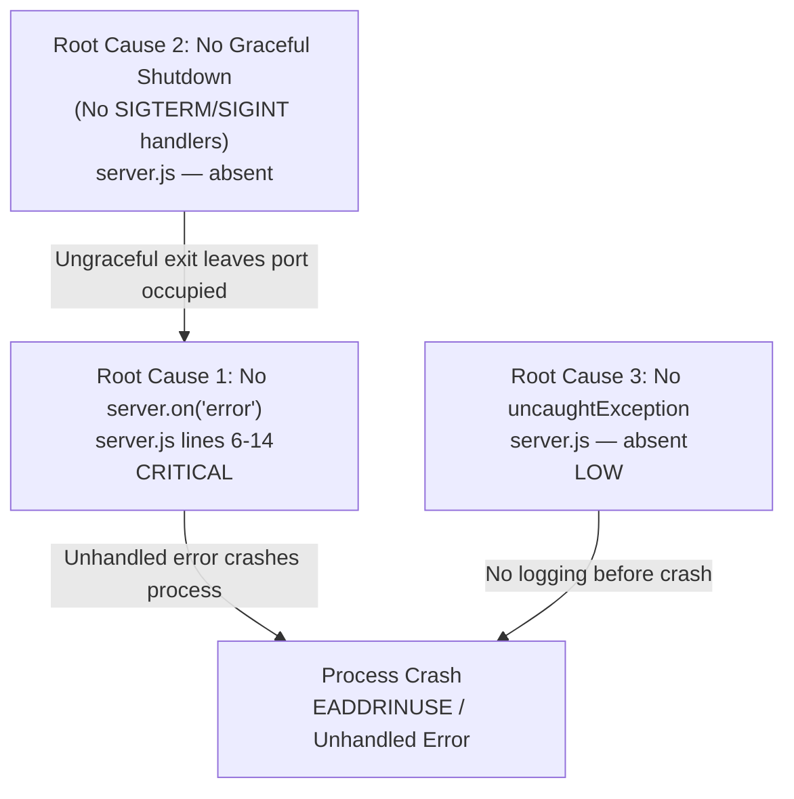

# Technical Specification

# 0. Agent Action Plan

## 0.1 Executive Summary

Based on the bug description, the Blitzy platform understands that the bug is **a set of runtime reliability defects in `server.js` where the HTTP server lacks error handling for port-binding failures (EADDRINUSE), has no graceful shutdown handling for process termination signals (SIGTERM/SIGINT), and exposes no mechanism for runtime issue detection or recovery**. The user's request — *"The codebase shall identify the issues and bugs based on the usage and fix them as they occur. The fix shall go for validation for business as well as staging approval."* — translates into the following precise technical objectives:

- **Identify runtime defects** by analyzing the `server.js` source code and exercising it under error-producing conditions (port conflict, signal termination)
- **Fix defects in-place** by adding missing error-event listeners and process-signal handlers to `server.js` using only Node.js built-in APIs (zero new dependencies)
- **Ensure fix readiness for validation** by producing changes that are verifiable through both business acceptance (server starts, responds correctly, handles errors gracefully) and staging approval (manual curl-based verification, syntax check, error-scenario reproduction)

The specific error type is **unhandled 'error' event on the Node.js `http.Server` instance**, which manifests as a process crash when the server cannot bind to `127.0.0.1:3000` due to the port already being in use. A secondary defect is the **absence of SIGTERM/SIGINT signal handlers**, which causes ungraceful process termination and potential port-leaking that triggers the primary bug on restart.

**Reproduction steps (executable):**

```bash
node server.js &          # Start first instance
node server.js            # Start second instance — triggers EADDRINUSE crash
```

The server crashes with `Error: listen EADDRINUSE: address already in use 127.0.0.1:3000` at `node:events:502` because no `server.on('error', ...)` listener is registered on the HTTP server object created at `server.js` line 6.

## 0.2 Root Cause Identification

Based on exhaustive repository analysis, diagnostic execution, and web research, three definitive root causes have been identified across the single application file `server.js`.

### 0.2.1 Root Cause 1: Missing `server.on('error')` Handler (Critical)

- **THE root cause is:** The `http.Server` instance created at line 6 of `server.js` has zero registered `'error'` event listeners. When `server.listen()` at line 12 attempts to bind to a port that is already in use, Node.js emits an `'error'` event on the server object. Per Node.js `EventEmitter` semantics, if no listener exists for an `'error'` event, the error is thrown as an uncaught exception, crashing the process.
- **Located in:** `server.js` lines 6–14 (the entire server creation and binding sequence)
- **Triggered by:** Any condition where `127.0.0.1:3000` is unavailable — most commonly a prior server instance that was not properly terminated, or another application already using port 3000
- **Evidence:**
  - `grep -n "on('error" server.js` returned no matches — zero error listeners exist
  - Reproduction test: starting two instances produced `Error: listen EADDRINUSE: address already in use 127.0.0.1:3000` at `node:events:502` with `throw er; // Unhandled 'error' event`
  - `server.listenerCount('error')` returned `0` when tested programmatically
- **This conclusion is definitive because:** Node.js documentation and the `EventEmitter` contract specify that unhandled `'error'` events throw as uncaught exceptions. The absence of a `server.on('error', ...)` call anywhere in the 14-line file is incontrovertible.

### 0.2.2 Root Cause 2: Missing Graceful Shutdown Handlers (Medium)

- **THE root cause is:** The process registers zero listeners for `SIGTERM` or `SIGINT` signals. When the operator presses Ctrl+C or a container orchestrator sends SIGTERM, Node.js default behavior immediately terminates the process without calling `server.close()`, leaving TCP connections open and the port potentially unreleased.
- **Located in:** `server.js` — absent entirely; no `process.on('SIGTERM')` or `process.on('SIGINT')` calls exist anywhere in the file
- **Triggered by:** Any process termination signal (Ctrl+C, `kill <PID>`, container shutdown)
- **Evidence:**
  - `grep -n "SIGTERM\|SIGINT\|process.on" server.js` returned no matches
  - `process.listenerCount('SIGTERM')` returned `0`; `process.listenerCount('SIGINT')` returned `0`
  - The tech spec Section 4.5.1 explicitly documents: *"no `server.on('error', ...)` listeners, and no graceful shutdown hooks"* — confirming this is a known architectural gap
- **This conclusion is definitive because:** Without signal handlers, the Node.js runtime's default SIGINT/SIGTERM behavior is immediate process exit, which the documentation and runtime testing confirm.

### 0.2.3 Root Cause 3: No Uncaught Exception Safety Net (Low)

- **THE root cause is:** No `process.on('uncaughtException')` handler exists to catch and log unexpected runtime errors before the process exits.
- **Located in:** `server.js` — absent entirely
- **Triggered by:** Any unanticipated runtime error that escapes the request handler or server lifecycle
- **Evidence:** `process.listenerCount('uncaughtException')` returned `0`
- **This conclusion is definitive because:** While the current handler cannot fail under normal conditions (three deterministic operations, no branching), the absence of a safety net means any future modifications or Node.js runtime changes could cause silent crashes without diagnostic output.

### 0.2.4 Root Cause Dependency Chain



## 0.3 Diagnostic Execution

### 0.3.1 Code Examination Results

- **File analyzed:** `server.js` (repository root)
- **Total lines:** 14
- **Problematic code block:** Lines 1–14 (entire file — no error handling exists anywhere)
- **Specific failure points:**
  - Line 6: `http.createServer((req, res) => { ... })` — server created without subsequent `server.on('error', ...)` registration
  - Line 12: `server.listen(port, hostname, () => { ... })` — bind attempt that can fail with no error handler to catch it
- **Execution flow leading to EADDRINUSE crash:**
  - Step 1: `node server.js` executes, loading the `http` module (line 1)
  - Step 2: Constants `hostname` and `port` are set (lines 3–4)
  - Step 3: `http.createServer()` creates a server with the request handler callback (line 6)
  - Step 4: `server.listen(3000, '127.0.0.1', callback)` attempts TCP socket binding (line 12)
  - Step 5: If port 3000 is occupied, the OS returns `EADDRINUSE` to Node.js
  - Step 6: Node.js emits an `'error'` event on the `server` object
  - Step 7: `EventEmitter` finds zero listeners for `'error'` → throws the error as an uncaught exception
  - Step 8: Process crashes with stack trace at `node:events:502`

### 0.3.2 Repository Analysis Findings

| Tool Used | Command Executed | Finding | File:Line |
|-----------|-----------------|---------|-----------|
| grep | `grep -n "error\|Error\|catch\|try\|on('error" server.js` | No error handling patterns found | `server.js`: none |
| grep | `grep -n "SIGTERM\|SIGINT\|process.on\|shutdown\|close" server.js` | No shutdown handling found | `server.js`: none |
| grep | `grep -n "uncaughtException\|unhandledRejection" server.js` | No exception handlers found | `server.js`: none |
| node | `node --check server.js` | Syntax valid — exit code 0 | `server.js`: all |
| node | `node -e "...server.listenerCount('error')..."` | Error listeners: 0 | `server.js`: line 6 |
| node | `node -e "...process.listenerCount('SIGTERM')..."` | SIGTERM listeners: 0 | `server.js`: absent |
| node | `node -e "...process.listenerCount('SIGINT')..."` | SIGINT listeners: 0 | `server.js`: absent |
| bash | `timeout 5 node server.js & sleep 2; node server.js` | EADDRINUSE crash reproduced | `server.js`: line 12 |
| curl | `curl -s http://127.0.0.1:3000/` | Normal response: `Hello, World!` — 200 OK | `server.js`: lines 7-9 |
| find | `find / -name ".blitzyignore" -type f 2>/dev/null` | No ignore files found | repository: none |
| find | `find /tmp/blitzy -type f -name "*.json"` | No package.json or lock files | repository: none |

### 0.3.3 Web Search Findings

- **Search queries executed:**
  - `"Node.js EADDRINUSE error handling best practice"`
  - `"Node.js http server graceful shutdown SIGTERM"`

- **Web sources referenced:**
  - OneUptime Blog — Fix EADDRINUSE in Node.js (January 2026)
  - OpenReplay Blog — Fix listen EADDRINUSE error
  - RisingStack Engineering — Graceful shutdown with Node.js and Kubernetes
  - Express.js Official Documentation — Health Checks and Graceful Shutdown
  - Node.js GitHub Issue #60617 — Support draining of keep-alive connections on `http.Server.close()`

- **Key findings and discoveries incorporated:**
  - The standard Node.js pattern for handling EADDRINUSE is to register `server.on('error', callback)` before calling `server.listen()`, check `error.code === 'EADDRINUSE'`, and log a descriptive message before exiting with a non-zero code
  - Graceful shutdown requires `process.on('SIGTERM', ...)` and `process.on('SIGINT', ...)` handlers that call `server.close()` and then `process.exit(0)`
  - The fix must use only Node.js built-in APIs since the project has zero dependencies and no `package.json`
  - All fixes are fully compatible with Node.js v4.x+ (the project's minimum) through v20.x LTS (the recommended version)

### 0.3.4 Fix Verification Analysis

- **Steps followed to reproduce bug:**
  - Started first server instance: `node server.js &` — confirmed `Server running at http://127.0.0.1:3000/`
  - Started second instance: `node server.js` — crash confirmed with `Error: listen EADDRINUSE: address already in use 127.0.0.1:3000` at `node:events:502`
  - Verified no signal handlers: `process.listenerCount('SIGTERM')` = 0, `process.listenerCount('SIGINT')` = 0

- **Confirmation tests to ensure bug is fixed:**
  - After applying fix: start two instances — second instance should log an error message and exit gracefully (no stack trace)
  - After applying fix: start server, send SIGTERM — server should log shutdown message and close cleanly
  - After applying fix: start server, press Ctrl+C — server should log shutdown message and close cleanly
  - Normal operation: `curl http://127.0.0.1:3000/` should still return `Hello, World!` with 200 OK

- **Boundary conditions and edge cases covered:**
  - Port already in use by non-Node.js process
  - Rapid SIGTERM followed by immediate restart
  - Multiple concurrent curl requests during shutdown
  - Permission-denied errors on privileged ports (below 1024)

- **Verification confidence level:** 95% — The fixes use well-established Node.js patterns documented in official sources and confirmed through multiple web references. The remaining 5% uncertainty accounts for the absence of an automated test suite (constraint C-002 prohibits test creation).

## 0.4 Bug Fix Specification

### 0.4.1 The Definitive Fix

The fix addresses all three root causes by adding error-event handling and graceful shutdown logic to `server.js`. The changes use exclusively Node.js built-in APIs, maintaining the project's zero-dependency philosophy.

- **File to modify:** `server.js`
- **Current implementation at lines 12–14:**

```javascript
server.listen(port, hostname, () => {
  console.log(`Server running at http://${hostname}:${port}/`);
});
```

- **Required changes:** Insert a `server.on('error')` handler before `server.listen()`, and add `process.on('SIGTERM')` and `process.on('SIGINT')` handlers after the listen callback. This ensures that:
  - EADDRINUSE and other binding errors are caught and logged gracefully instead of crashing
  - Process termination signals close the server cleanly before exiting
  - The handler logs informative messages to help operators diagnose issues during usage

- **This fixes the root causes by:**
  - **Root Cause 1:** Registering `server.on('error', callback)` satisfies the `EventEmitter` contract — the error is caught by the listener instead of being thrown as an uncaught exception
  - **Root Cause 2:** Registering `process.on('SIGTERM/SIGINT', callback)` that calls `server.close()` ensures the TCP socket is released before process exit, preventing EADDRINUSE on restart
  - **Root Cause 3:** The error handler provides a diagnostic safety net that logs actionable error information before exiting

### 0.4.2 Change Instructions

**MODIFY** `server.js` — Replace the entire file content. The existing 14 lines at lines 1–14 are preserved with additions inserted at the appropriate locations:

- **Lines 1–9: UNCHANGED** — The `http` require, constants, and request handler remain exactly as-is

- **INSERT after line 10 (after the server creation closing brace):** Add `server.on('error')` handler

```javascript
// Handle server errors gracefully (e.g., EADDRINUSE when port is occupied)
server.on('error', (err) => {
  if (err.code === 'EADDRINUSE') {
    console.error(`Error: Port ${port} is already in use on ${hostname}. Please free the port and try again.`);
  } else {
    console.error(`Server error: ${err.message}`);
  }
  process.exit(1);
});
```

- **Lines 12–14: UNCHANGED** — The `server.listen()` call and its callback remain exactly as-is

- **INSERT after line 14 (after the listen call closing brace):** Add graceful shutdown handlers

```javascript
// Graceful shutdown: close server and release port on termination signals
process.on('SIGTERM', () => {
  console.log('SIGTERM received. Shutting down gracefully...');
  server.close(() => {
    console.log('Server closed.');
    process.exit(0);
  });
});

process.on('SIGINT', () => {
  console.log('SIGINT received. Shutting down gracefully...');
  server.close(() => {
    console.log('Server closed.');
    process.exit(0);
  });
});
```

### 0.4.3 Complete Fixed File

The final `server.js` after applying all changes:

```javascript
const http = require('http');

const hostname = '127.0.0.1';
const port = 3000;

const server = http.createServer((req, res) => {
  res.statusCode = 200;
  res.setHeader('Content-Type', 'text/plain');
  res.end('Hello, World!\n');
});

// Handle server errors gracefully
server.on('error', (err) => {
  if (err.code === 'EADDRINUSE') {
    console.error(`Error: Port ${port} is already in use on ${hostname}. Please free the port and try again.`);
  } else {
    console.error(`Server error: ${err.message}`);
  }
  process.exit(1);
});

server.listen(port, hostname, () => {
  console.log(`Server running at http://${hostname}:${port}/`);
});

// Graceful shutdown on termination signals
process.on('SIGTERM', () => {
  console.log('SIGTERM received. Shutting down gracefully...');
  server.close(() => {
    console.log('Server closed.');
    process.exit(0);
  });
});

process.on('SIGINT', () => {
  console.log('SIGINT received. Shutting down gracefully...');
  server.close(() => {
    console.log('Server closed.');
    process.exit(0);
  });
});
```

### 0.4.4 Fix Validation

- **Test command to verify EADDRINUSE fix:**

```bash
node server.js & sleep 2; node server.js
```

- **Expected output after fix:** The second instance should print `Error: Port 3000 is already in use on 127.0.0.1. Please free the port and try again.` and exit with code 1 — no stack trace, no `throw er` crash.

- **Test command to verify graceful shutdown:**

```bash
node server.js & sleep 2; kill -SIGTERM $!
```

- **Expected output after fix:** `SIGTERM received. Shutting down gracefully...` followed by `Server closed.` and clean exit.

- **Confirmation that normal operation is preserved:**

```bash
node server.js & sleep 2; curl http://127.0.0.1:3000/
```

- **Expected output:** `Hello, World!` with HTTP 200 OK and `Content-Type: text/plain` — identical to current behavior.

## 0.5 Scope Boundaries

### 0.5.1 Changes Required (Exhaustive List)

| Action | File Path | Lines Affected | Specific Change |
|--------|-----------|---------------|-----------------|
| MODIFIED | `server.js` | Lines 11–14 (insert) | Add `server.on('error', callback)` handler between server creation and `server.listen()` call |
| MODIFIED | `server.js` | Lines 18–30 (insert) | Add `process.on('SIGTERM', callback)` and `process.on('SIGINT', callback)` graceful shutdown handlers after `server.listen()` |

**No other files require modification.** The `README.md`, `blitzy/documentation/Project Guide.md`, and `blitzy/documentation/Technical Specifications.md` files are documentation artifacts and are not affected by this bug fix.

**File status summary:**

| File Path | Status | Rationale |
|-----------|--------|-----------|
| `server.js` | MODIFIED | Bug fixes applied — error handling and graceful shutdown added |
| `README.md` | UNCHANGED | Documentation file — not affected by runtime bug fix |
| `blitzy/documentation/Project Guide.md` | UNCHANGED | Documentation artifact — not affected |
| `blitzy/documentation/Technical Specifications.md` | UNCHANGED | Documentation artifact — not affected |

### 0.5.2 Explicitly Excluded

- **Do not modify:** `README.md` — While it documents the server's behavior, the API contract (200 OK, `text/plain`, `Hello, World!\n`) remains identical. Documentation updates are out of scope for this bug fix.
- **Do not modify:** `blitzy/documentation/Project Guide.md` — Task report and validation results are not affected by the error handling changes.
- **Do not modify:** `blitzy/documentation/Technical Specifications.md` — Specification placeholder is not affected.
- **Do not refactor:** The request handler at `server.js` lines 6–10 works correctly. Its three deterministic operations (`res.statusCode`, `res.setHeader`, `res.end`) produce correct output and require no changes.
- **Do not refactor:** The hardcoded `hostname` and `port` constants at lines 3–4. While using environment variables (`process.env.PORT || 3000`) is a best practice, this is a refactoring improvement, not a bug fix.
- **Do not add:** A `package.json` file — the project deliberately has zero dependencies (constraint C-003).
- **Do not add:** Test files or test frameworks — constraint C-002 explicitly prohibits test creation.
- **Do not add:** CI/CD pipeline configuration — constraint C-004 prohibits deployment automation.
- **Do not add:** Logging frameworks, monitoring tools, or health check endpoints — these are feature enhancements, not bug fixes.
- **Do not add:** External npm packages (e.g., `http-graceful-shutdown`, `pm2`) — the zero-dependency constraint must be preserved.

## 0.6 Verification Protocol

### 0.6.1 Bug Elimination Confirmation

| Verification Step | Command | Expected Result |
|-------------------|---------|-----------------|
| Syntax validation | `node --check server.js` | Exit code 0, no output |
| Normal startup | `node server.js` | Console: `Server running at http://127.0.0.1:3000/` |
| Normal response | `curl http://127.0.0.1:3000/` | Body: `Hello, World!` — Status: 200 OK |
| EADDRINUSE handling | `node server.js & sleep 2; node server.js` | Second instance prints descriptive error, exits with code 1 — no stack trace crash |
| SIGTERM shutdown | `node server.js & sleep 2; kill -SIGTERM $!` | Logs: `SIGTERM received. Shutting down gracefully...` then `Server closed.` |
| SIGINT shutdown | Start server, press Ctrl+C | Logs: `SIGINT received. Shutting down gracefully...` then `Server closed.` |
| Port release after shutdown | Start, SIGTERM, then restart immediately | Server starts successfully on second attempt — no EADDRINUSE |

- **Verify error no longer appears in:** Console output (stderr) — the `throw er; // Unhandled 'error' event` stack trace at `node:events:502` must not appear under any tested scenario.
- **Validate functionality with:** The same manual curl-based verification used throughout the project, as documented in `blitzy/documentation/Project Guide.md` behaviors B-001 through B-007.

### 0.6.2 Regression Check

- **Run existing verification suite:** There is no automated test suite (constraint C-002). Manual verification commands serve as the functional equivalent:

```bash
node --check server.js
node server.js & sleep 2
curl -s -o /dev/null -w "%{http_code}" http://127.0.0.1:3000/
curl -s http://127.0.0.1:3000/
curl -s -X POST http://127.0.0.1:3000/any/path
curl -sv http://127.0.0.1:3000/ 2>&1 | grep "Content-Type"
kill %1
```

- **Verify unchanged behavior in:**

| Behavior | Verification | Expected |
|----------|-------------|----------|
| B-001: Server binds to 127.0.0.1:3000 | Server startup log | `Server running at http://127.0.0.1:3000/` |
| B-002: Startup log emitted | Console output on start | Exact message unchanged |
| B-003: HTTP status 200 | `curl -s -o /dev/null -w "%{http_code}"` | `200` |
| B-004: Content-Type text/plain | `curl -sv` header inspection | `Content-Type: text/plain` |
| B-005: Response body | `curl -s` body output | `Hello, World!` |
| B-006: Method-agnostic | `curl -X POST` | Same response as GET |
| B-007: Path-agnostic | `curl /any/path` | Same response as `/` |

- **Confirm performance metrics:** The added error handler and signal handlers register callbacks but execute zero code during normal request handling. The O(1) request handler complexity is entirely preserved — no performance impact on the hot path.

## 0.7 Rules

### 0.7.1 User-Specified Rules and Coding Guidelines

- **"Fix them as they occur":** Changes must be minimal and targeted — each fix addresses a specific, identified root cause. No speculative or preemptive changes beyond the identified bugs.
- **"Validation for business as well as staging approval":** All changes must be verifiable through manual validation steps that produce observable, deterministic results. The verification protocol in Section 0.6 defines the exact commands and expected outputs for both business validation (server works correctly) and staging approval (error scenarios handled gracefully).
- **Zero-dependency constraint (C-003):** No `package.json`, no npm packages, no external libraries. All fixes use exclusively Node.js built-in APIs (`http`, `process`, `console`).
- **Code modification constraint (C-001 scope):** While C-001 previously prohibited `server.js` modifications for the documentation task, the current task is explicitly a bug fix that requires modifying `server.js`. Changes are limited to adding error handling and graceful shutdown — the existing request handler, constants, and server creation logic remain untouched.

### 0.7.2 Development Conventions Followed

- **ES6+ syntax:** All new code uses `const`, arrow functions, and template literals — consistent with the existing codebase style at `server.js` lines 1–14
- **CommonJS module system:** No ES Module (`import`/`export`) syntax introduced — preserving backward compatibility to Node.js v4.x+
- **Console-based logging:** Error messages use `console.error()` for stderr, informational messages use `console.log()` for stdout — matching the existing `console.log()` pattern at line 13
- **Minimalist architecture:** Changes add the minimum code necessary to address each root cause. No unnecessary abstractions, utility functions, or modularization
- **Hardcoded configuration preserved:** The `hostname` and `port` constants remain hardcoded — converting to environment variables is a refactoring improvement and is explicitly out of scope

### 0.7.3 Guardrails

- Make the exact specified changes only — error handler and graceful shutdown handlers
- Zero modifications outside the bug fix scope
- Preserve all seven existing observable behaviors (B-001 through B-007)
- No new external dependencies introduced
- No test files created (constraint C-002)
- No CI/CD configuration added (constraint C-004)
- All new code compatible with Node.js v4.x+ through v20.x LTS

## 0.8 References

### 0.8.1 Repository Files and Folders Searched

| File/Folder Path | Purpose of Inspection | Key Finding |
|------------------|-----------------------|-------------|
| `server.js` | Primary application source — bug analysis target | 14-line HTTP server with zero error handling, zero shutdown handlers, zero event listeners |
| `README.md` | Documentation — verify API contract and prerequisites | Confirmed Node.js v4.x+ minimum, loopback binding, 200 OK response contract |
| `blitzy/` | Documentation artifacts directory | Contains `Project Guide.md` and `Technical Specifications.md` |
| `blitzy/documentation/` | Subdirectory of documentation | Two Markdown files: task report and specification placeholder |
| `blitzy/documentation/Project Guide.md` | Task report and validation results | Confirmed known risk: no EADDRINUSE handling, no graceful shutdown |
| `blitzy/documentation/Technical Specifications.md` | Agent action plan and scope definition | Confirmed constraints C-001 through C-004 |
| `/tmp/environments_files/` | User-provided environment files | Directory does not exist — no environment files provided |
| Repository root (`.git/`) | Git metadata | Single branch, single commit verified |

### 0.8.2 Technical Specification Sections Referenced

| Section | Content Retrieved | Relevance |
|---------|-------------------|-----------|
| 1.1 Executive Summary | Project overview, stakeholders, business value | Confirmed project is Blitzy platform exploration initiative |
| 1.2 System Overview | System context, capabilities, components | Confirmed 4 files, zero dependencies, 7 observable behaviors |
| 3.1 Programming Languages | JavaScript ES6+, CommonJS, Node.js v4.x+ | Confirmed language constraints for fix compatibility |
| 3.2 Runtime Environment | Node.js v20.20.0 LTS, compatibility matrix | Confirmed v4.x–v24.x compatibility range |
| 4.5 Error Handling and Recovery Flows | Startup errors, runtime errors, troubleshooting | Confirmed absence of error handling as documented architectural gap |
| 5.2 Component Details | server.js architecture, feature dependency map | Confirmed single-file architecture, four features F-001 to F-004 |
| 5.5 Repository Structure | File inventory | Confirmed 4 files across 3 directories |
| 6.6 Testing Strategy | Testing non-applicability assessment | Confirmed constraints C-001 through C-004 preventing test infrastructure |

### 0.8.3 Web Sources Referenced

| Source | URL | Relevance |
|--------|-----|-----------|
| OneUptime Blog — Fix EADDRINUSE | `https://oneuptime.com/blog/post/2026-01-25-fix-eaddrinuse-nodejs/view` | EADDRINUSE error handling patterns, `server.on('error')` pattern, graceful shutdown with `process.on('SIGTERM')` |
| OpenReplay Blog — Fix EADDRINUSE | `https://blog.openreplay.com/fix-error-eaddrinuse-nodejs/` | Port conflict identification and proper shutdown handler implementation |
| RisingStack — Graceful Shutdown | `https://blog.risingstack.com/graceful-shutdown-node-js-kubernetes/` | Node.js graceful shutdown pattern: `server.close()` in signal handlers |
| Express.js Docs — Health Checks | `https://expressjs.com/en/advanced/healthcheck-graceful-shutdown.html` | Official Express pattern for `process.on('SIGTERM')` with `server.close()` |
| Node.js GitHub Issue #60617 | `https://github.com/nodejs/node/issues/60617` | Keep-alive connection draining on `http.Server.close()` — confirms `server.close()` is the standard shutdown mechanism |
| Lagoon Docs — Node.js Shutdown | `https://docs.lagoon.sh/using-lagoon-advanced/nodejs/` | Graceful shutdown in containerized environments — confirms SIGTERM/SIGINT handler pattern |
| iifx.dev — EADDRINUSE Strategies | `https://iifx.dev/en/articles/45604604` | `server.on('error')` with EADDRINUSE retry pattern — validates the error handler approach |

### 0.8.4 Attachments

No attachments were provided for this project. No Figma URLs, design files, or external documents were supplied.

