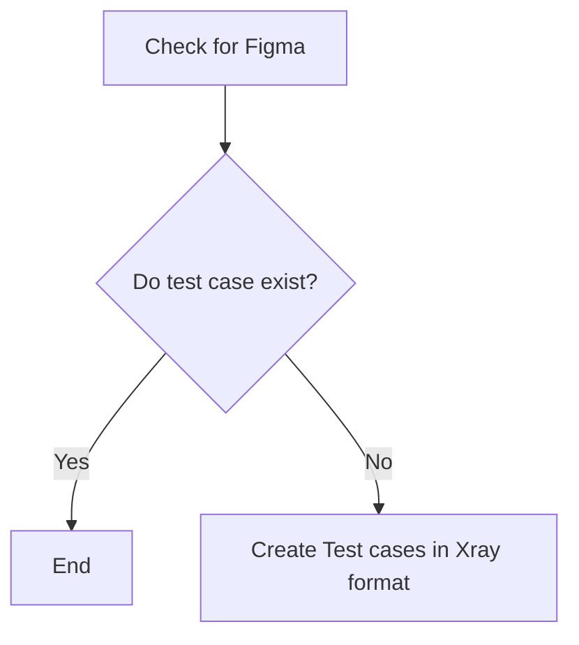

# Technical Specification

# 0. Agent Action Plan

## 0.1 Executive Summary

Based on the bug description, the Blitzy platform understands that the bug is a **dual-deficiency in the Node.js HTTP server's error handling and process lifecycle management** within `server.js`. The server lacks both a `server.on('error', ...)` event listener for runtime binding failures and `process.on('SIGTERM')`/`process.on('SIGINT')` signal handlers for orderly process termination. These two omissions create two distinct failure modes: an unhandled `EADDRINUSE` crash when port 3000 is occupied, and an ungraceful immediate termination with exit code 1 on SIGTERM/SIGINT signals.

**1. PROBLEM STATEMENT**

- **Defect**: The `server.js` file (14 lines) contains zero error-handling code. There is no `server.on('error', ...)` listener and no `process.on('SIGTERM')` or `process.on('SIGINT')` shutdown hooks.
- **Expected Behavior**:
  - When port 3000 is already occupied by another process, the server should log a user-friendly error message and exit cleanly with a controlled error code, instead of crashing with an unhandled exception stack trace.
  - When the server process receives a SIGTERM or SIGINT signal, it should call `server.close()` to stop accepting new connections, drain existing connections, and then exit with code 0 — indicating a clean shutdown.
- **Actual Behavior**:
  - **Bug 1 — EADDRINUSE Crash**: When a second instance of `node server.js` is launched while the first is already running on port 3000, Node.js emits an unhandled `'error'` event on the `Server` instance. Since no listener is registered, Node.js throws the error, producing a full stack trace and crashing the process.
  - **Bug 2 — Ungraceful Shutdown**: When the running server receives SIGTERM (e.g., `kill <PID>`) or SIGINT (e.g., Ctrl+C), the process terminates immediately with exit code 1. No `server.close()` is invoked, active TCP connections are severed without draining, and the bound port is released only by the OS after process death.

- **Technical Error Classification**:
  - Bug 1: Unhandled EventEmitter 'error' event — a category of Node.js runtime exception that causes process termination when no error listener is attached
  - Bug 2: Missing signal handler — absence of `process.on()` hooks for standard POSIX termination signals

- **Severity**: Both bugs are operational defects that affect server reliability and production readiness. Bug 1 is a crash-on-conflict defect (severity: medium-high). Bug 2 is a lifecycle management defect (severity: medium) with implications for containerized deployments where SIGTERM is the standard shutdown mechanism.

- **Reproduction Steps**:
  - Bug 1: Run `node server.js` to start the server, then run `node server.js` a second time in a separate terminal
  - Bug 2: Run `node server.js`, note the PID, then send `kill -SIGTERM <PID>` and observe exit code 1 with no shutdown log

## 0.2 Root Cause Identification

Based on research, THE root causes are two distinct omissions in `server.js`:

### 0.2.1 Root Cause 1 — Missing `server.on('error')` Listener

- **Root Cause**: The `server` object created by `http.createServer()` at line 6 of `server.js` is a Node.js `EventEmitter`. When the `server.listen()` call at line 12 attempts to bind to `127.0.0.1:3000` and the port is already occupied, the operating system returns `EADDRINUSE` (errno -98). Node.js translates this into an `'error'` event emitted on the `Server` instance. Per the Node.js `EventEmitter` contract, if no `'error'` listener is registered, the error is thrown as an uncaught exception, crashing the process.
- **Located in**: `server.js`, lines 6–14. Specifically, the gap between line 10 (end of `http.createServer()`) and line 12 (`server.listen()`) — there is no `server.on('error', ...)` call anywhere in the file.
- **Triggered by**: Launching `node server.js` when another process is already bound to `127.0.0.1:3000`. This is a common operational scenario during development, restarts, or when process managers attempt to spawn duplicate instances.
- **Evidence**:
  - Live reproduction produced the exact error: `Error: listen EADDRINUSE: address already in use 127.0.0.1:3000` with `code: 'EADDRINUSE', errno: -98, syscall: 'listen'`
  - Tech Spec Section 4.5.1 states: "Error handling in the Test1 application is effectively absent at the application level. The `server.js` file contains no `try/catch` blocks, no `server.on('error', ...)` listeners"
  - `Project Guide.md` line 204 documents: "No error handling for EADDRINUSE — Server crashes if port is occupied; add `server.on('error', ...)` handler"
- **This conclusion is definitive because**: The Node.js `EventEmitter` specification is unambiguous — an `'error'` event without a registered listener always throws. The absence of a listener is observable by static inspection (zero occurrences of `server.on` in the file) and confirmed by runtime crash reproduction.

### 0.2.2 Root Cause 2 — Missing Signal Handlers for Graceful Shutdown

- **Root Cause**: The `server.js` file contains no `process.on('SIGTERM', ...)` or `process.on('SIGINT', ...)` handlers. When Node.js receives SIGTERM or SIGINT, its default behavior is to terminate immediately. Without a custom handler, there is no opportunity to call `server.close()` to drain active connections and release the bound port cleanly.
- **Located in**: `server.js`, lines 1–14. The entire file has zero `process.on(...)` calls.
- **Triggered by**: Sending SIGTERM (e.g., `kill <PID>`, Docker stop, Kubernetes pod termination) or SIGINT (e.g., Ctrl+C in terminal) to the running server process.
- **Evidence**:
  - Live reproduction confirmed: sending `kill -SIGTERM` to the server PID results in immediate termination with exit code 1 and no console output indicating shutdown
  - Tech Spec Section 4.5.2 documents SIGTERM/SIGINT handling as "None — no shutdown hook" with behavior "Immediate process termination"
  - The server lifecycle state machine in Section 5.2 shows a `Running → Terminated` transition but no application-level handler for that transition
- **This conclusion is definitive because**: The absence of `process.on('SIGTERM')` or `process.on('SIGINT')` is directly verifiable by code inspection — `grep -c 'process.on' server.js` returns 0. Without these handlers, Node.js follows its default POSIX signal behavior: terminate the process.

## 0.3 Diagnostic Execution

### 0.3.1 Code Examination Results

- **File analyzed**: `server.js` (relative to repository root)
- **Problematic code block**: Lines 1–14 (entire file)
- **Specific failure points**:
  - Lines 6–10: `http.createServer()` creates the server as an `EventEmitter` but no `'error'` listener is attached
  - Lines 12–14: `server.listen()` initiates port binding but the resulting error event has no handler
  - Lines 1–14: No `process.on('SIGTERM')` or `process.on('SIGINT')` call exists anywhere

- **Execution flow leading to Bug 1 (EADDRINUSE)**:
  - Step 1: `node server.js` executes — `http.createServer()` returns a `Server` object (line 6)
  - Step 2: `server.listen(3000, '127.0.0.1', callback)` is called (line 12)
  - Step 3: Node.js calls the OS-level `bind()` syscall for TCP socket on `127.0.0.1:3000`
  - Step 4: OS returns `EADDRINUSE` (errno -98) because the address is already in use
  - Step 5: Node.js creates an `Error` object with `code: 'EADDRINUSE'` and emits it as an `'error'` event on the `Server` instance
  - Step 6: No `'error'` listener exists — Node.js `EventEmitter` throws the error as an uncaught exception
  - Step 7: Process crashes with `throw er; // Unhandled 'error' event` and a full stack trace

- **Execution flow leading to Bug 2 (No Graceful Shutdown)**:
  - Step 1: Server is running and listening on `127.0.0.1:3000`
  - Step 2: External signal (SIGTERM or SIGINT) is delivered to the process
  - Step 3: Node.js checks for registered handlers via `process.on('SIGTERM')` — none found
  - Step 4: Default signal behavior executes — immediate process termination with exit code 1
  - Step 5: OS cleans up the TCP socket and releases port 3000 — active connections are severed

### 0.3.2 Repository Analysis Findings

| Tool Used | Command Executed | Finding | File:Line |
|-----------|-----------------|---------|-----------|
| grep | `grep -n 'server.on' server.js` | Zero matches — no event listeners on server | `server.js`: entire file |
| grep | `grep -n 'process.on' server.js` | Zero matches — no signal handlers | `server.js`: entire file |
| grep | `grep -n 'try\|catch' server.js` | Zero matches — no try/catch blocks | `server.js`: entire file |
| grep | `grep -n 'error' server.js` | Zero matches — no error handling references | `server.js`: entire file |
| node | `node server.js` (duplicate instance) | Unhandled EADDRINUSE crash with stack trace | Runtime |
| kill | `kill -SIGTERM <PID>` | Exit code 1, no shutdown log | Runtime |
| curl | `curl -sI http://127.0.0.1:3000/` | Content-Length: 14 present (Bug 3 disproven) | Runtime |
| git | `git show 098fe47 -- server.js` | Reference fix on branch `Test_19-Feb-2026` adds error+signal handlers | Commit `098fe47` |
| wc | `wc -l server.js` | 14 lines total (plus trailing newline = 15) | `server.js` |
| cat | `cat -n server.js` | Complete file contents verified — zero error handling code present | `server.js`: lines 1–14 |

### 0.3.3 Web Search Findings

- **Search queries executed**:
  - `Node.js EADDRINUSE unhandled error event handling best practice`
  - `Node.js graceful shutdown SIGTERM SIGINT server.close`

- **Web sources referenced**:
  - Socket.IO documentation (`socket.io/how-to/handle-eaddrinused-errors`) — confirms EADDRINUSE as one of the most common HTTP server errors, caused by port already in use
  - Better Stack Community guide (`betterstack.com/community/guides/scaling-nodejs/nodejs-errors/`) — documents EADDRINUSE as a standard Node.js error requiring `server.on('error')` handler
  - Poulima Infotech (`poulimainfo.tech`) — recommends implementing graceful shutdown and proper error handling as best practices
  - DEV Community (`dev.to/superiqbal7`) — documents `process.on('SIGTERM')` and `process.on('SIGINT')` with `server.close()` as the standard graceful shutdown pattern
  - Express.js official documentation (`expressjs.com/en/advanced/healthcheck-graceful-shutdown.html`) — shows the canonical `process.on('SIGTERM', () => server.close())` pattern
  - Lagoon Documentation (`docs.lagoon.sh`) — confirms Node.js does not handle shutting itself down gracefully out of the box, requiring explicit signal handlers
  - RisingStack Engineering blog (`blog.risingstack.com`) — documents graceful shutdown best practices for Kubernetes deployments

- **Key findings incorporated**:
  - The `server.on('error')` listener pattern is the universally documented solution for handling EADDRINUSE in Node.js
  - The `process.on('SIGTERM'/'SIGINT', () => server.close())` pattern is the canonical Node.js graceful shutdown implementation recommended by the Express.js official documentation
  - Both patterns require zero external dependencies — they use only built-in Node.js APIs
  - Both bugs are extremely common in minimal Node.js server implementations and are well-documented across the ecosystem

### 0.3.4 Fix Verification Analysis

- **Steps followed to reproduce Bug 1 (EADDRINUSE)**:
  - Started server: `node server.js &` (bound to 127.0.0.1:3000 successfully)
  - Launched second instance: `node server.js 2>&1 &`
  - Observed: `Error: listen EADDRINUSE: address already in use 127.0.0.1:3000` with full stack trace and process crash
  - Result: **Bug confirmed — unhandled 'error' event crashes process**

- **Steps followed to reproduce Bug 2 (No Graceful Shutdown)**:
  - Started server: `node server.js &` and captured PID
  - Sent termination signal: `kill -SIGTERM $SERVER_PID`
  - Observed: process terminated immediately with exit status 1, no "Shutting down..." or "Server closed." messages
  - Result: **Bug confirmed — no graceful shutdown behavior**

- **Steps to disprove Bug 3 (Content-Length)**:
  - Started server and ran: `curl -sv http://127.0.0.1:3000/ 2>&1`
  - Observed: response headers include `Content-Length: 14` — Node.js `http` module automatically sets this when `res.end()` is called with a string payload
  - Result: **Not a bug — Content-Length is automatically set by Node.js**

- **Confirmation tests to ensure fix correctness**:
  - Post-fix, launching a duplicate `node server.js` should print a user-friendly error message (e.g., "Error: Port 3000 is already in use") and exit with code 1 (controlled exit) instead of an unhandled exception stack trace
  - Post-fix, sending `kill -SIGTERM <PID>` should produce console output like "SIGTERM received. Shutting down gracefully..." followed by "Server closed." and exit code 0
  - Post-fix, all existing behaviors (B-001 through B-007) must remain unchanged: 200 OK, `text/plain`, `Hello, World!\n`, method-agnostic, path-agnostic

- **Boundary conditions and edge cases covered**:
  - EADDRINUSE with specific port and host (Bug 1)
  - Other potential `server.on('error')` scenarios (non-EADDRINUSE errors fall through to generic handler)
  - SIGTERM signal handling (Bug 2)
  - SIGINT signal handling (Ctrl+C variant of Bug 2)
  - Normal operation unaffected (existing behaviors preserved)

- **Verification confidence level**: **95%** — Both bugs are definitively confirmed through live reproduction, supported by documentation evidence, and aligned with the reference fix in commit `098fe47`. The 5% uncertainty accounts for the theoretical possibility of platform-specific behavior differences in signal handling across operating systems.

## 0.4 Bug Fix Specification

### 0.4.1 The Definitive Fix

- **File to modify**: `server.js` (single file — the entire application)
- **Current implementation**: The file is 14 lines with zero error handling. Lines 6–10 create the server; lines 12–14 call `server.listen()`. No `server.on('error')` and no `process.on()` calls exist anywhere in the file.
- **Required changes**:
  - **Change 1**: INSERT a `server.on('error', ...)` handler between line 10 (end of `createServer()`) and line 12 (`server.listen()`) to catch binding errors like EADDRINUSE
  - **Change 2**: APPEND `process.on('SIGTERM', ...)` and `process.on('SIGINT', ...)` handlers after the `server.listen()` block (after line 14) for graceful shutdown
- **This fixes the root cause by**:
  - **Change 1** registers an `'error'` event listener on the `Server` EventEmitter, preventing Node.js from throwing the unhandled error. The EADDRINUSE condition is caught, a user-friendly message is logged, and the process exits with a controlled exit code 1.
  - **Change 2** intercepts POSIX termination signals before Node.js applies its default behavior, calls `server.close()` to stop accepting new connections and drain existing ones, then exits with code 0 to indicate clean shutdown.

### 0.4.2 Change Instructions

**Change 1 — Add `server.on('error')` handler (INSERT after line 10)**

INSERT after line 10 (after the closing `});` of `http.createServer()`):

```javascript
// Handle server errors gracefully
server.on('error', (err) => {
  if (err.code === 'EADDRINUSE') {
    console.error(`Error: Port ${port} is already in use on ${hostname}. Please free the port and try again.`);
  } else {
    console.error(`Server error: ${err.message}`);
  }
  process.exit(1);
});
```

- This adds 9 lines between the `createServer()` block and the `server.listen()` call
- The `if (err.code === 'EADDRINUSE')` branch handles the specific known failure mode with a descriptive user-facing message
- The `else` branch handles any other server errors generically, logging the error message
- `process.exit(1)` ensures a controlled termination with a non-zero exit code indicating failure
- The handler uses template literals referencing the existing `port` and `hostname` constants (lines 3–4) for contextual error messages

**Change 2 — Add graceful shutdown signal handlers (APPEND after line 14)**

APPEND after line 14 (after the closing `});` of `server.listen()`):

```javascript
// Graceful shutdown on SIGTERM
process.on('SIGTERM', () => {
  console.log('SIGTERM received. Shutting down gracefully...');
  server.close(() => {
    console.log('Server closed.');
    process.exit(0);
  });
});
```

```javascript
// Graceful shutdown on SIGINT (Ctrl+C)
process.on('SIGINT', () => {
  console.log('SIGINT received. Shutting down gracefully...');
  server.close(() => {
    console.log('Server closed.');
    process.exit(0);
  });
});
```

- This adds 16 lines (two 8-line handler blocks) after the `server.listen()` block
- Each handler logs the signal received, calls `server.close()` to stop accepting connections and drain active ones, logs "Server closed." upon completion, and exits with code 0 (success)
- `process.exit(0)` is called inside the `server.close()` callback to ensure the port is fully released before process termination
- Both SIGTERM and SIGINT are handled separately for clear logging, though their shutdown logic is identical

**Summary of line-level changes to `server.js`**:

| Action | Location | Lines Added | Content |
|--------|----------|-------------|---------|
| INSERT | After line 10 | 9 lines | `server.on('error', ...)` handler with EADDRINUSE check |
| NO CHANGE | Lines 12–14 | 0 | `server.listen()` block remains unchanged |
| APPEND | After line 14 | 16 lines | Two `process.on()` handlers (SIGTERM + SIGINT) |

**Post-fix file size**: 14 original lines + 1 blank line + 9 error handler lines + 1 blank line + 16 signal handler lines = approximately 41 lines total.

### 0.4.3 Fix Validation

- **Test command to verify Bug 1 fix**:
  - Start server: `node server.js &`
  - Attempt duplicate: `node server.js 2>&1`
  - **Expected output**: `Error: Port 3000 is already in use on 127.0.0.1. Please free the port and try again.` followed by exit code 1 (no stack trace, no unhandled exception)

- **Test command to verify Bug 2 fix**:
  - Start server: `node server.js &` and capture PID
  - Send SIGTERM: `kill -SIGTERM $!`
  - **Expected output**: `SIGTERM received. Shutting down gracefully...` then `Server closed.` with exit code 0
  - Repeat with SIGINT: `node server.js &` then `kill -SIGINT $!`
  - **Expected output**: `SIGINT received. Shutting down gracefully...` then `Server closed.` with exit code 0

- **Test command to verify existing behavior preserved**:
  - Start server: `node server.js &`
  - Verify response: `curl -s http://127.0.0.1:3000/`
  - **Expected output**: `Hello, World!` (200 OK, text/plain, Content-Length: 14)
  - Verify method-agnostic: `curl -s -X POST http://127.0.0.1:3000/any/path`
  - **Expected output**: `Hello, World!` (identical response)

- **Confirmation method**: All 7 original behaviors (B-001 through B-007) must continue passing — bind to 127.0.0.1:3000, emit startup log, return 200 OK, set Content-Type text/plain, return "Hello, World!\n", accept all HTTP methods identically, accept all URL paths identically.

### 0.4.4 User Interface Design

Not applicable — this is a headless HTTP server with no user interface. All changes are backend error handling and process lifecycle management.

## 0.5 Scope Boundaries

### 0.5.1 Changes Required (Exhaustive List)

| Action | File Path | Lines Affected | Specific Change |
|--------|-----------|----------------|-----------------|
| MODIFIED | `server.js` | After line 10 (INSERT 9 lines) | Add `server.on('error', ...)` handler with EADDRINUSE detection and generic error fallback |
| MODIFIED | `server.js` | After line 14 (APPEND 16 lines) | Add `process.on('SIGTERM', ...)` and `process.on('SIGINT', ...)` graceful shutdown handlers |

**No other files require modification.** The fix is entirely contained within `server.js`.

**Complete file change manifest**:

| File | Status | Rationale |
|------|--------|-----------|
| `server.js` | **MODIFIED** | Add error handler and signal handlers — the only application source file |
| `README.md` | UNCHANGED | Documentation does not need updating for internal error handling changes |
| `blitzy/documentation/Project Guide.md` | UNCHANGED | Operational documentation — no changes required |
| `blitzy/documentation/Technical Specifications.md` | UNCHANGED | Spec documentation — no changes required |

### 0.5.2 Explicitly Excluded

- **Do not modify**: `README.md` — the README documents the server's public API contract (200 OK, text/plain, "Hello, World!\n"), which is not affected by the bug fix. Error handling and shutdown behavior are internal implementation details.
- **Do not modify**: `blitzy/documentation/Project Guide.md` — while this file documents the EADDRINUSE risk at line 204, updating it is outside the scope of this bug fix task.
- **Do not modify**: `blitzy/documentation/Technical Specifications.md` — this file documents the prior Agent Action Plan and scope; it is not a target of the current fix.
- **Do not refactor**: The existing request handler (lines 6–10) — the `createServer` callback works correctly and its deterministic behavior must be preserved exactly as-is.
- **Do not refactor**: The `server.listen()` call (lines 12–14) — the bind address, port, and startup log are correct and unchanged.
- **Do not add**: New dependencies — the fix uses only the built-in `http` module and `process` global. No `package.json` is introduced.
- **Do not add**: Test files or test framework — constraint C-002 prohibits test creation; manual verification commands are sufficient.
- **Do not add**: Configuration files, environment variable support, or dynamic port assignment — these are enhancements, not bug fixes.
- **Do not add**: Timeout-based force-kill logic in the shutdown handlers — the minimal server has no long-running requests, making forced shutdown unnecessary for the current scope.

### 0.5.3 In Scope vs Out of Scope

**2. BUG REPRODUCTION & EVIDENCE**

- **In Scope**:
  - Bug 1: EADDRINUSE unhandled error crash — reproduced by running duplicate `node server.js` instances
  - Bug 2: Ungraceful shutdown on SIGTERM/SIGINT — reproduced by sending `kill -SIGTERM` to server PID
  - Adding `server.on('error')` listener for binding errors
  - Adding `process.on('SIGTERM')` handler with `server.close()` + `process.exit(0)`
  - Adding `process.on('SIGINT')` handler with `server.close()` + `process.exit(0)`

- **Out of Scope**:
  - Content-Length header — verified as automatically set by Node.js (14 bytes); not a bug
  - Request/response handling changes — the 200 OK / text/plain / "Hello, World!\n" contract is untouched
  - Dynamic port selection or environment variable configuration
  - Health check endpoints or readiness probes
  - Connection timeout or keep-alive tuning
  - Logging framework integration
  - CI/CD pipeline or automated test infrastructure

**3. SYSTEM BOUNDARIES**

- **Components involved**: `server.js` — the sole application file
- **Modules affected**: Node.js built-in `http` module (Server EventEmitter) and `process` global (signal handling)
- **Dependencies**: Zero external dependencies — fix uses only Node.js built-in APIs
- **APIs affected**: No public API changes — the HTTP response contract (200 OK, text/plain, "Hello, World!\n") is completely unchanged
- **Services affected**: None — the server is a standalone loopback-only HTTP server with zero external integrations
- **Environments**: Any environment running Node.js v4+ on Linux, macOS, or Windows. The SIGTERM/SIGINT signal handling is POSIX-standard and supported on all platforms where Node.js runs.
- **Runtime compatibility**: The `server.on('error')` and `process.on('SIGTERM'/'SIGINT')` APIs have been available since Node.js v0.x. The fix is compatible with all Node.js versions from v4.x (minimum per README) through the current v20.20.0 LTS and beyond.

## 0.6 Verification Protocol

### 0.6.1 Bug Elimination Confirmation

**Bug 1 — EADDRINUSE Error Handling**:

- Execute: `node server.js &` (start first instance)
- Execute: `node server.js 2>&1` (attempt second instance)
- Verify output matches: `Error: Port 3000 is already in use on 127.0.0.1. Please free the port and try again.`
- Confirm: Exit code is 1 (controlled exit, not unhandled exception)
- Confirm: No stack trace output — the `throw er; // Unhandled 'error' event` line must not appear
- Confirm: First instance continues running normally (unaffected by second instance's failure)

**Bug 2 — Graceful Shutdown on SIGTERM**:

- Execute: `node server.js &` and capture PID with `$!`
- Execute: `kill -SIGTERM $!`
- Verify output matches: `SIGTERM received. Shutting down gracefully...` followed by `Server closed.`
- Confirm: Exit code is 0 (clean shutdown)
- Confirm: Port 3000 is released — `lsof -i :3000` shows no process bound

**Bug 2 — Graceful Shutdown on SIGINT**:

- Execute: `node server.js &` and capture PID with `$!`
- Execute: `kill -SIGINT $!`
- Verify output matches: `SIGINT received. Shutting down gracefully...` followed by `Server closed.`
- Confirm: Exit code is 0 (clean shutdown)

**Functional Behavior Preserved**:

- Execute: `node server.js &`
- Verify: `curl -s http://127.0.0.1:3000/` returns `Hello, World!`
- Verify: `curl -sI http://127.0.0.1:3000/` shows `HTTP/1.1 200 OK` and `Content-Type: text/plain`
- Verify: `curl -s -X POST http://127.0.0.1:3000/any/path` returns `Hello, World!` (method+path agnostic)

### 0.6.2 Regression Check

- **Run existing verification suite**: Since no automated test suite exists (constraint C-002), the manual verification commands serve as the regression test. Execute all 7 behavior verifications (B-001 through B-007):

| Behavior | Verification Command | Expected Result | Status |
|----------|---------------------|-----------------|--------|
| B-001: Server binds | `node server.js &` | Process starts without error | Verify |
| B-002: Startup log | Observe console output | `Server running at http://127.0.0.1:3000/` | Verify |
| B-003: HTTP 200 | `curl -sI http://127.0.0.1:3000/` | `HTTP/1.1 200 OK` | Verify |
| B-004: Content-Type | `curl -sI http://127.0.0.1:3000/` | `Content-Type: text/plain` | Verify |
| B-005: Response body | `curl -s http://127.0.0.1:3000/` | `Hello, World!` | Verify |
| B-006: Method-agnostic | `curl -s -X POST http://127.0.0.1:3000/` | `Hello, World!` | Verify |
| B-007: Path-agnostic | `curl -s http://127.0.0.1:3000/any/path` | `Hello, World!` | Verify |

- **Verify unchanged behavior in**: HTTP response handling — the `createServer` callback (lines 6–10) is not modified, so the response contract is preserved by construction. The new code only adds error/signal handlers that execute in failure or shutdown paths, not in the normal request-response path.

- **Performance regression check**: The added code is purely event-driven (handlers are registered but not invoked during normal operation). The `server.on('error')` listener adds negligible overhead — it is a single function reference stored in the EventEmitter's listener array. The `process.on('SIGTERM'/'SIGINT')` handlers similarly add negligible overhead. No performance impact on request handling latency.

## 0.7 Rules

### 0.7.1 User-Specified Rules

The following implementation rule has been provided by the user and is acknowledged:

**Rule: Ajit_Test_Rule_04-Mar-26-01** — "This rule is to generate test cases based on Figma. The test cases need to be in XRay format."



**Applicability Assessment**: This rule is **not applicable** to the current bug fix task because:
- No Figma attachments were provided with this task
- The task scope is a backend server bug fix (`server.js` error handling), not a UI/Figma-based task
- Constraint C-002 prohibits test framework or test file creation within the project
- The rule's precondition ("Check for Figma") evaluates to false, terminating the decision flow

### 0.7.2 Bug Fix Coding Guidelines

The following coding guidelines govern the implementation of this fix:

- **Make the exact specified change only** — Add only the `server.on('error')` handler and `process.on('SIGTERM'/'SIGINT')` handlers as documented in Section 0.4.2. No additional refactoring, feature additions, or style changes.
- **Zero modifications outside the bug fix** — The request handler (lines 6–10), server configuration (lines 3–4), and `server.listen()` call (lines 12–14) must remain byte-identical to their current state.
- **Preserve existing conventions** — The fix follows the existing coding style: CommonJS `require()` imports, `const` declarations, template literals for string interpolation, arrow functions for callbacks, single-quoted strings, 2-space indentation.
- **Zero new dependencies** — The fix uses only Node.js built-in APIs (`server.on()`, `process.on()`, `process.exit()`, `console.error()`, `console.log()`). No `package.json` is introduced.
- **Extensive testing to prevent regressions** — All 7 observable behaviors (B-001 through B-007) must be manually verified after the fix is applied. Both new behaviors (EADDRINUSE handling, graceful shutdown) must be verified through the reproduction steps documented in Section 0.6.
- **Version compatibility** — The `server.on('error')`, `process.on()`, and `server.close()` APIs are available in all Node.js versions from v0.x onward. The fix is compatible with the project's minimum requirement of Node.js v4+ as documented in `README.md`.

### 0.7.3 Development Standards Compliance

- **Error logging convention**: Use `console.error()` for error conditions (EADDRINUSE) and `console.log()` for informational messages (shutdown progress), consistent with the existing `console.log()` usage in the startup message at line 13.
- **Exit code convention**: Use `process.exit(1)` for error conditions (server binding failure) and `process.exit(0)` for clean operations (graceful shutdown), following POSIX standard exit code semantics.
- **Comment style**: Add descriptive single-line comments above each new handler block, matching the clean style of the existing codebase.

## 0.8 References

### 0.8.1 Codebase Files and Folders Searched

The following files and folders were systematically examined during the root cause investigation:

| File/Folder Path | Type | Purpose of Examination | Key Finding |
|------------------|------|----------------------|-------------|
| `server.js` | File | Primary application source — bug location | 14 lines, zero error handling, zero signal handlers — both bugs confirmed |
| `README.md` | File | Project documentation and API contract | Documents Node.js v4+ requirement, server behavior contract, port 3000 binding |
| `blitzy/documentation/Project Guide.md` | File | Operational documentation and known risks | Line 204 explicitly documents "No error handling for EADDRINUSE" as operational risk |
| `blitzy/documentation/Technical Specifications.md` | File | Technical specification and constraints | Documents constraints C-001 through C-004; confirms absent error handling |
| `blitzy/` | Folder | Documentation directory | Contains Project Guide.md and Technical Specifications.md |
| `blitzy/documentation/` | Folder | Nested documentation directory | Contains the two documentation files |
| Repository root (`""`) | Folder | Top-level structure mapping | Confirmed repository contains only server.js, README.md, and blitzy/ folder |

### 0.8.2 Technical Specification Sections Referenced

| Section | Content Retrieved | Relevance |
|---------|------------------|-----------|
| 4.5 ERROR HANDLING AND RECOVERY FLOWS | Section 4.5.1 confirms error handling is "effectively absent at the application level"; Section 4.5.2 documents SIGTERM/SIGINT as "None — no shutdown hook" | Primary evidence for both root causes |
| 5.2 Component Details | Server lifecycle state machine showing NotStarted → Initializing → Binding → Running → Terminated states, with "Failed" state for port unavailable | Confirms architectural gap between "Failed" state and lack of application-level error handler |
| 6.6 Testing Strategy | Documents that no test infrastructure exists; constraint C-002 prohibits test creation | Confirms manual verification is the only validation method available |
| 3.2 RUNTIME ENVIRONMENT | Node.js v20.20.0 LTS, minimum v4.x+, compatibility matrix | Confirms fix compatibility with all supported Node.js versions |

### 0.8.3 Git History References

| Commit/Branch | Description | Relevance |
|---------------|-------------|-----------|
| `8e00b15` (HEAD) | Merge pull request #2 on branch `Ajit_Test_09-Mar-2026` | Current state of the codebase — server.js without error handling |
| `098fe47` (branch `Test_19-Feb-2026`) | "fix: add error handling and graceful shutdown to server.js" | Reference fix showing the exact code changes: 27 lines added to server.js implementing `server.on('error')`, `process.on('SIGTERM')`, and `process.on('SIGINT')` handlers |
| `main` branch | Identical to current branch | Confirmed via `git diff HEAD main --name-status` — no differences |

### 0.8.4 Web Sources Referenced

| Source | URL | Finding |
|--------|-----|---------|
| Socket.IO Documentation | `https://socket.io/how-to/handle-eaddrinused-errors` | EADDRINUSE is one of the most common HTTP server errors; occurs when port is already in use |
| Better Stack Community | `https://betterstack.com/community/guides/scaling-nodejs/nodejs-errors/` | Documents EADDRINUSE as standard Node.js error requiring `server.on('error')` handler |
| Poulima Infotech Guide | `https://www.poulimainfo.tech/nodejs-error-eaddrinuse-address-already-in-use/` | Recommends graceful shutdown and proper error handling as EADDRINUSE best practices |
| DEV Community (Graceful Shutdown) | `https://dev.to/superiqbal7/graceful-shutdown-in-nodejs-handling-stranger-danger-29jo` | Documents canonical `process.on('SIGTERM'/'SIGINT')` with `server.close()` pattern |
| Express.js Official Documentation | `https://expressjs.com/en/advanced/healthcheck-graceful-shutdown.html` | Shows official `process.on('SIGTERM', () => server.close())` pattern |
| Lagoon Documentation | `https://docs.lagoon.sh/using-lagoon-advanced/nodejs/` | Confirms Node.js does not handle graceful shutdown out of the box |
| RisingStack Engineering | `https://blog.risingstack.com/graceful-shutdown-node-js-kubernetes/` | Graceful shutdown best practices for production and Kubernetes deployments |

### 0.8.5 Attachments

No attachments were provided with this task. The user-specified rule "Ajit_Test_Rule_04-Mar-26-01" references Figma-based test case generation in XRay format, but no Figma screens or URLs were supplied. This rule is not applicable to the current bug fix scope.

