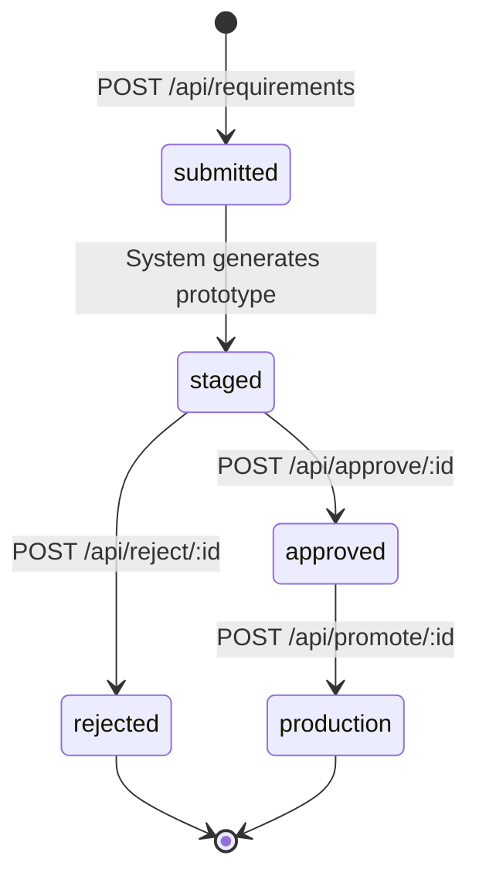

# Staging-Approval Workflow Guide

This document describes the **Staging-Approval Workflow** — a controlled promotion pipeline that enforces a strict gate between prototype development and production deployment. It serves as the conceptual and visual companion to the [API Reference](./api-reference.md).

## Core Principle: No Direct Production Mutation

The paramount constraint of this system is that **the production endpoint (`GET /`) cannot be updated directly**. All changes to what the production endpoint serves must flow through the following controlled pipeline:

```
submitted → staged → approved → production
```

There are no shortcuts. A prototype cannot skip stages, jump from `submitted` to `production`, or bypass the approval gate. Every production change is traceable, reviewable, and explicitly authorized.

The default production response is `Hello, World!\n` and remains unchanged until a prototype is explicitly promoted through the full workflow.

---

## Workflow Overview

The staging-approval workflow consists of six distinct phases that every requirement passes through:

1. **Requirement Submission** — A user submits a new requirement via `POST /api/requirements` with a prompt text describing the desired functionality.
2. **Automatic Staging** — The system automatically generates a prototype from the submitted prompt and transitions the requirement to the `staged` state. No manual intervention is needed for this step.
3. **Prototype Review** — Reviewers inspect the staged prototype via `GET /staging/:id` to evaluate whether it meets the stated requirements.
4. **Approval Decision** — An authorized user (with a valid API key) either approves the prototype (`POST /api/approve/:id`) or rejects it (`POST /api/reject/:id`).
5. **Production Promotion** — Only prototypes that have been explicitly approved can be promoted to production via `POST /api/promote/:id`. This is the sole mechanism by which the production response changes.
6. **Production Serving** — The `GET /` endpoint serves the content of the currently promoted prototype. If no prototype has been promoted, it serves the default `Hello, World!\n`.

### High-Level Flow

```
Submit Requirement → Auto-Stage → Review Prototype → Approve/Reject → Promote to Production
```

Each arrow represents a controlled, validated transition. The system enforces that every requirement follows this exact path — there are no alternate routes to production.

---

## State Machine Diagram

The requirement lifecycle is governed by a finite state machine with five states and strictly defined transitions.

### Mermaid Diagram



### Text-Based Diagram

For environments that do not render Mermaid, the following ASCII diagram illustrates the same state machine:

```
                                   ┌─────────────┐
                                   │   [Start]    │
                                   └──────┬───────┘
                                          │ POST /api/requirements
                                          ▼
                                   ┌─────────────┐
                                   │  submitted   │
                                   └──────┬───────┘
                                          │ System auto-generates prototype
                                          ▼
                                   ┌─────────────┐
                          ┌────────│   staged     │────────┐
                          │        └─────────────┘         │
        POST /api/reject/:id                    POST /api/approve/:id
                          │                                │
                          ▼                                ▼
                   ┌─────────────┐                  ┌─────────────┐
                   │  rejected   │                  │  approved   │
                   │  (terminal) │                  └──────┬──────┘
                   └─────────────┘                         │
                                          POST /api/promote/:id
                                                           │
                                                           ▼
                                                    ┌─────────────┐
                                                    │ production  │
                                                    │  (terminal) │
                                                    └─────────────┘
```

Key observations from the diagram:
- The state machine is **strictly forward-only** — no backward transitions are permitted.
- There are exactly **two terminal states**: `rejected` and `production`. Once a requirement reaches either, it cannot transition further.
- The `staged` state is the only branching point: a requirement can go to `approved` or `rejected`, but never both.

---

## State Definitions

### `submitted`

| Property | Detail |
|----------|--------|
| **Description** | Initial state when a requirement is first created via the API. |
| **Entry Trigger** | `POST /api/requirements` with a valid `prompt` field. |
| **Transitions Out** | `staged` — automatic transition triggered when the system generates a prototype from the prompt. |
| **Transitions In** | None. This is the initial state only; no other state can transition to `submitted`. |
| **Duration** | Transient. The system immediately auto-transitions to `staged` after generating the prototype. Under normal operation, a requirement does not remain in `submitted` for a visible duration. |

### `staged`

| Property | Detail |
|----------|--------|
| **Description** | The prototype has been generated from the submitted prompt and is now available for reviewer inspection. This is the primary review state. |
| **Entry Trigger** | Automatic transition from `submitted` after prototype generation completes. |
| **Transitions Out** | `approved` (via `POST /api/approve/:id`) or `rejected` (via `POST /api/reject/:id`). |
| **Transitions In** | From `submitted` only. |
| **Visibility** | Staged prototypes are listed at `GET /staging` and individually accessible at `GET /staging/:id`. |

### `approved`

| Property | Detail |
|----------|--------|
| **Description** | The prototype has been reviewed by an authorized user and approved. It is now eligible for promotion to production. |
| **Entry Trigger** | `POST /api/approve/:id` — requires a valid API key in the `x-api-key` header. |
| **Transitions Out** | `production` (via `POST /api/promote/:id`). |
| **Transitions In** | From `staged` only. |
| **Constraint** | API key authentication is required to transition into this state. |

### `rejected`

| Property | Detail |
|----------|--------|
| **Description** | The prototype has been reviewed and rejected by an authorized user. This is a **terminal state** — the requirement's lifecycle ends here. |
| **Entry Trigger** | `POST /api/reject/:id` — requires a valid API key. An optional `reason` field may be provided in the request body. |
| **Transitions Out** | **NONE.** This is a terminal state. No further transitions are allowed. |
| **Transitions In** | From `staged` only. |
| **Constraint** | Once rejected, the requirement cannot be re-approved, re-staged, or otherwise modified. A new requirement must be submitted instead. |

### `production`

| Property | Detail |
|----------|--------|
| **Description** | The prototype content is now actively served by the `GET /` production endpoint. This is a **terminal state** — the requirement has completed its full lifecycle. |
| **Entry Trigger** | `POST /api/promote/:id` — requires a valid API key. |
| **Transitions Out** | **NONE.** This is a terminal state. No further transitions are allowed. |
| **Transitions In** | From `approved` only. |
| **Constraint** | Only **one** requirement can be in the `production` state at any given time. When a new requirement is promoted, the previously active production requirement is automatically archived. |

---

## State Transition Rules and Guards

Every state transition is protected by guard conditions that the system enforces. The following table enumerates all valid transitions, their triggers, and the guards that must be satisfied.

### Transition Table

| From State | To State | Trigger | Guard Condition | Enforced By |
|------------|----------|---------|-----------------|-------------|
| `submitted` | `staged` | Automatic (prototype generated) | Prototype content must be non-empty | `requirementStore.js` |
| `staged` | `approved` | `POST /api/approve/:id` | Requirement must be in `staged` state; valid API key required | `approvalController.js` + `authGuard.js` |
| `staged` | `rejected` | `POST /api/reject/:id` | Requirement must be in `staged` state; valid API key required | `approvalController.js` + `authGuard.js` |
| `approved` | `production` | `POST /api/promote/:id` | Requirement must be in `approved` state; valid API key required; only one production requirement at a time | `approvalController.js` |
| Any | `submitted` | **BLOCKED** | No backward transitions allowed | `requirementStore.js` |
| `rejected` | Any | **BLOCKED** | Terminal state — no further transitions permitted | `requirementStore.js` |
| `production` | Any | **BLOCKED** | Terminal state — no further transitions permitted | `requirementStore.js` |

### Additional Rules

- **Idempotent Transitions:** Attempting to transition a requirement to its current state (for example, approving an already-approved requirement) returns the current state without error. The system does not treat this as a failure.
- **Single Active Production:** Only one requirement may be in the `production` state at any given time. Promoting a new requirement automatically archives the previously active production requirement.
- **No Backward Transitions:** The state machine is strictly forward-only. A requirement that has moved to `staged` cannot return to `submitted`. A requirement that has been `approved` cannot return to `staged`.
- **No Shortcuts:** There is no path from `submitted` directly to `production`. There is no path from `submitted` directly to `approved`. Every requirement must pass through the `staged` state and receive explicit approval before promotion.
- **Terminal Finality:** The `rejected` and `production` states are irreversible. Once a requirement reaches either terminal state, its lifecycle is complete and no further modifications to its state are possible.

---

## Step-by-Step Workflow Guide

This section walks through the complete workflow using `curl` commands against the default server at `http://127.0.0.1:3000`.

### Step 1: Submit a Requirement

Send a `POST` request to `/api/requirements` with a JSON body containing the `prompt` and optional `description` fields.

```bash
curl -X POST http://127.0.0.1:3000/api/requirements \
  -H "Content-Type: application/json" \
  -d '{"prompt": "Add a personalized greeting feature", "description": "The server should greet users by name"}'
```

**What happens:**

- The system creates a new requirement with a unique UUID.
- A prototype is automatically generated from the prompt text.
- The requirement transitions from `submitted` to `staged`.
- The response includes the requirement ID and its current `staged` status.

### Step 2: Review the Staged Prototype

Reviewers can list all staged prototypes or view a specific one.

```bash
# List all staged prototypes
curl http://127.0.0.1:3000/staging

# View a specific prototype by its ID
curl http://127.0.0.1:3000/staging/{requirement-id}
```

**What happens:**

- The listing endpoint returns all requirements currently in the `staged` state with their prototype content.
- The detail endpoint renders the specific staged prototype for reviewer inspection.
- Reviewers evaluate whether the prototype meets the stated requirements before making an approval decision.

### Step 3: Approve or Reject the Prototype

An authorized user (with a valid API key) decides whether to approve or reject the staged prototype.

**To approve:**

```bash
curl -X POST http://127.0.0.1:3000/api/approve/{requirement-id} \
  -H "x-api-key: YOUR_API_KEY"
```

**To reject (with optional reason):**

```bash
curl -X POST http://127.0.0.1:3000/api/reject/{requirement-id} \
  -H "x-api-key: YOUR_API_KEY" \
  -H "Content-Type: application/json" \
  -d '{"reason": "Does not meet acceptance criteria"}'
```

**What happens:**

- If **approved**: the requirement transitions to the `approved` state and becomes eligible for production promotion.
- If **rejected**: the requirement transitions to the `rejected` state (terminal). No further actions can be taken on it. A new requirement must be submitted instead.

### Step 4: Promote to Production

Only approved prototypes can be promoted. Send a `POST` request with a valid API key.

```bash
curl -X POST http://127.0.0.1:3000/api/promote/{requirement-id} \
  -H "x-api-key: YOUR_API_KEY"
```

**What happens:**

- The requirement transitions to the `production` state (terminal).
- The prototype content replaces the current `GET /` production response.
- If another requirement was previously in the `production` state, it is automatically archived.

### Step 5: Verify the Production Endpoint

Confirm that the production response has changed by requesting the root endpoint.

```bash
curl http://127.0.0.1:3000/
```

**What happens:**

- The response now contains the newly promoted prototype content instead of the default `Hello, World!\n`.

---

## Security Considerations

### Authentication

The following endpoints are protected by API key authentication and require the `x-api-key` header:

| Endpoint | Why Protected |
|----------|---------------|
| `POST /api/approve/:id` | Prevents unauthorized approval of prototypes |
| `POST /api/reject/:id` | Prevents unauthorized rejection of prototypes |
| `POST /api/promote/:id` | Prevents unauthorized changes to production content |

- The API key is configured via the `BLITZY_CLIENT_API_KEY` environment variable.
- The key must be sent in the `x-api-key` request header on every request to a protected endpoint.
- Requests without a valid API key receive a `401 Unauthorized` response.
- The `authGuard.js` middleware uses **constant-time comparison** for API key validation to prevent timing attacks.

### Input Validation

- All user-submitted prompt text is treated as **untrusted input**.
- Prompt content is sanitized before being stored in the requirement store.
- The system does not evaluate or execute prompt content — it is stored and served as data only.

### API Key Security

The system follows strict rules to protect API key confidentiality:

- API key values are **never logged** to the console or any log output.
- API key values are **never included** in API response bodies.
- API key values are **never exposed** in error messages, even when authentication fails.

---

## Complete Lifecycle Example

This section demonstrates a full end-to-end workflow using the example UUID `550e8400-e29b-41d4-a716-446655440000` for consistency.

### 1. Verify Initial Production State

Before any requirements are submitted, the production endpoint serves the default response.

```bash
curl http://127.0.0.1:3000/
```

**Expected response:**

```
Hello, World!
```

### 2. Submit a New Requirement

Submit a requirement with a prompt describing the desired functionality.

```bash
curl -X POST http://127.0.0.1:3000/api/requirements \
  -H "Content-Type: application/json" \
  -d '{"prompt": "Add a personalized greeting feature", "description": "The server should greet users by name"}'
```

**Expected response (HTTP 201 Created):**

```json
{
  "id": "550e8400-e29b-41d4-a716-446655440000",
  "prompt": "Add a personalized greeting feature",
  "description": "The server should greet users by name",
  "status": "staged",
  "createdAt": "2026-02-16T12:00:00.000Z"
}
```

The requirement was created and automatically staged. Notice the status is `staged`, not `submitted` — the system auto-generated a prototype and transitioned the state.

### 3. List All Staged Prototypes

Verify that the new requirement appears in the staging list.

```bash
curl http://127.0.0.1:3000/staging
```

**Expected response (HTTP 200 OK):**

```json
[
  {
    "id": "550e8400-e29b-41d4-a716-446655440000",
    "prompt": "Add a personalized greeting feature",
    "status": "staged",
    "prototype": "Prototype: Add a personalized greeting feature"
  }
]
```

### 4. View the Specific Staged Prototype

Inspect the prototype content in detail before making an approval decision.

```bash
curl http://127.0.0.1:3000/staging/550e8400-e29b-41d4-a716-446655440000
```

**Expected response (HTTP 200 OK):**

The prototype content is rendered for review. The reviewer evaluates whether this meets the stated requirements.

### 5. Approve the Prototype

After reviewing, an authorized user approves the prototype.

```bash
curl -X POST http://127.0.0.1:3000/api/approve/550e8400-e29b-41d4-a716-446655440000 \
  -H "x-api-key: YOUR_API_KEY"
```

**Expected response (HTTP 200 OK):**

```json
{
  "id": "550e8400-e29b-41d4-a716-446655440000",
  "status": "approved"
}
```

### 6. Promote to Production

With the prototype approved, promote it to replace the current production response.

```bash
curl -X POST http://127.0.0.1:3000/api/promote/550e8400-e29b-41d4-a716-446655440000 \
  -H "x-api-key: YOUR_API_KEY"
```

**Expected response (HTTP 200 OK):**

```json
{
  "id": "550e8400-e29b-41d4-a716-446655440000",
  "status": "production"
}
```

### 7. Verify Production Has Changed

Confirm that the `GET /` endpoint now serves the promoted prototype content.

```bash
curl http://127.0.0.1:3000/
```

**Expected response:**

The response now contains the promoted prototype content instead of the default `Hello, World!\n`. The workflow is complete.

### Lifecycle Summary

| Step | Action | Result |
|------|--------|--------|
| 1 | `GET /` | `Hello, World!\n` (default) |
| 2 | `POST /api/requirements` | Requirement created, auto-staged |
| 3 | `GET /staging` | Lists staged prototypes |
| 4 | `GET /staging/:id` | Renders prototype for review |
| 5 | `POST /api/approve/:id` | Prototype approved |
| 6 | `POST /api/promote/:id` | Prototype promoted to production |
| 7 | `GET /` | Promoted prototype content (not `Hello, World!\n`) |

---

## Troubleshooting

### 401 Unauthorized on Approve, Reject, or Promote

**Symptom:** You receive a `401 Unauthorized` response when trying to approve, reject, or promote a requirement.

**Cause:** The `x-api-key` header is missing or contains an invalid API key.

**Resolution:**
- Ensure you include the `x-api-key` header in your request.
- Verify the API key matches the value set in the `BLITZY_CLIENT_API_KEY` environment variable on the server.
- Example: `-H "x-api-key: YOUR_API_KEY"`

### 409 Conflict on State Transition

**Symptom:** You receive a `409 Conflict` response when attempting a state transition.

**Cause:** The requirement is not in the expected state for the requested transition. Common scenarios:
- Trying to approve a requirement that has already been `rejected` (terminal state).
- Trying to promote a requirement that is still in `staged` state (must be `approved` first).
- Trying to reject a requirement that has already been `approved`.

**Resolution:**
- Check the current state of the requirement via `GET /api/requirements/:id`.
- Ensure the requirement is in the correct state for the desired transition:
  - Approve: requirement must be `staged`
  - Reject: requirement must be `staged`
  - Promote: requirement must be `approved`

### 404 Not Found

**Symptom:** You receive a `404 Not Found` response.

**Cause:** One of the following:
- The requirement ID in the URL does not match any existing requirement.
- The URL path does not match any registered route.

**Resolution:**
- Verify the requirement ID by listing all requirements via `GET /api/requirements`.
- Check that the URL path is correct (refer to the [API Reference](./api-reference.md) for all valid endpoints).

### Production Content Did Not Change After Promotion

**Symptom:** After promoting a requirement, `GET /` still returns the old content.

**Cause:** The full workflow was not completed. All three steps are required in sequence.

**Resolution:**
Ensure you have completed every step of the pipeline:
1. **Submit** the requirement via `POST /api/requirements` (status becomes `staged`).
2. **Approve** the requirement via `POST /api/approve/:id` (status becomes `approved`).
3. **Promote** the requirement via `POST /api/promote/:id` (status becomes `production`).

Skipping any step will prevent the prototype from reaching the production endpoint. There are no shortcuts — this is by design.

### Requirement Stuck in Submitted State

**Symptom:** A requirement remains in the `submitted` state and does not appear in the staging list.

**Cause:** The automatic prototype generation may have failed (for example, if the prompt was empty or invalid).

**Resolution:**
- Verify the requirement was created with a non-empty `prompt` field.
- Check the requirement details via `GET /api/requirements/:id` to inspect its current state.
- Submit a new requirement with a valid prompt if the original cannot be recovered.

---

## Related Documentation

- [API Reference](./api-reference.md) — Complete REST API documentation for all endpoints
- [README](../README.md) — Project overview and getting started guide
